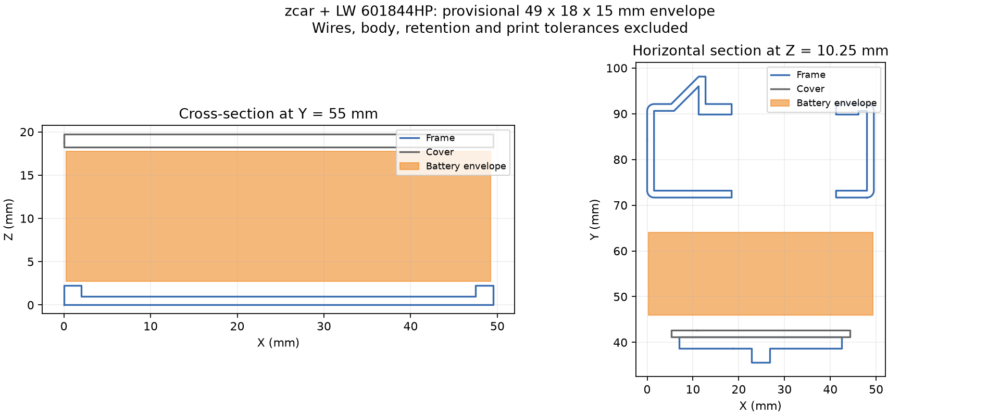

# Примерка батареи в zcar

15 сентября: [съёмный держатель XIAO 0.1](xiao-mount/README.md) с опорой, прижимом и STL для примерки. Исправлена ошибка направления сервисного USB: по именованной STEP он выходит по +X, а прежний резерв 0.5 был направлен по −X. Новая сцена также меняет три трассы проводов и край поддона; старые регулировки/снятие кузова для неё ещё не квалифицированы.

15 сентября: [проверка обслуживания компоновки 0.5](packaging-service.md) учитывает новые платы и трассы проводов. В начальном положении геометрически свободны составное снятие кузова, снятие левого упора и выход батарейного макета влево с оставленным правым упором. Физические разъёмы батареи, пальцы и удержание ещё не проверены.

**15 сентября: текущая итерация — [детальная компоновка 0.5](packaging-v05/README.md) и [интерактивная сборка](packaging-v05/viewer.html).** Добавлены STEP SG90, подробный Waveshare -M, раздельные места плат, провода, зарядный USB и предложение выемок рамы. Прежние итерации ниже сохранены для сравнения; полной физически проверенной конструкции пока нет.

14 сентября: [компоновка бокового зарядного USB-C 0.2](usb-port-study.md) с [переключением закрытого порта и кабеля в 3D](usb-port-study-viewer.html) обновлена по [разведённой PCB KiCad](../hardware/usb-port/README.md). Основание, плата с отверстиями и площадки экспортированы; геометрия проверена. Фиксация накладки/жгута и изготовление ещё впереди.

Последние результаты: [регулируемые крепления 0.3](adjustable-layout.md) с [двумя ползунками в 3D](adjustable-layout-viewer.html) и [примерка конкретных кандидатов 0.4](candidate-fit.md) с [моделью XIAO из STEP](candidate-fit-viewer.html). В 0.4 выявлена неопределённость посадки SG90; полная CAD-модель машины всё ещё не завершена. Описание 0.2 ниже — предшествующая габаритная итерация.

**Полная конструкция RaceRemote ещё не закончена.** Текущий вариант — [компоновка под кузов 0.2](body-study.md) и [вращаемая модель](body-study-viewer.html): условный кузов 70×155×54 мм, исходная механика, батарейный узел и более низкие габаритные резервы электроники. Это предложенная форма, не подтверждённая посадка покупного Mini-Z. [Прежняя компоновка 0.1](assembly.md) высотой 62 мм без кузова сохранена для сравнения. Реальные платы/провода, крепления, окна камеры и магниты ещё не спроектированы полностью. Ниже сохранена документация батарейной примерки; изображения сечений не являются чертежами готовой машинки.

Следующая итерация — [держатель 0.2](battery-holder.md): опора, два съёмных торцевых упора, канавка и резерв эластичного ремешка. Подготовлены SCAD/STL, проверены коллизии и путь снятия. Это кандидат для физической примерки, не испытанное крепление; описание ниже сохраняет исходную компоновку 0.1.

2026-09-13, исследовательская компоновка 0.1. Размер батареи **49 × 18 × 15 мм** взят из карточки покупки, которую подтвердил пользователь; его аккумуляторы ещё не измерены. Это CAD-макет, не готовый держатель и не подтверждение физической совместимости.



## Полученный результат

Макет располагается поперёк рамы. Оси: X — поперёк машины, Y — вдоль, Z — вверх; начало координат — минимум габаритов основной рамы. Центр макета `(24,75; 55; 10,25)` мм; занимаемый объём от `(0,25; 46; 2,75)` до `(49,25; 64; 17,75)` мм.

| Проверка | Результат в модели |
| --- | --- |
| Макет в выбранном положении | Пересечение с рамой и центральной деталью: 0 мм³; габариты остальных компонентов сборки не пересекаются с макетом |
| Прямое извлечение на 50 мм в сторону −X | Весь объём перемещения, включая промежуточные положения, свободен от этих деталей |
| Подъём макета на 1 мм | Пересечение с центральной деталью 428,0625 мм³; это также положительная контрольная проверка обнаружения коллизии |

В центральном сечении верх боковых выступов рамы находится на Z=2,25 мм, нижняя поверхность полки — на Z=18,25 мм. Макет оставляет **по 0,5 мм вертикального зазора** относительно этих поверхностей. По ширине его края находятся в 0,25 мм от внешних границ рамы; это **не зазор до кузова**. Размер 49 мм сам по себе не требует расширить раму на 4 мм относительно батареи из README автора.

Макет пока «висит» над дном отсека: для выбранной высоты нужна опора примерно 1,75 мм над центральным дном Z=1 мм. Её конструкция, крепление, мягкая прокладка и независимый фиксатор ещё не разработаны. Пустое место в CAD не означает, что незафиксированную батарею уже можно ставить на машинку.

Для следующей итерации предлагается снять кузов, освободить фиксатор и разъёмы, затем выдвинуть батарею вбок. Такой путь позволяет оставить центральную полку на месте. Доступ руками, провода, разъёмы, кузов, новые платы, камера и антенна в проверку **не включены**. Направление выхода проводов у реальных пакетов ещё нужно установить. Предложенный ранее доступ сверху после снятия кузова сохраняется как сценарий обслуживания; непосредственное извлечение вверх потребовало бы изменения полки.

## Файлы и воспроизведение

- [battery-layout.scad](battery-layout.scad) — редактируемая модель OpenSCAD. `part="layout"` показывает компоновку; `extraction_offset` от 0 до −50 мм показывает боковое извлечение. Для просмотра нужны сгенерированные ниже STL рамы и центральной детали.
- [battery-dummy.stl](battery-dummy.stl) — готовый геометрический макет 49 × 18 × 15 мм для возможной примерки. Это простой брусок без проводов/разъёмов; печать и физическая примерка не выполнялись. Его размер нужно обновить после измерения всех трёх батарей.
- [Числовой отчёт](../docs/evidence/zcar-battery-layout.json) — исходная ревизия, SHA-256, преобразования и объёмы пересечений.
- [Скрипт](../tools/layout_zcar_battery.py) — восстанавливает компоновку из зафиксированных STL, проверяет геометрию и создаёт сечения.

Из корня RaceRemote, если исходный клон уже подготовлен по [инструкции](../docs/chassis-candidates.md#проверка-файлов-cad):

```powershell
uv run --with-requirements tools/cad-requirements.txt python tools/layout_zcar_battery.py build/upstream/zcar
```

Результаты появятся в игнорируемом `build/cad-layout`: `frame.stl`, `cover.stl`, `battery.stl`, `report.json`, `sections.png`, `SOURCE.txt`, `UPSTREAM-LICENSE`. `battery.stl` сохраняет положение в сборке; опубликованный `cad/battery-dummy.stl` экспортирован из OpenSCAD с началом в нижнем углу для печати.

Проверенный экспорт в Windows PowerShell:

```powershell
& 'C:/Program Files/OpenSCAD/openscad.com' -o build/cad-layout/battery-dummy.stl -D 'part=\"battery_dummy\"' cad/battery-layout.scad
```

Экспорт OpenSCAD прошёл; получена замкнутая ориентированная сетка с габаритами ровно 49 × 18 × 15 мм. Это проверка файла, не точности принтера. В других оболочках экранирование аргумента `-D` может отличаться.

## Метод и ограничения

Источник геометрии — [alexyu132/zcar, ревизия 4b714e6](https://github.com/alexyu132/zcar/tree/4b714e63fa30ed2030a8a48ab15f1e4a5fa380c4). Для объёмных операций используются замкнутые детали `tray1.stl`, размещённые по сборочной модели. Центральная деталь повёрнута из печатного положения; рама перенесена без изменения формы. Основные поверхности совпадают с точностью менее 0,001 мм. У трёх вершин рамы расстояние до незамкнутой сборочной сетки больше: максимум 1,0353 мм на дальнем конце, вне батарейного отсека. Эти расхождения сохранены в отчёте, а не исправлены автоматически.

Для рамы и центральной детали рассчитаны булевы пересечения замкнутых тел. Для остальных частей исходной сборки проверены ограничивающие параллелепипеды: отсутствие их пересечений исключает пересечение самих поверхностей в проверенном объёме. Модель не содержит всех компонентов будущей машинки. Нулевой объём пересечения не заменяет расчёт допусков, жёсткости и проверку удержания.

Сечения содержат геометрию zcar; сопровождающая [GPL-3.0 из исходного репозитория](../docs/evidence/zcar-LICENSE.txt) сохранена вместе с ними. Сгенерированные сторонние STL остаются в `build` с атрибуцией и той же лицензией. Исходник `zcar.skp` не менялся.
