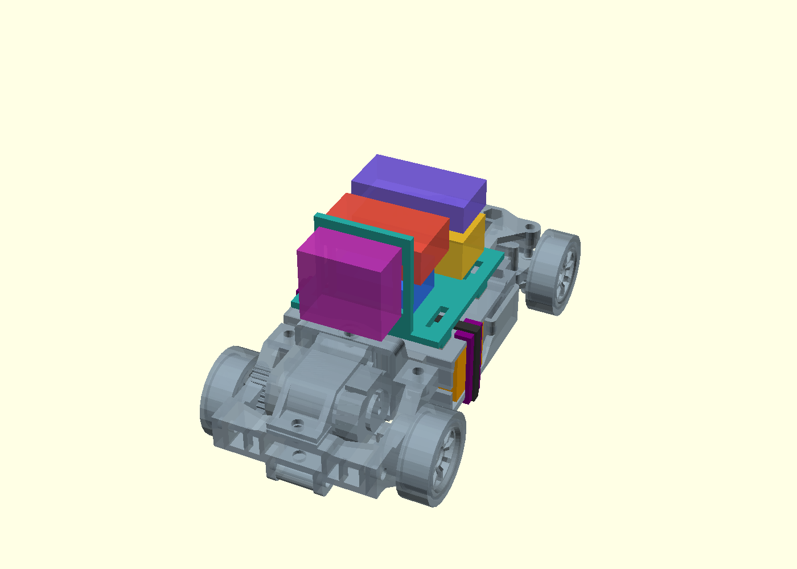

# Общая компоновка 0.1

13 сентября 2026. **Есть общая 3D-сцена, но проект машинки ещё не закончен.** Это проверка распределения места и первая конструкция площадки электроники. Сборки/печати на железе не было.

Открыть [assembly-viewer.html](assembly-viewer.html) в Chrome: работает локально без сервера, интернета и внешних библиотек. Можно вращать модель, скрывать группы, смотреть сверху/сбоку и разнести детали по высоте. Для редактирования — [assembly.scad](assembly.scad), OpenSCAD, просмотр F5. Исходная сборка zcar незамкнутая; F6/экспорт всей машины единым печатным телом не является поддерживаемым результатом.



## Что изображено

- Серая механика — исходная сборка zcar: рама, колёса, рулевой узел, мотор и передача. Она перенесена в общую систему координат без изменения формы. Посадка новых F130/SG90 и предложенная передача 9:43 здесь ещё не реализованы. Включён исходный [SketchUp-файл автора](reference/zcar.skp); это не наш законченный проект.
- Оранжевая батарея — макет 49×18×15 мм, с нашими опорой, упорами и резервом ремешка 0.2.
- Зелёная площадка — новая деталь 43×46 мм с четырьмя опорами, пазами под будущие ремешки и вертикальной стойкой за камерой. Четыре площадки 6×6 мм опираются через резерв клеевого слоя 0,5 мм на полку zcar. Основание находится на Z=24…26 мм, стойка до Z=55 мм.
- Остальные цветные блоки — **габаритные бюджеты**, не точные 3D-модели уже выбранных плат. Между нижними платами и площадкой оставлен 1 мм под изоляцию/крепление; крепление верхнего уровня ещё не создано.

| Блок | Размер X×Y×Z, мм | Нижний угол, мм | Что означает |
| --- | --- | --- | --- |
| Контроллер | 22×18×10 | 13,75; 43; 27 | Резерв компактной платы; имеющаяся WROOM-32U devboard не измерена и не объявлена помещающейся сюда |
| Преобразователь 5 В | 33×16×12 | 8,25; 67; 27 | Площадь по Waveshare, высота 12 мм — наш резерв под вариант с разъёмами, не измеренная высота |
| Камера | 23×12×21 | 13,25; 27; 32 | Резерв компактного модуля класса XIAO в вертикальном положении. Не подтверждает посадку Waveshare CAM-WAV-01, кабелей и угол обзора |
| Драйвер | 30×18×10 | 9,75; 43; 40 | Бюджет будущей силовой платы, TA6586 с обвязкой ещё не разведён |
| Зарядка | 33×16×8 | 8,25; 67; 42 | Бюджет узла 2S, не модель выбранного зарядника/USB-C |

Размеры условных блоков — ограничения для дальнейшего подбора/разводки. Если конкретный модуль больше, менять компоновку, а не уменьшать его макет. Разнесение в просмотрщике не является рассчитанной последовательностью монтажа.

## Проверка и выявленные ограничения

[Числовой отчёт](../docs/evidence/assembly-layout.json) фиксирует исходные SHA256, размеры, попарные пересечения и результаты проверки:

- Добавленные объёмы не пересекают закрытые модели рамы/полки, батарейный узел и друг друга. Проверен прямой боковой ход батареи на 50 мм после освобождения её упоров.
- Для незамкнутых частей исходной сборки применены консервативные ограничивающие объёмы. Широкая проверка площадки задевает плоские фрагменты модели, но уточнение по каждому ограничивающему объёму даёт нулевое пересечение. Отверстия исходной сборки не залечивались ради положительного результата.
- Каждая ножка имеет 36 мм² геометрического контакта с полкой через зарезервированный клеевой слой. Это не испытание клея/жёсткости. При намеренном опускании площадки на 5 мм возникает коллизия — положительная контрольная проверка.
- Габариты сцены около **65×123,625×62 мм**, включая исходные колёса и стойку. Эта высота существенна: совместимость с низким кузовом Mini-Z не подтверждена. Потребуется уменьшить высоту плат/стойки либо проектировать более высокий кузов.

Пока не покрыты: полный ход руля/подвески, кабели, антенна, реальные разъёмы, снятие эластичного ремешка под площадкой, вибрация/удары, магниты и кузов. Свободный ход батарейного бруска не доказывает удобство обслуживания. Верхние драйвер/зарядник пока показаны без стоек и крепления, камера — без проверенного крепежа. Эта сцена не закрывает MOUNT-01/MECH-01/SWAP-01.

[electronics-carrier.stl](electronics-carrier.stl) — экспорт одного замкнутого тела, не готовое задание принтеру. Ориентацию, поддержки для нависающего основания/стойки, материал и допуски ещё выбрать. Его не следует считать проверенной заменой печатных деталей zcar.

## Воспроизведение

После подготовки исходного клона и батарейной компоновки по [README](README.md), из корня репозитория:

```powershell
uv run --with-requirements tools/cad-requirements.txt python tools/build_cad_assembly.py
```

Скрипт экспортирует детали OpenSCAD, проверяет геометрию, обновляет автономный HTML, PNG, STL площадки и отчёт. [Шаблон просмотрщика](../tools/cad_viewer_template.html) — отдельный редактируемый исходник; HTML в cad генерируется из него. После изменения SCAD нужно пересоздать HTML/отчёт, иначе он показывает прежнюю геометрию. Проверены просмотр в Chrome, переключение вида, скрытие площадки и разнесение на 25 мм; WebGL вернул код ошибки 0 после действий. Это проверка интерфейса, не механики.

Происхождение исходной механики, неизменённый редактируемый источник и GPL-3.0 сохранены в [reference](reference/NOTICE.md). Файлы сборки доступны непосредственно из репозитория, без зависимостей просмотра на игнорируемый build.
