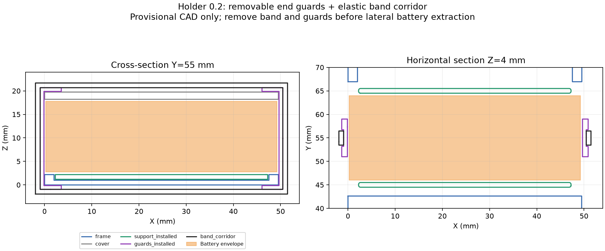

# Держатель батареи 0.2 — вариант для примерки

13 сентября 2026. Предложение агента для SWAP-01/MOUNT-01, **проверено только в CAD**. Размер LW 601844HP остаётся ориентиром продавца 49 × 18 × 15 мм. Пользователь отложил физические работы; печать и осмотр батарей не выполнялись.



## Конструкция

Тонкая опора закрывает промежуток над центральным дном рамы. Две направляющие ограничивают смещение батареи вдоль машины; боковые стороны открыты. Два одинаковых съёмных С-образных упора охватывают торцы рамы и центральной полки, перекрывая батарее выход вбок. Эластичный ремешок вокруг упоров удерживает их вместе. На упорах есть канавка под ремешок. Кузов и его магниты в фиксации не участвуют; исходные STL рамы/полки не изменены.

Упоры — **не защёлки**: самостоятельно не фиксируются, нужен ремешок. В CAD показан прямоугольный объём под него, а не форма натянутого материала. Сечение, длина в покое, растяжение и усилие ещё не выбраны. Нельзя считать рассчитанный периметр свободной длиной для покупки.

| Элемент | Предварительная геометрия, мм |
| --- | --- |
| Опора, 1 шт. | 45 × 21 × 3,05; основание 1,05, направляющие выше основания на 2 |
| Крепление опоры к дну | Резерв 0,20 под клеевой слой; крепить опору к раме, не батарею |
| Мягкая прокладка на опоре | Резерв сжатой толщины 0,50; низ батареи остаётся Z=2,75 |
| Направляющие | По 0,50 свободного места относительно передней/задней грани макета |
| Торцевой упор, 2 одинаковых шт. | Стенка 1,20; заход над/под рамой 3,50; ширина вдоль Y — 8 |
| Зазор упора от рамы/полки | 0,15 с каждой соответствующей стороны; не проверен на принтере |
| Канавка ремешка | Ширина 3,50, глубина 0,40; остаток стенки 0,80 |
| Резерв ремешка | Ширина 3, толщина 1; изделие/материал не выбраны |
| Общий поперечный габарит с ремешком | 53,40 вместо 49,50 у рамы; совместимость с кузовом открыта |

Ремешок проходит ниже рамы до Z=−1,95. Минимальная Z исходной сборочной модели — −7: геометрическая разность 5,05 мм, **не измеренный дорожный просвет** под нагрузкой. Износ нижней части ремешка и ход подвески ещё нужно проверить.

Упор занимает Y=51…59. По обе стороны остаются свободные участки торца батареи, но это не проверка прохода её проводов/разъёмов. После осмотра может потребоваться другое положение/ширина упора; пережимать провода или край пакета нельзя. Прокладка, лента и ремешок пока отсутствуют в подтверждённой закупочной спецификации.

## Смена батареи — предлагаемый порядок

1. Отключить питание, снять кузов и отключить батарею за разъёмы.
2. Освободить ремешок, снять упоры наружу. В CAD проверен свободный ход каждого на 6 мм.
3. Выдвинуть батарею в сторону −X; проверен весь прямой ход на 50 мм.
4. Вставить другую батарею, вернуть упоры и ремешок, проверить посадку и провода, подключить питание. Управление разрешать новой нейтральной сессией.

Доступ пальцами, растяжение/снятие ремешка и время смены пока не проверены. Первая примерка — с [печатным макетом](battery-dummy.stl), без нагрузки на настоящий пакет; затем с измеренными батареями. Прочность, отсутствие острых кромок, удержание при ударе и несколько замен проверяются физически. Выбор материала/параметров печати остаётся предварительным.

## Файлы и проверка

- [battery-holder.scad](battery-holder.scad): редактируемые опора, упоры и резерв ремешка; `part="layout"` показывает сборку, `show_retention=false` и `extraction_offset=-50` — снятые упоры и извлечение. Импорты требуют `build/cad-layout`.
- [battery-support.stl](battery-support.stl): 1 опора, плоское основание на Z=0.
- [battery-end-guard.stl](battery-end-guard.stl): 2 одинаковых упора; экспорт лежит широкой стороной на Z=0, размер около 4,85 × 22,45 × 8. Это файлы для примерки, не проверенная печать.
- [Числовой отчёт](../docs/evidence/zcar-battery-holder.json): ревизия исходника, SHA256 CAD/STL, габариты и коллизии.

Воспроизведение из корня репозитория после подготовки закреплённого клона zcar:

```powershell
uv run --with-requirements tools/cad-requirements.txt python tools/layout_zcar_battery.py build/upstream/zcar
uv run --with-requirements tools/cad-requirements.txt python tools/check_battery_holder.py
```

Проверка покрывает **значения по умолчанию**, не произвольные изменения параметров. Обе печатные детали — по одному замкнутому ориентированному телу. Пересечения опоры, упоров, резерва ремешка, батареи, рамы и полки равны нулю; bounding boxes остальных деталей исходной сборки также свободны. При снятых упорах/ремешке боковой путь батареи свободен. При оставленных упорах путь намеренно пересекает их на 123 мм³ — положительная контрольная проверка, не расчёт силы удержания. Проверен консервативный объём хода упоров наружу; процесс растягивания ремешка не моделировался.

Сечения включают геометрию [alexyu132/zcar, 4b714e6](https://github.com/alexyu132/zcar/tree/4b714e63fa30ed2030a8a48ab15f1e4a5fa380c4) с сохранённой [GPL-3.0](../docs/evidence/zcar-LICENSE.txt). Новые STL экспортированы из нашего SCAD и не включают исходную раму. Кузов, камера, новые платы и провода в проверке отсутствуют.
