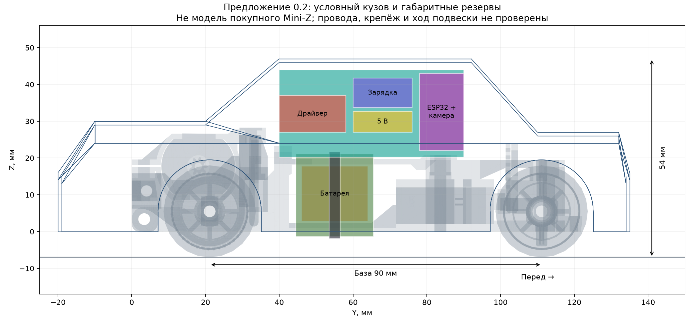

# Кузов и низкая компоновка 0.2

13 сентября 2026. Пользователь уточнил: сверху должен помещаться кузов модели автомобиля, чтобы машинка выглядела законченной. **Кузов задаёт ограничения компоновки. Полная конструкция ещё не готова.**

После следующего уточнения пользователя разработан [регулируемый вариант 0.3](adjustable-layout.md): силовой поддон и камера переставляются вдоль шасси независимо. Этот вариант 0.2 сохранён как исходное исследование низкой компоновки и условного профиля кузова; расположение салона одного кузова не закрепляется для всей платформы.

[Открыть вращаемую модель](body-study-viewer.html) · [Редактировать OpenSCAD](body-study.scad) · [Отчёт проверок](../docs/evidence/body-study-layout.json)



## Предложенная компоновка

Это второй вариант исследования, с условным силуэтом небольшого хетчбэка/купе. Контур создан нами для оценки необходимого места. Он **не снят с покупного кузова**, не является копией AE86 и не доказывает совместимость Mini-Z. Выбор готового либо собственного печатного кузова остаётся открытым. Колёсная база исходного zcar сохранена: 90 мм.

Перед находится по **+Y**, рулевая ось Y=111,125 мм; задняя ведущая ось Y=21,125 мм. В прежнем просмотрщике направление было подписано неверно, камера стояла сзади. Направление и положение камеры исправлены также в варианте 0.1.

1. **Батарея внизу под салоном**, поперёк рамы. Сохраняются макет 49×18×15 мм, независимые упоры и боковое извлечение после снятия кузова и освобождения фиксатора.
2. **Силовая электроника над батарейной полкой.** Драйвер лежит за узлом питания; зарядка располагается над низким преобразователем. Стойки зарядника и провода ещё нужно разместить.
3. **Одна компактная плата ESP32 для управления и камеры** вместо отдельных контроллеров. Вертикальный узел расположен под передней частью крыши, объектив предполагается направить через область лобового стекла. Камера крепится к шасси: снятие кузова не должно требовать отсоединения её шлейфа.
4. **Кузов снимается целиком.** Магниты — основной кандидат. Фиксация батареи от кузова не зависит; точки магнитов должны обходить батарейный выход и рулевой узел. Их размеры/усилие и механические направляющие ещё не рассчитаны.
5. **USB-C доступен после снятия кузова**, как предложение для первого экземпляра. Выключатель, разъём, кабель и общая цепь зарядки/прошивки ещё не размещены. Постоянное отверстие в каждом сменном кузове пока не проектируется.

| Объём | Размер X×Y×Z, мм | Нижний угол X; Y; Z, мм | Условие |
| --- | --- | --- | --- |
| Общая плата ESP32 + камера | 23×12×21 | 13,25; 78; 22 | Габаритный бюджет, не точная модель XIAO/Waveshare; отдельный контроллер убран только в этом предложении |
| Драйвер | 30×18×10 | 9,75; 40; 27 | Будущая плата с обвязкой; разводки пока нет |
| Преобразователь 5 В | 33×16×5,7 | 8,25; 60; 27 | Низкий модуль без высоких клемм/штырей; не подтверждённая высота выбранного для стенда варианта -M |
| Зарядка 2S | 33×16×8 | 8,25; 60; 33,7 | Резерв, конкретная плата и крепёж не выбраны |
| Основание площадки | 43×36×2 | 3,25; 40; 24 | Четыре ножки на прежней полке; передняя полочка камеры ниже основной площадки |

Размер 33×16×5,7 мм взят как ориентир низкого исполнения из [Waveshare Wiki](https://www.waveshare.com/wiki/DC5-36-TO-DC3V3-5), ранее разобранного в [подборе питания](../docs/drive-candidates.md). Нельзя перенести этот результат на модуль -M с разъёмами или с дополнительным радиатором. Нагрев, допустимый ток и доступность нужного исполнения остаются условиями выбора. Сокращение высоты здесь получено **сменой варианта электроники**, а не уменьшением модели того же покупного блока.

## Кузов и ограничения

Предложенный наружный габарит — примерно **70×155×54 мм от пола до крыши**. Последнее число включает колёса: их низ Z=−7 мм, крыша Z=47 мм. Вариант 0.1 занимал 62 мм без кузова. У новой площадки верх Z=44 мм, электроника до Z=43 мм, внутренняя крыша условной оболочки Z=46 мм. Это небольшой запас: провода/антенна могут его израсходовать.

Крыша сужается до 50 мм снаружи и 48 мм внутри; лобовое стекло опускается от Y=92, Z=47 к Y=110, Z=27. Таким образом проверяется профиль салона и капота, а не только общий прямоугольный ящик. Внутренняя оболочка получена условным отступом 1 мм по заданным координатам; это не равномерная по нормали стенка для печати. Арки радиусом 14 мм — статическая иллюстрация, не рассчитанный свободный ход колёс.

**У готового кузова геометрия может оказаться теснее.** Нужны его внутренняя ширина на разных высотах, профиль крыши/капота, база, колея/вылеты и крепления. Проверенный автором zcar MZQ101 — конкретный кузов, а не гарантия для всех Mini-Z. Если реальная оболочка не покрывает этот объём, переделывать расположение/подбор плат или рассматривать другое шасси; не объявлять посадку по совпадению масштаба.

Для FPV ещё требуются положение объектива, шлейф, поле зрения и проверка, сколько капота видно в кадре. Печатное/непрозрачное лобовое стекло потребует аккуратного отверстия; прозрачное — проверки искажений и отражений. Окно объектива в этой оболочке пока не вырезано. Антенне нужно отдельное место с проверкой связи под кузовом; металлическая окраска/магниты не входят в текущую проверку.

Общая ESP32 для видео и управления — **архитектурное предложение, прошивки пока раздельные**. До принятия нужны совместный FPV ≥30 FPS, задержка команд, отключение/зависание камеры с сохранением управления и независимая остановка по watchdog при потере команд. Удаление второго контроллера из рисунка не доказывает FAIL-01/CAMERA-03. Работа без установленной камеры должна сохраняться.

## Что проверено

Скрипт проверяет замкнутость добавленных объёмов, их попарные пересечения, отсутствие пересечения с рамой/полкой и консервативными ограничивающими объёмами остальных частей механики, четыре опорные площадки по 36 мм² и боковой ход батарейного макета на 50 мм. Добавленные детали и батарейный узел находятся внутри **нашей условной** оболочки и не пересекают её стенки. Намеренное поднятие камеры на 8 мм даёт пересечение с крышей — положительная контрольная проверка.

Не проверены: конкретный покупной кузов, все исходные механические детали относительно оболочки, ход руля/подвески, проводка и антенна, реальные платы/разъёмы, доступ пальцами к ремешку, магнитное крепление, нагрузки/нагрев, печать и физическая сборка. Макеты зарядника и камеры не имеют завершённого крепежа. [Экспорт площадки](body-study-carrier.stl) — одно замкнутое тело, не готовое задание на печать.

В Chrome проверены отрисовка, виды сверху/сбоку, скрытие оболочки и разнесение. Контур кузова показан линиями, чтобы видеть распределение места. Разнесение — только иллюстрация, не последовательность монтажа.

После подготовки исходного клона и батарейной модели по [README](README.md):

```powershell
uv run --with-requirements tools/cad-requirements.txt python tools/build_cad_assembly.py --body-study
```

Следующий результат по CAD — примерка конкретной оболочки и точных плат, затем крепления, проводка, окно камеры и проверка движения колёс. Этот вариант показывает направление компоновки, а не завершённую машину.
