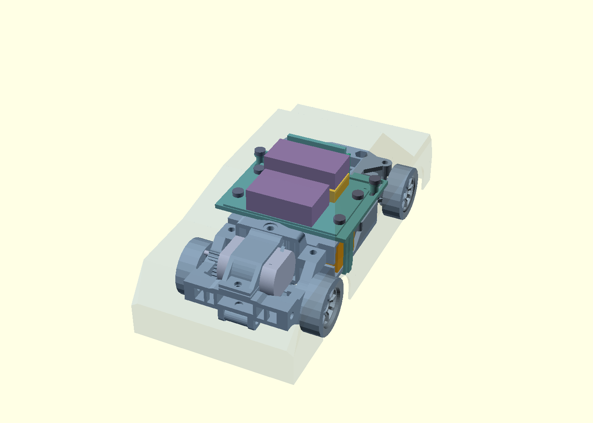

# Примерка конкретных кандидатов 0.4

13 сентября 2026. По уточнению пользователя начинаем заменять общие бюджеты геометрией конкретных покупных кандидатов. **Не все позиции уже выбраны, и не для всех есть полный чертёж.** Модель камеры импортирована, мотор построен по размерам; для серво/DC-DC пока используется опубликованный габарит. Крепление и работоспособность полной машины ещё не подтверждены.

[Открыть 3D-сцену](candidate-fit-viewer.html) · [OpenSCAD](candidate-fit.scad) · [Отчёт с источниками и SHA256](../docs/evidence/candidate-fit.json) · [Список для поиска покупок](../docs/aliexpress-shortlist.md)



| Кандидат | Что смоделировано | Что ещё неизвестно |
| --- | --- | --- |
| Seeed XIAO ESP32S3 Sense | Официальная STEP-сборка от **27 мая 2023**: основная плата, расширение, объектив, USB и компоненты. Габарит сетки 24,363×13,960×17,780 мм в осях сцены X×Y×Z | Соответствие нынешней ревизии OV3660, радиатор, антенна, провода и крепление. Это не модель ESP32C5 |
| F130-08450 12 V | Корпус 25,3 мм, круглое сечение Ø20,4 с двумя плоскостями на расстоянии 15,1 мм; вал Ø2 с выступом 11 мм. Отдельный макет корпуса по верхним допускам | Передний буртик, клеммы, детали торца, посадка в печатный зажим и пиньон, осевой запас |
| SG90 180°, кандидат ChipDip | Прямоугольный габарит из карточки 23×12,2×29 мм, повёрнут в горизонтальное положение | Карточка не даёт точную форму корпуса/ушей/вала и их привязку. Размер 29 мм может включать выступы; это не утверждённый сплошной корпус |
| Waveshare DC5-36-TO-DC3V3-5 | Низкий опубликованный габарит 33×16×5,7 мм в месте преобразователя | Высокие разъёмы версии -M, провода, высота с радиатором. Расположение мелких компонентов не выдумывается |
| 625ZZ | Отдельная модель кольцевого габарита: Ø16/Ø5×5 мм | Не моделируются внутренние шарики/щитки; подшипники исходной сборки не заменялись |

Драйвер 30×18×10 и зарядка 33×16×8 остались бюджетами: будущая плата TA6586 ещё не разведена, конкретный зарядный узел 2S не выбран. Случайные платы IP2326 разных продавцов нельзя считать одинаковыми по размерам/току/защите.

## Размещение и результат

Дополнительная [диагностика серво 0.1](servo-clearance/README.md) от 14 сентября разделила пересечение на четыре боковые зоны (7,000 мм³) и переднюю нижнюю (36,815 мм³). Проход рамы 22,8 мм уже номинальных 23 мм кандидата; исходная справочная модель серво имеет корпус шириной 22,4 мм. Поэтому все пересечения нельзя считать только ошибкой бруска. Геометрия этой сцены сохранена; образец и адаптация упоров остаются открытыми.

XIAO установлен вертикально, объективом по +Y, с USB сбоку. Полный контур центрирован по ширине шасси; нижняя точка Z=22 мм, задняя Y=79 мм. Его верх Z≈39,78 мм ниже прежнего резерва камеры Z=43; глубина больше прежних 12 мм. Сам объектив смещён относительно центра платы — положение окна в кузове ещё нужно привязать к нему.

STEP не масштабировался. После тесселяции часть поверхностей остаётся незамкнутой; модель не залечивалась ради положительной проверки. Для проверки внешнего свободного места взят **полный ограничивающий объём** импортированной геометрии. В нулевом положении он не пересекает раму/полку, добавленные площадки/крепёж, прочие бюджеты и низкий преобразователь и находится внутри условного кузова. Это консервативная проверка свободного места, **не проверка опирания платы на держатель**: у настоящей платы есть вырезы и выступы. Держатель ещё нужно адаптировать под конкретные точки контакта.

Мотор совмещён с осью исходного вала; её центр восстановлен по 24 вершинам торцевой окружности: Y≈18,064866, Z≈17,700000 мм. Предполагаемая передняя плоскость корпуса X=12,65 мм. Корпус/вал не пересекают раму и центральную полку; контакт с зажимом и посадка шестерни этим не проверены.

**Габаритный брусок SG90 пересекает раму примерно на 43,815 мм³.** Это выявленная неопределённость, а не доказательство, что SG90 не подходит: брусок заполняет области, где реальная форма может быть пустой или иметь выступ в другом месте, а положение по карточке недостаточно определено. До точного чертежа/STEP или измерения образца посадка STEER-CD-01 остаётся открытой. Пересечение не скрыто и не устранено произвольным уменьшением модели.

В сцене скрыты исходные корпуса мотора и серво zcar, чтобы их не спутать с новыми кандидатами. Исходные крепления, передача и качалка оставлены. [Регулировка 0.3](adjustable-layout.md) сохранена отдельно: её 144 проверки относятся к прежним бюджетам; **не переносятся автоматически на импортированные детали**. Эта сцена показывает только нулевое положение.

## Источники и воспроизведение

- [Seeed: открытые материалы XIAO, ссылка STEP Sense](https://wiki.seeedstudio.com/SeeedStudio_XIAO_Series_Introduction/), [архив производителя](https://files.seeedstudio.com/wiki/SeeedStudio-XIAO-ESP32S3/res/seeed-studio-xiao-esp32s3-sense-3d_model.zip). Неизменённый [STEP](components/xiao-sense-2023.step) включён в проект; дата взята из его заголовка, а не из даты скачивания.
- [Чертёж F130-08450](https://static.chipdip.ru/lib/799/DOC059799826.pdf), параметры и неопределённости [в подборе привода](../docs/drive-candidates.md).
- [Габариты Waveshare](https://www.waveshare.com/wiki/DC5-36-TO-DC3V3-5), [карточка конкретного SG90](https://www.chipdip.ru/product/servoprivod-tower-pro-sg90-180-s-neylonovym-reduktorom-8009579822).

После генерации варианта 0.3:

```powershell
uv run --with-requirements tools/cad-candidate-requirements.txt python tools/build_candidate_models.py
```

Скрипт проверяет SHA256 архива перед импортом, использует OpenCascade для STEP и OpenSCAD для размерных моделей, сохраняет источник, STL, HTML и числовой отчёт. Источник zcar и его GPL-3.0 остаются в `reference`; STEP Seeed — отдельный справочный материал производителя, его происхождение не подменяется лицензией zcar.
