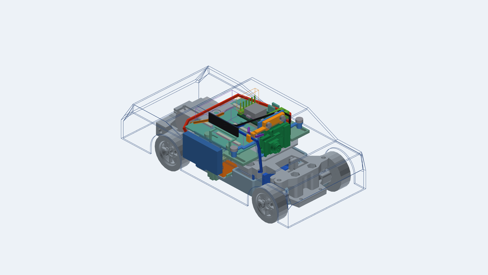

# Текущая компоновка 0.6: регулировка новых площадок

15 сентября 2026. [Открыть интерактивную сборку](viewer.html).
Она объединяет новый держатель XIAO, направляющие проводов, поддон с выемкой,
исправленный правый доступ к сервисному USB и исходную механику.



[Исходники деталей и общая SCAD-сборка](../harness-guides/README.md) ·
[Числовой отчёт регулировок](../../docs/evidence/current-adjustment-v06.json) ·
[Источники просмотрщика](../../docs/evidence/current-viewer-v06.json).

## Полезные положения

Заново проверены 144 пары с шагом 1 мм в диапазоне −3…+8 мм. **27 пар**
помещаются в учтённые твёрдые тела и полость условного кузова; у них свободен
и резерв штекера сервисного USB при снятом кузове. Это геометрически допустимые
положения, не проверенные рабочие конфигурации проводки или разные готовые кузова.

| Сдвиг силовых плат, мм | Допустимые положения камеры, мм |
| --- | --- |
| −1 | +3, +4, +5, +6, +7, +8 |
| 0 | +3, +4, +5, +6, +7, +8 |
| +1 | +4, +5, +6, +7, +8 |
| +2 | +5, +6, +7, +8 |
| +3 | +6, +7, +8 |
| +4 | +7, +8 |
| +5 | +8 |

Значения относятся к прежней системе координат: начальная сборка **0/+3 мм**.
Поэтому крайнее +5/+8 означает сдвиг обеих площадок на 5 мм вперёд относительно
начальной сборки. Диапазоны двух площадок зависят друг от друга — нельзя произвольно
комбинировать каждое значение из отдельных столбцов.

Число допустимых позиций нельзя прямо сравнивать с шестью в старой проверке 0.5:
изменился держатель, а вместо одного большого прямоугольника XIAO теперь используется
объединение **103 отдельных ограничивающих объёмов** STEP. Оно не заполняет пустое
пространство над выступающим объективом, поэтому меньше завышает занятую область
около скоса кузова. Это уточнение модели, а не измеренное улучшение физической посадки.

## Что учитывает проверка

- Перемещаются силовой поддон с направляющей, Waveshare/его ответный разъём,
  опоры, резервы драйвера/зарядки и основной крепёж; отдельно — XIAO, опора,
  прижим с направляющей, крепёж прижима и площадки.
- Проверяются взаимные пересечения групп, рама/полка, мотор/серво, батарейные
  элементы, пассивный зарядный USB, антенна с опорой и полость условного кузова.
- Учтены центры обоих винтов камеры в существующих пазах. После переноса правого
  крепления на 4 мм назад не весь прежний диапазон положения камеры доступен.
- Сервисный USB проверяется по оценочному объёму штекера; реальный кабель ещё не измерен.

Контрольные примеры: `0/0` выводит крепёж за проверенный диапазон паза; `+8/+8`
даёт пересечение деталей; `−3/+3` свободно по механике, но выходит за условный кузов.
Эти состояния различаются в просмотрщике.

## Провода и обслуживание

Форма трасс и [снятие кузова/батареи/прижима](../harness-guides/README.md)
проверены только при **0/+3**. Для остальных положений пять трасс автоматически
скрываются, а сообщение прямо требует проверки проводки и обслуживания.
Не выполняются фиктивное растяжение кабелей или перенос прежней проверки на новый
жгут. Геометрическая свобода штекера среди твёрдых деталей не гарантирует доступ
между реальными проводами.

Переставлять площадки предполагается при выключенной машине, с освобождением
фиксаторов жгута и последующей перекладкой/фиксацией. Полный запас длины, радиусы
изгиба, нагрузки на разъёмы и сохранение сигнала ещё не рассчитаны.
Непрерывный ход между выбранными точками, ход подвески, удержание винтами, фактический
кузов, ревизия OV3660, печать и работоспособность машины не подтверждены.

## Просмотр и воспроизведение

Ползунки и три примера компоновки находятся сверху. «Детали и видимость» раскрывает
список компонентов; доступны виды сверху/сбоку и вращение мышью. HTML автономный,
без CDN. Провода видны только в начальной компоновке.

```powershell
uv run --with-requirements tools/cad-candidate-requirements.txt python tools/check_current_adjustment.py
uv run --with-requirements tools/cad-candidate-requirements.txt python tools/build_current_viewer.py
```

Геометрия берётся из зафиксированных STL/STEP-данных предыдущих итераций.
Изменения этих исходников требуют повторной проверки. SCAD-сборка по ссылке
открывается в начальном положении; интерактивные сдвиги задаются в HTML и не
перезаписывают файлы деталей. Старые просмотрщики оставлены как история.

Происхождение моделей: [NOTICE](../packaging-v05/NOTICE.md),
[zcar/GPL-3.0](../reference/NOTICE.md). Физической примерки пока нет.
