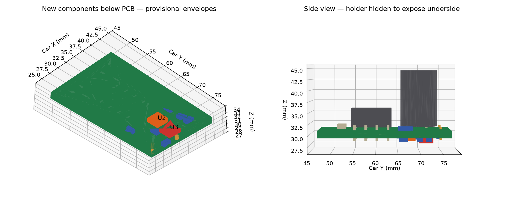

# Привод и питание на одной плате — примерка 0.1

15 сентября 2026. [Открыть интерактивную машинку](viewer.html) · [схема и PCB](../../hardware/drive-power-carrier/README.md) · [STEP новых компонентов и PCB](added-power-and-pcb.step) · [составной STL всей платы](combined-reserves.stl) · [числовая проверка](../../docs/evidence/drive-power-carrier-v01/fit.json).

Сохранены PCB **30 × 18 × 1,6 мм**, её положение и прежний держатель. Питание XIAO добавлено преимущественно снизу. Габарит узла в координатах машинки: X=25,75…43,75; Y=47…77; Z=28,0…44,6 мм — **18 × 30 × 16,6 мм**. Новые компоненты опускаются на 0,6 мм ниже прежнего нижнего резерва; верхняя граница не изменилась.

Проверены 11 новых объёмов против 156 учтённых препятствий, новой PCB, друг друга и полости условного кузова. В начальном положении электроники 0 / камеры +3 мм пересечений свыше 0,001 мм³ нет. Контрольная ошибка — перемещение U3 внутрь PCB — даёт пересечение 15,36 мм³. Старую PCB заменили такой же по контуру с двумя дополнительными отверстиями; заново проверялись именно добавленные компоненты, а не вся история испытаний старой сборки.

Резерв TPS737 — 3,1 × 3,1 × 1,05 мм; MAX40200 — предварительный 3,2 × 3,2 × 1,5 мм. Небольшие параллелепипеды H8/H9 обозначают только место вывода/пайки. Координаты площадок, центры компонентов и сторона монтажа сверены с PCB отдельной проверкой. Полная форма выводов SMD, припой и тепловые переходы в CAD не смоделированы. STEP содержит новую PCB и 11 новых резервов; прежние корпуса драйвера/конденсатора доступны в составном STL и просмотрщике.

Просмотрщик показывает собранное положение и позволяет вращать машинку/скрывать детали. Он не утверждает проверку новых движений при обслуживании. Путь снятия платы, все другие регулировки и новые провода H8/H9 ещё нужно проверить. Данные старого просмотра `current-service` остаются историческими для его комплектации. Кузов и несколько компонентов условные; реальная посадка, теплоотвод и прочность не проверены.

STL — модели электронной сборки для компоновки, не задания на печать. **Пользователь отложил печать.** Материал, IP принтера и запуск печати сейчас не требуются.

Геометрия общей машинки и атрибуция наследуются из [packaging-v05/NOTICE](../packaging-v05/NOTICE.md), включая zcar GPL-3.0, SG90 и Seeed. Новые простые модели построены из проекта PCB и явно обозначенных резервов. [Хеши источников визуализации](../../docs/evidence/drive-power-carrier-v01/view.json).
