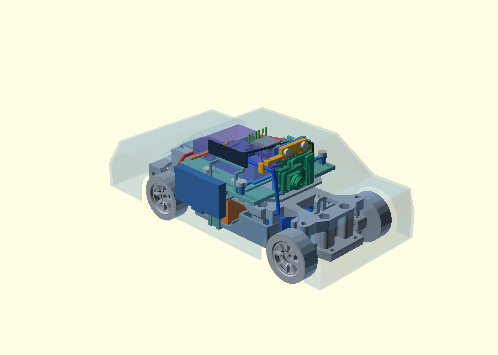

# Направляющие проводов и обслуживание — 0.1

15 сентября 2026. Продолжение [держателя XIAO](../xiao-mount/README.md).
Две направляющие добавлены непосредственно в печатные детали: силовая — в
левый край поддона, серво — в боковое крыло верхнего прижима XIAO.



[Крупный вид](../../docs/evidence/harness-guides-close.png) ·
[Редактируемые детали](../harness-guides.scad) ·
[Редактируемая сборка](../harness-guides-assembly.scad) ·
[Отчёт](../../docs/evidence/harness-guides-v01.json).

## Удержание и изготовление

Это открытые седловидные направляющие, **не защёлки**. Провод укладывается сверху
и дополнительно удерживается съёмной стяжкой либо шнуром. В силовой направляющей
есть проход 2,8×1,3 мм под седлом; на крыле прижима — отверстие 1,3×2,8 мм.
Радиус ложа 1,25 мм рассчитан как резерв относительно нынешних коридоров проводов
радиусами 1,0 и 0,9 мм. Он не устанавливает сечение жил или диаметр реального жгута.
Конкретные стяжки, их замки, затяжка и допустимое сдавливание изоляции ещё не выбраны.

Направляющие объединены со своими основаниями в замкнутые связные тела.
Дополнительный клей или саморезы для их крепления не предусмотрены.
Гибкость консольного крыла, прочность печати и удержание при ударе не проверены.
Остальные провода пока не имеют новых фиксаторов; это не законченный жгут машины.

Для примерки подготовлены:

- [Поддон с силовой направляющей](tray_print.stl), около 53,25×48×8,5 мм.
- [Прижим с направляющей серво](cap_print.stl), около 32,75×8,2×3,5 мм.

Они заменяют прежние поддон с выемкой и прижим в этой итерации. Опора XIAO,
крепёж, схема электрических соединений и размеры остальных плат не менялись.
Экспорты расположены на Z≈0; ориентацию, мосты/поддержки и профиль K1C ещё нужно
проверить в слайсере. G-code и фактическая печать не выполнялись.

## Повторная проверка обслуживания

Проверяется **начальная компоновка: платы 0 мм, камера +3 мм**. Используются новая
опора, прижим, крепёж XIAO и переложенные трассы из предыдущей итерации, а не старая
опора 0.5. Сервисный USB остаётся направленным по +X; его резерв проверен отдельно.

| Проверка | Объём проверки | Результат для учтённой геометрии |
| --- | --- | --- |
| Новые направляющие | Детали электроники, 103 ограничивающих объёма STEP, трассы, крепёж, резерв сервисного USB | Непредусмотренных пересечений нет; объединение с собственной печатной основой намеренное |
| Посадка под кузовом | Новые поддон и прижим против полости условного кузова | Выхода за полость нет |
| Снятие кузова с крышкой зарядного порта | +2 мм Z, затем +1 мм X, затем подъём до +65 мм Z; 76 положений | Пересечений нет |
| Снятие левого упора батареи | 6 мм наружу, 25 положений | Пересечений нет |
| Выход батареи влево | Весь объём прямого хода макета на 50 мм; кузов/ремешок/левый упор сняты, правый оставлен | Пересечений нет |
| Снятие нового прижима | +1,1 мм Z, затем +8 мм Y; 28 положений | Пересечений нет при снятых винтах и отведённом проводе серво |

Перед снятием прижима требуется освободить его стяжку и **вынуть провод серво из
направляющей**, затем отвести его. Свободная форма провода и достаточность его
гибкости/запаса длины не моделировались. Для обычной замены батареи прижим снимать
не требуется. Снятие кузова моделируется с отключённым внешним USB-кабелем.

Контрольные неправильные операции действительно обнаруживаются: выход батареи
с левым упором даёт 123,000 мм³ пересечения; прямой подъём кузова на 7 мм —
14,821 мм³ пересечения с зарядным USB. Числа характеризуют коллизии, не силу удержания.

Проверка кузова/упора/прижима выполнена в отдельных положениях; только для коробки
батареи проверен непрерывный прямой ход. Не учтены пальцы, реальные разъёмы и хвост
аккумулятора, форма стяжек, магниты, некоторые детали исходной подвески/передачи,
нагрузки, другой кузов и другие положения регулировок. Батарея и часть электроники
остаются размерными резервами; камера — справочная STEP 2023, не измеренная OV3660.
Физическая посадка, зарядка, радиосвязь и готовность машины к заезду не подтверждены.

Воспроизведение:

```powershell
uv run --with-requirements tools/cad-candidate-requirements.txt python tools/build_harness_guides.py
```

Отчёт содержит SHA256 входов. Трассы восстанавливаются из точек/радиусов исходных
отчётов, чтобы не использовать незамкнутый STL силового провода как твёрдое тело.
Происхождение заимствованных моделей и их лицензии сохраняются по
[NOTICE компоновки](../packaging-v05/NOTICE.md) и [источнику zcar](../reference/NOTICE.md).
