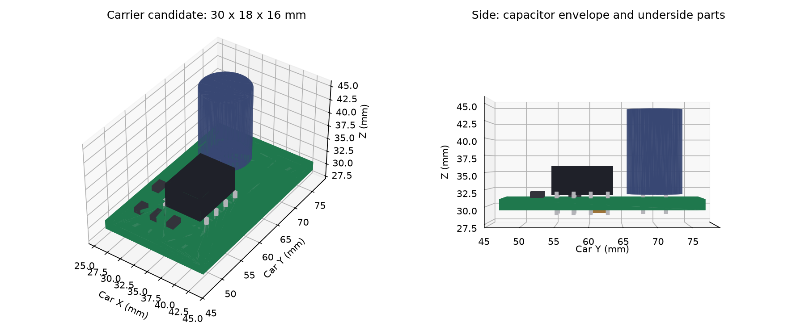

# Примерка платы привода, 0.1

Следующая отдельная проработка: [съёмное крепление и STL для пробы](../motor-carrier-mount/README.md). Ниже сохранена исходная примерка платы без этого держателя.

15 сентября 2026. [Открыть интерактивную машинку](viewer.html) · [STEP платы](carrier.step) · [схема/PCB/BOM](../../hardware/motor-carrier/README.md).

В отдельной сцене заменён условный блок драйвера из компоновки 0.6 на модель нового носителя TA6586: PCB с отверстиями, корпус и ножки DIP8, резисторы, нижний C1, корпус и выводы C2. Геометрия взята из координат новой PCB и чертежей корпусов; это собственная модель для компоновки, не заводской STEP. Медные дорожки/паяные соединения/точные изгибы ножек в STEP не воспроизведены. Цвета доступны в просмотрщике; STEP — составное тело без цветов.

Размер узла в координатах машинки **18 × 30 × 16 мм**, X=25,75…43,75, Y=47…77, Z=28,6…44,6. Раньше высота блока была 10 мм. Основное увеличение даёт вертикальный электролит C2 с учётом максимальных размеров из документации. Его конкретный артикул и вариант монтажа пока предложены агентом.

В начальном положении электроники 0 / камеры +3 мм модель не пересекает учтённые детали, 103 объёма компонентов XIAO, резерв сервисного USB и полость условного кузова. **Старая антенная трасса пересекала C2 на 8,909 мм³.** Новый обход проходит по Y=76,5 мм, затем снаружи конденсатора; проверка твёрдых тел/полости не находит пересечений. Конечный контакт с антенной исключён намеренно. Трасса обозначает резерв Ø1,3 мм, а не измеренный кабель.

[Числовой отчёт, маршрут и исходные хеши](../../docs/evidence/motor-carrier-fit-v01.json).

Эта примерка не переносит прежние результаты 144 положений и снятия кузова на новую плату. Здесь только 0/+3; движения при обслуживании, фиксация платы, прочность, реальные корпуса деталей и кузов не проверены. Четыре остальных старых провода скрыты по умолчанию: подключения надо переложить к площадкам H1…H7. Натяжение, радиусы изгиба, фиксация антенного кабеля и пересечения проводов между собой остаются открыты. Старый просмотрщик `cad/current-layout` сохранён со своей геометрией и доказательствами.

Общая механика и внешние модели унаследованы из [компоновки 0.5 и её NOTICE](../packaging-v05/NOTICE.md), включая zcar GPL-3.0, SG90 и Seeed STEP. Сохраняются ссылки на источники и лицензии. Собственные модели новой платы не импортированы из внешней CAD-библиотеки.

Повторная сборка: `uv run --with-requirements tools/cad-candidate-requirements.txt python tools/build_motor_carrier_cad.py`. Используется OCP напрямую: установленный CadQuery даже после простого построения куба завершался кодом 1; OCP выполняет экспорт и проверки с кодом 0. Предупреждение trimesh о центре массы пустого пересечения не является геометрическим пересечением; массы не рассчитываются.
