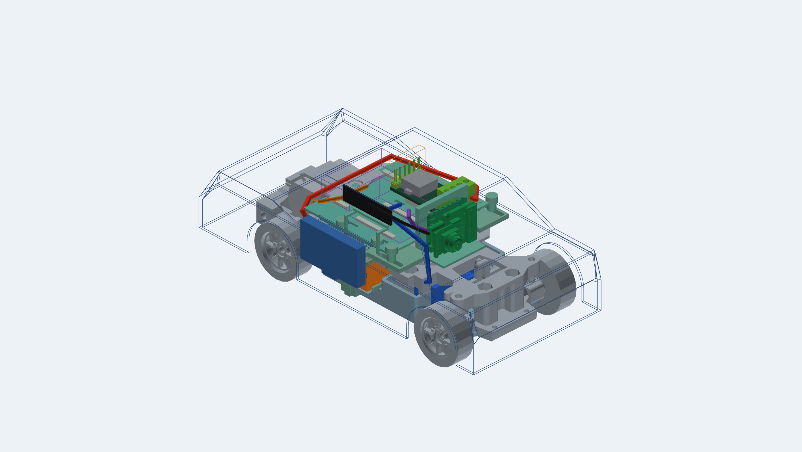

# Детальная компоновка 0.5

15 сентября 2026. Предложение размещения деталей первого прототипа под кузовом.
Все пять позиций для стенда заказаны пользователем и находятся в пути: антенна
WROOM, XIAO ESP32S3 Sense с OV3660, F130, SG90 и Waveshare. Эта сборка позволяет
продолжать проектирование до получения образцов; физическая посадка ещё не проверена.

[Открыть вращаемую 3D-модель](viewer.html) · [Редактируемый OpenSCAD](layout.scad) ·
[Числовые проверки](../../docs/evidence/packaging-v05.json) · [Происхождение моделей](NOTICE.md)



В просмотрщике можно скрывать детали, смотреть сверху/сбоку и отдельно перемещать
силовые платы и камеру. Начальное положение: платы **0 мм**, камера **+3 мм**.
Плюс направлен вперёд, к управляемым колёсам. Провода показаны только для этого
положения: при перемещении площадок они скрываются, поскольку запас длины ещё не рассчитан.

## Что изменено

| Узел | Геометрия и размещение | Степень достоверности |
| --- | --- | --- |
| SG90 | Импортирован STEP с корпусом, ушами и выходным валом. Совмещён с осью исходной качалки, без масштабирования | Справочная модель FreeCAD, не CAD конкретного заказанного экземпляра |
| XIAO Sense | Сохранена STEP-сборка Seeed с объективом, USB и компонентами; вертикально спереди, на независимой площадке | Модель 2023 года; соответствие ревизии OV3660 ещё не установлено |
| Waveshare -M | Плата 33×16 мм вдоль левого борта; добавлены отверстия, катушка, клеммы, штырьки и резерв ответного разъёма. Клеммы обращены вперёд | Контур/шаги отверстий по чертежу, компоненты по фото; высоты клемм, хвостов пайки и ответного разъёма оценочные |
| Драйвер | Резерв 30×18×10 мм развёрнут вдоль правой стороны | Плата ещё не разведена, размер может измениться |
| Зарядка | Резерв 33×16×8 мм перенесён назад, за преобразователь | Полный зарядный узел ещё не скомпонован на PCB; это выделенное место |
| Поддон | Удлинён до 52×48 мм; добавлены прорези под фиксацию и диэлектрические опоры | Предложение для печати, прочность и удержание плат не проверены |
| Антенна | Боковой резерв FPC 27×7×1 мм, отдельная опора вне движения поддона | Размер комплектной антенны неизвестен; это не проверенная RF-зона |
| Зарядный USB-C | Включены ранее разработанные пассивная PCB, гнездо, крепление и съёмная крышка | Геометрия связана с KiCad; изготовление и удобство кабеля ещё не проверены |
| LW и мотор | Сохранены макет батареи 49×18×15 мм и размерная модель F130 | Батарея по карточке покупки, мотор по чертежу; нужны измерения образцов |

Прежний вариант ставил резерв зарядки над низким DC-DC. Добавление высоких клемм
-M даёт в той компоновке около **438 мм³ пересечения** при принятых оценках.
Поэтому зарядный узел перенесён назад, а драйвер и преобразователь размещены рядом.

## Проверенные зазоры и оставшиеся ограничения

- STEP серво пересекает исходную раму на **3,724 мм³**. Создан отдельный вариант
  `frame-relief-proposal.stl` с четырьмя локальными выемками в боковых упорах.
  Пересечение с этим STEP стало **0 мм³**, снято 23,167 мм³; рама осталась одним
  замкнутым связным телом. Исходник сохранён в `inputs/frame.stl`.
  Проход около 23,4 мм и припуск 0,2 мм/сторону — предложения, не измеренные допуски.
  Прочность, прижим корпуса, крепёж и движение качалки ещё нужно проверить.
- Пересчитаны **144 пары положений** с шагом 1 мм в пределах −3…+8 мм.
  Для проверяемых тел **шесть** пар проходят и геометрические проверки, и условный
  кузов: платы/камера `−1/+2`, `−1/+3`, `−1/+4`, `0/+3`, `0/+4`, `+1/+4` мм.
  Полный ход пазов 11 мм поэтому пока не является полезным диапазоном собранной машины.
- Внутренних пересечений между корпусом Waveshare, поддоном и резервами драйвера/
  зарядки в начальном положении не найдено. Посадка ответного разъёма на штырьки
  и контакт опор с платами считаются намеренными сопряжениями.
- Пять трасс проводов проверены относительно рамы, центральной полки, батареи,
  мотора, основания USB и полости условного кузова. Это коридоры размещения,
  **не электрическая схема и не длины отрезания**. Конкретные контакты, сечения,
  радиусы изгиба, фиксация и контакт со всеми компонентами не квалифицированы.
- Незамкнутые поверхности STEP XIAO не исправлялись ради проверки: для внешних
  зазоров используется полный ограничивающий объём. Опирание платы на держатель,
  доступ штекера сервисного USB и окно объектива требуют отдельной деталировки.
- Оболочка остаётся условным кузовом 70×155 мм, высота до крыши 47 мм от базы CAD
  (54 мм с нижней точкой колёс). Это не модель купленного Mini-Z-кузова.
  Ход подвески/руля, снятие кузова с новыми проводами, извлечение батареи и
  крепление магнитов в этой итерации заново не проверены.

Рабочее положение полезно для дальнейшей деталировки, но не означает завершение
всей механики. Ближайшие задачи: посадочные поверхности камеры/серво, фиксация
проводов и плат, проверка реального кузова и замена резервов готовыми PCB.

## Воспроизведение

Нужны OpenSCAD по пути из скрипта, `uv` и зафиксированные зависимости. Из корня:

```powershell
uv run --with-requirements tools/cad-candidate-requirements.txt python tools/build_packaging_v05.py
```

`inputs/` содержит зафиксированные экспорты прежних итераций: `adjustable-*` из
`cad/adjustable-layout.scad`, `usb-*` из `cad/usb-port-study.scad`, раму и полку из
исходной сборки zcar. Их SHA256 включены в отчёт. После изменения этих исходников
экспорты нужно осознанно обновлять, а не использовать старые проверки новой геометрии.
Генерация 0.5 не требует прежнего игнорируемого каталога `build/`.

Скрипт импортирует STEP, создаёт отдельные STL, сцены HTML/PNG и проверяет тела
через OpenCascade/OpenSCAD и булевы операции Manifold. Статические положения
не доказывают свободу непрерывного движения. HTML работает локально без CDN.
В Chrome проверены WebGL, два ползунка, допустимое/недопустимое положение,
переключатели видов и скрытие кузова; снимок выше получен из его canvas.

Дополнительные изображения: [сверху](../../docs/evidence/packaging-v05-top.png),
[сбоку](../../docs/evidence/packaging-v05-side.png),
[изометрия OpenSCAD](../../docs/evidence/packaging-v05-overview.png).
