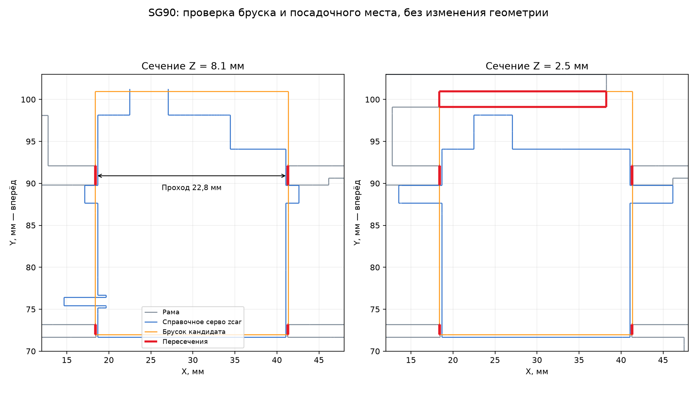

# Зазоры серво 0.1

14 сентября 2026. [Открыть 3D-сравнение](viewer.html) · [OpenSCAD](study.scad) ·
[Числа и хеши](../../docs/evidence/servo-clearance.json).

**Номинальный проход рамы 22,8 мм уже указанной ширины кандидата SG90 23 мм.**
Подтверждённой посадки STEER-CD-01 пока нет. Это уточнение геометрии, а не
законченная адаптация рамы или новый выбор сервопривода.



## Что обнаружено

Все размеры ниже — миллиметры CAD, без допусков печати и покупной детали.
Участок рамы получен из прежней восстановленной замкнутой сетки zcar; он не
изменялся ради посадки. Перед машины — +Y.

| Измерение | Результат |
| --- | ---: |
| Внутренняя левая поверхность боковых упоров, X | 18,45 |
| Внутренняя правая поверхность, X | 41,25 |
| Проход между упорами | 22,80 |
| Ширина задней плоской грани справочного серво из zcar | 22,40 |
| Ширина бруска кандидата, взятая из карточки | 23,00 |
| Заход бруска в каждый боковой упор при нынешнем центрировании | 0,10 |

Грань исходного серво измерена по четырём вершинам при Y=71,675:
X=18,65…41,05, Z=2…14,2. Эти 22,4 мм объясняют запас исходной компоновки,
но **не являются паспортом продаваемого SG90**. Перенос корпуса вбок не
устраняет разницу общей ширины 23/22,8; смена положения вала также потребует
проверки кинематики и крепления.

Прежние 43,815 мм³ пересечения бруска состоят из пяти раздельных объёмов:

- Четыре тонкие боковые зоны, суммарно 7,000 мм³: две слева и две справа,
  по Y≈71,975…73,175 и 89,825…92,125, Z=2…12.
- Передняя нижняя зона 36,815 мм³: Y≈98,625…100,975, Z=2…3.
  Здесь брусок заполняет место вокруг выступающего вала. Справочная форма
  zcar устроена иначе; эта часть может завышать реальное пересечение. Для
  конкретного товара форма и её привязка пока не подтверждены.

Нельзя удалить из рамы все пять зон по бруску и назвать результат готовым:
вторая зона может оказаться ложной, а ушки, шлиц, провод и крепёж брусок
вообще не учитывает. Исходная поверхность серво незамкнута; она используется
только для просмотра/сечений, без автоматического «залечивания» и объёмной
проверки совместимости. Красные объёмы рассчитаны исключительно между
замкнутыми рамой и прежним бруском.

## Источники и следующий образец

14 сентября повторно прочитана [карточка ChipDip 8009579822](https://www.chipdip.ru/product/servoprivod-tower-pro-sg90-180-s-neylonovym-reduktorom-8009579822)
через браузер: 23×12,2×29 мм, бренд «Нет торговой марки», аналоговый SG90 180°.
Карточка содержит фото, но не найден размерный чертёж корпуса/ушек/вала.
Цена по этой проверке 170 ₽, 179 шт. на складе Москвы, срок 4–7 дней;
самовывоз в Чебоксарах ориентировочно 20 сентября. Это не резерв или заказ.

У [TowerPro SG90 Analog](https://towerpro.com.tw/product/sg90-analog/)
также приведены общие габариты 23×12,2×29 мм и таблица размеров A…F.
Её связь с конкретной безымянной партией не подтверждена. Найденный
[другой PDF SG90 в ChipDip](https://static.chipdip.ru/lib/471/DOC002471655.pdf)
указывает приблизительно 22,2×11,8×31 мм и не привязан к этой карточке;
он не использован для уменьшения выбранного макета.

Первым нужен один образец, а не партия на всю серию. Для адаптации снять:
ширину/толщину прямоугольного корпуса, высоту до крышки и до конца шлица,
смещение оси относительно корпуса, положение ушек/отверстий, выступ провода
и габарит применяемой качалки. Проверять как установку, так и извлечение.

Если фактическая ширина окажется 23 мм, агент предлагает начать примерку
с прохода 23,4 мм (по 0,2 мм на сторону), то есть на 0,6 мм шире нынешнего.
Это **предложенный припуск**, не измеренный допуск принтера и не выполненный
разрез рамы. Перед изменением проверить остаточную толщину/прочность упоров
и привязку вала к тяге. Образец может потребовать других значений; окончательно
менять серво или раму по одному общему габариту преждевременно.

## Файлы и воспроизведение

`frame.stl` — обрезанный для просмотра участок неизменённой рамы;
`upstream-servo.stl` — открытая поверхность компонента 176 исходной сборки;
`interference.stl` — пять диагностических объёмов. **Это не набор для печати.**
Исходный [zcar 4b714e6](https://github.com/alexyu132/zcar/tree/4b714e63fa30ed2030a8a48ab15f1e4a5fa380c4)
и производные файлы сохраняют [источник и GPL-3.0](../reference/NOTICE.md).
Брусок кандидата импортируется из предыдущей сцены без изменения.

После подготовки [примерки кандидатов](../candidate-fit.md):

```powershell
uv run --with-requirements tools/cad-requirements.txt python tools/build_servo_clearance.py
```

Скрипт проверяет исходные привязки, выделяет пять пересечений, сохраняет
сечения/3D-сцену и сверяет неизменность хешей входной геометрии. Здесь не
меняются прежние проверки батареи, USB или регулируемых плат; физические
посадки, ход рулевого механизма, усилие и питание ещё не испытаны.
