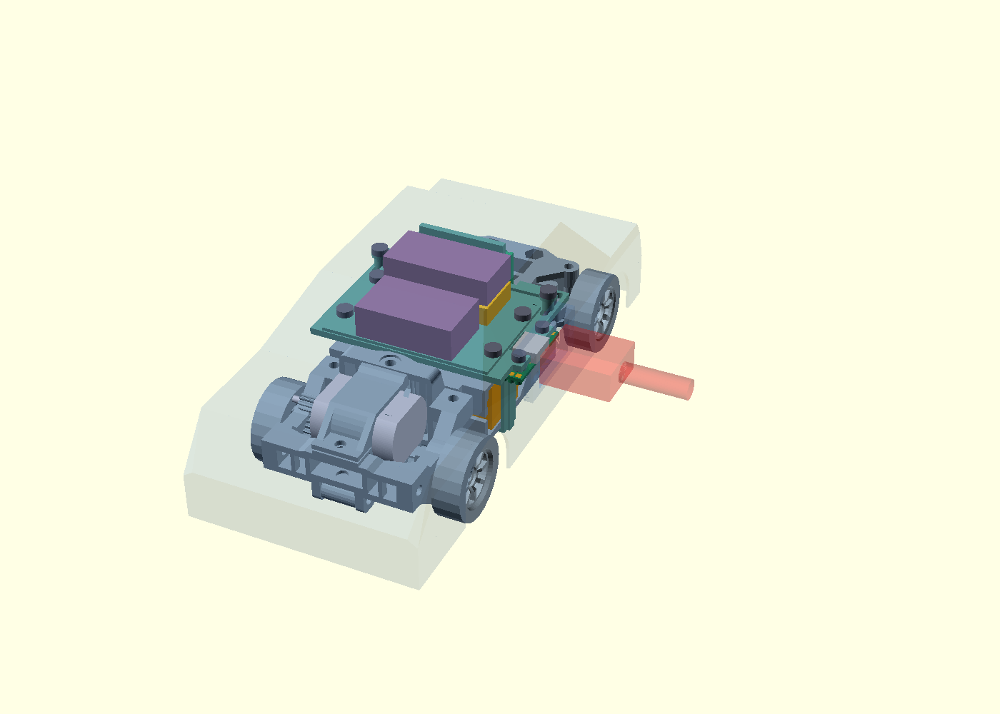
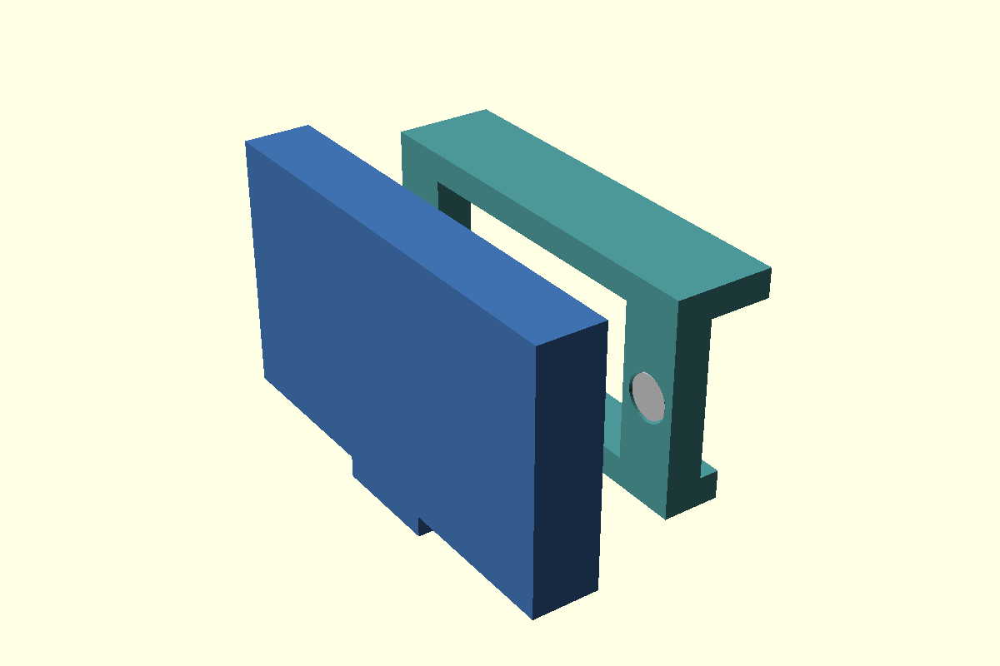
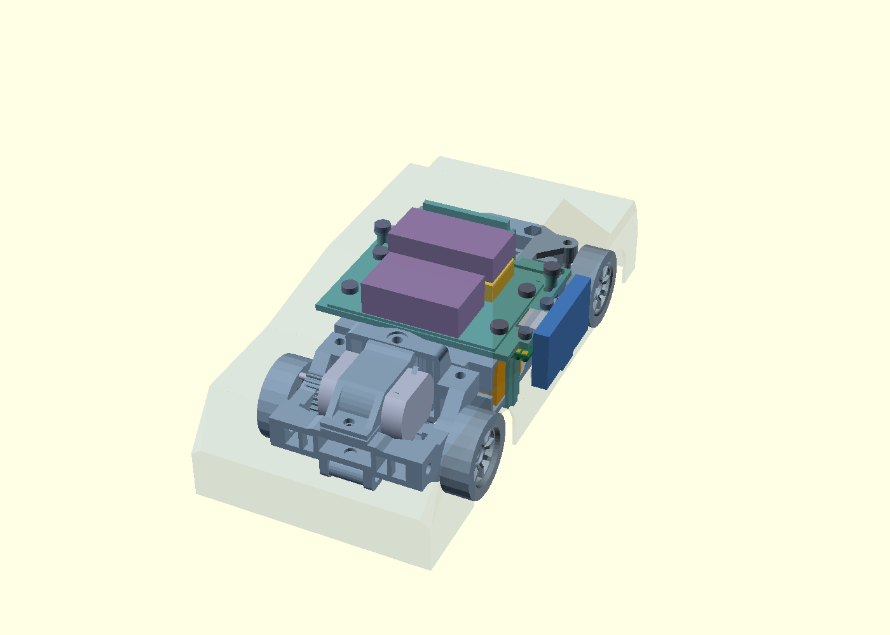

# Зарядный порт: боковая компоновка 0.3

14 сентября 2026. Предложение USB-MOUNT-01 v0.4 для текущего условного кузова. **Геометрия проверена, плата разведена, узел не изготовлен.** Боковое расположение — вариант агента для этой примерки, не новое требование пользователя. Добавлена съёмная магнитная крышка с бортиком и упорами; усилие удержания и удобство пока не измерены.

Добавлена [плата порта KiCad](../hardware/usb-port/README.md): GCT USB4105-GF-A, два отдельных Rd 5,1 кОм и шесть выводов жгута. DRC — 0 нарушений / 0 неподключённых соединений. Проверка площадок обнаружила выход за прежний край на 0,33 мм: разъём сдвинут на 0,6 мм наружу, плата удлинена до 26 мм для пайки жгута. Посадочные отверстия, монтажные выводы и площадки перенесены в CAD из KiCad; электрических испытаний ещё нет.

[Открыть вращаемую 3D-сцену](usb-port-study-viewer.html) · [Исходник OpenSCAD](usb-port-study.scad) · [Числовой отчёт](../docs/evidence/usb-port-study.json)

В сцене есть кнопки «Порт скрыт» и «Подключение кабеля» и переключатели деталей. Красный контур — условный штекер/кабель; это резерв свободного места, не часть автомобиля.



## Конструкция

Разъём направлен вбок по +X между колёсами, центр по длине Y=59 мм. Маленькая плата порта закрепляется под двумя новыми опорами **неподвижного основания**. Зарядный контроллер остаётся отдельным узлом, связь с ним — жгут, ещё не разведённый и не проложенный. Кузов снимается независимо от порта.

Первое размещение платы под полкой пересекало полку и ремешок батареи. В итоговой геометрии плата вынесена за боковую грань полки. Основание получило два выступа, отверстия под крепёж и вырез под корпус USB. Оно заменяет прежнее основание регулируемой компоновки, а не добавляется поверх него.

| Элемент | Размер / положение, мм | Основание |
| --- | --- | --- |
| GCT USB4105-GF-A | Корпус X×Y×Z = 7,50×9,09×3,46; передняя плоскость X=59,10; низ Z=23,15 | Габарит производителя с допуском; добавлены консервативные объёмы выводов/направляющих до Z=22,05 |
| Плата порта | 7,60×26×1; минимум (50,90;46;22,15) | Разведённая PCB; отверстия и площадки импортированы из KiCad. Не изготовлена |
| Крепление | Два отверстия Ø2,40; центры (55,25;51) и (55,25;67) | Предложение под M2; винты/гайки пока габаритные резервы |
| Окно в кузове | По Y×Z: 20×11; центр (59;24,88) | Под условный штекер, не просто под металлическую часть USB |
| Корпус штекера | Y×Z×X = 18×9×24; далее прямой участок кабеля Ø6 длиной 20 | Допущение для проверки; реальные A–C/C–C ещё измерить |
| Место для пальцев | 23,6×40×20, от X=66,4 | Свободный объём после наружной рамки, не гарантия удобства |
| Маскировка | Крышка 32×19,5×4,7 (Y×Z×X), наружная плоскость X=65,4 | Съёмная, с нижним выступом для пальца; выступает на 5,65 мм за вертикальный борт условного кузова |
| Направляющая рамка | 29×15 по Y×Z; передняя плоскость X=62,5; проход 20×11 | Часть условного печатного кузова, не платы порта. Зазор бортика крышки 0,3 мм на сторону; три упора задают положение по X |
| Магниты | Четыре диска Ø3×1; два в рамке, два в крышке | Гнёзда Ø3,3 глубиной 1,2; номинальный зазор между магнитами 0,7 мм с учётом заглубления. Клей/класс/допуски и усилие ещё проверить |

Источник разъёма: [чертёж GCT USB4105, B4 от 18.12.2023](https://gct.co/files/drawings/usb4105.pdf), стр. 1. SHA-256: `fb331fbabee8392ed2937ed757c1610cb0f174b84625147c0b580a18eea8c0e5`. Макет показывает внешнее свободное место, **не точную форму контактов/внутренней полости**. Посадочное место KiCad сверено с чертежом; минимальный зазор задних площадок до края PCB — 0,27 мм. Металлизация/припой и выводы смоделированы консервативно. Возможности изготовителя, пайка и допуски реального узла ещё проверить.

Встроенных зарядных функций у разъёма нет. Контакты CC и линии определения источника доступны в этой серии; электрические номиналы, проводка и ограничение тока относятся к [отдельному зарядному узлу](../docs/charge-node-comparison.md). Его микросхемы не помещены на маленькую плату порта.

## Что проверено

- Сетки экспортированных деталей замкнуты и имеют положительный объём. Новый узел не пересекает проверенные раму/полку, держатель батареи, ремешок, макеты электроники и крепёж в нулевом положении. Консервативная проверка ограничивающих объёмов остальных частей исходной механики также не нашла пересечений с платой/разъёмом/его крепежом или резервами кабеля/пальцев.
- Проверен полный прямолинейный путь батарейного макета на 50 мм в сторону −X относительно добавленных деталей. Снятие упоров/ремешка и удобство работы руками этим не проверены.
- Каждый из восьми подвижных элементов проверен против нового узла при 12 смещениях от −3 до +8 мм с шагом 1. Эти 96 проверок означают отсутствие **новых** пересечений с портом. Они не отменяют ограничения сочетаний положений и кузова из [компоновки 0.3](adjustable-layout.md).
- Проверены вставленный условный корпус штекера и его прямой путь снаружи к разъёму. Сопряжение металлического носика и контактов не моделировалось. Закрытая накладка намеренно перекрывает путь штекера; с самим узлом она не пересекается.
- Разъём и часть крепежа занимают область удалённой стенки условного кузова. Это отражено ненулевым выходом за исходную внутреннюю полость в отчёте; с оставшейся стенкой пересечений нет. Накладка вынесена наружу, а не объявлена заподлицо.
- Для версии 0.3 HTML открыт в Chrome: 28 элементов, переключения закрыто → открыто → закрыто показывают/скрывают крышку вместе с её магнитами и противоположно переключают штекер/кабель, `gl.getError()` = 0. PNG и отчёт пересозданы. Это проверка представления модели, не физических деталей.

В версии 0.3 дополнительно проверены 33 положения крышки при прямом снятии по +X на 8 мм с шагом 0,25. Упоры и бортик проверены положительными контролями: избыточный ход внутрь на 0,1 мм и боковой сдвиг на 0,4 мм дают пересечения. Это геометрический контакт, не расчёт прочности или магнитного усилия. Гнёзда не пересекают макеты четырёх магнитов, рамка соединена с оболочкой в одно замкнутое тело.

**Обнаружено ограничение снятия кузова:** строго вертикальный подъём цепляет разъём. Для текущей геометрии проверены 76 положений пути: сначала +2 мм вверх, затем +1 мм к стороне USB (+X), затем вверх до +65 мм. Крышка может оставаться на кузове. Сдвигать кузов сразу вбок тоже нельзя: мешает резерв крепежа камеры. Проверка выполнена при нулевом положении регулируемых деталей относительно замкнутых моделей и полного габарита XIAO; прочие незамкнутые части исходной механики, непрерывный ход и реальное крепление кузова ею не подтверждены. Будущие фиксаторы кузова должны допускать этот путь либо геометрию потребуется изменить. Это не инструкция для уже собранной машины.

Эти результаты не подтверждают посадку произвольного Mini-Z кузова, реальную ревизию OV3660, движение подвески или напечатанную сборку. Прежняя неопределённость SG90 остаётся открытой. Малые зазоры, крепёж, пайку USB и прочность основания нужно проверить физически. Провода, изгиб кабеля при нагрузке, защита порта от удара, удержание накладки и зарядка с кузовом ещё не испытаны.

## Крышка и малая пробная печать





Разъём и зарядный жгут остаются на шасси. Рамка встроена в предложенную печатную оболочку; для покупного кузова понадобится отдельная адаптация. Крышку снимают за нижний выступ в сторону +X, подключают кабель и после зарядки возвращают крышку. Бортик воспринимает боковое смещение, магниты удерживают крышку от снятия. Водозащита не заявлена. При отрыве крышки управление не должно меняться; незакреплённые магниты устанавливать в машинку нельзя.

Чтобы проверить посадку без печати целого кузова:

1. Напечатать [калибр трёх гнёзд](usb-port-magnet-coupon-print.stl): Ø3,1 / 3,3 / 3,5 мм, глубина 1,2 мм. Надписи 0,1 / 0,3 / 0,5 обозначают добавку к **диаметру** магнита. Измерить реальные магниты и отверстия; не вдавливать хрупкий диск с усилием.
2. Напечатать [крышку](usb-port-cover-print.stl) и [образец рамки](usb-port-bezel-coupon-print.stl). Эти STL уже лежат на Z=0: крышка лицом вниз, рамка гнёздами вверх. Образец рамки повторяет сопряжение и гнёзда, но **не содержит соединительных перемычек кузова**, поэтому не является готовым креплением к машине.
3. Без магнитов проверить свободное надевание, опору на три упора и снятие за выступ. Исходный зазор 0,3 мм на сторону — предложение; при заедании изменить `cap_gap` и повторить. Не компенсировать плохую посадку чрезмерным магнитным усилием.
4. После выбора клея установить четыре магнита с притягивающейся ориентацией. Проверить, что они остаются в своих гнёздах при снятии крышки. Для первого образца предлагаются 50 циклов открытия, измерение усилия снятия и проверка удержания при реальных заездах; требуемое усилие в ньютонах ещё не назначено.

Размеры образцов: крышка 19,5×32×4,7 мм после поворота для печати; рамка 15×29×2,6 мм; калибр 26×9×2,4 мм. Пластик, принтер и профиль слайсера уточняются; G-code и печать не выполнялись. Предложение начала примерки — слой 0,2 мм и сопло 0,4 мм, если это соответствует оборудованию; проверить гнёзда и тонкие стенки в слайсере. Крышка не требует гибкой защёлки. Магниты и клеевое соединение пока не испытаны.

Найден [кандидат магнита в ChipDip](../docs/charge-parts.md#магниты-для-крышки): 24 ₽, но минимум 15 штук за 360 ₽. На одну крышку нужно четыре; наличие предложения не подтверждает нужное усилие. Покупки нет.

## Файлы для следующей примерки

[Основание с опорами](usb-port-base.stl) и [макет платы с отверстиями](usb-port-pcb.stl) — для пробной механической примерки. Печатный макет PCB не заменяет плату с медью. Это не окончательные детали серии; STL сохранены в сборочных координатах, перед печатью нужна ориентация/поддержки в слайсере.

Воспроизведение после существующих сборок `--adjustable`, кандидатов 0.4 и генерации платы командой из hardware/usb-port/README.md:

```powershell
uv run --with-requirements tools/cad-requirements.txt python tools/build_usb_port_study.py
```

Скрипт проверяет ревизию чертежа по SHA-256, экспортирует OpenSCAD, выполняет проверки и создаёт HTML/PNG/JSON. [Предложения покупки разъёма](../docs/charge-parts.md#разъём-для-cad-примерки): одна штука за 320 ₽ либо более дешёвые партии. Заказов нет. Схема порта добавлена в hardware/usb-port: ERC/DRC и сравнение с PCB прошли; 42 записи геометрии площадок/отверстий сверены без изменения CAD. Следующий шаг для узла — пробная печать крышки, фиксация жгута и физическая примерка с кабелями; выбор зарядника остаётся отдельной работой.
