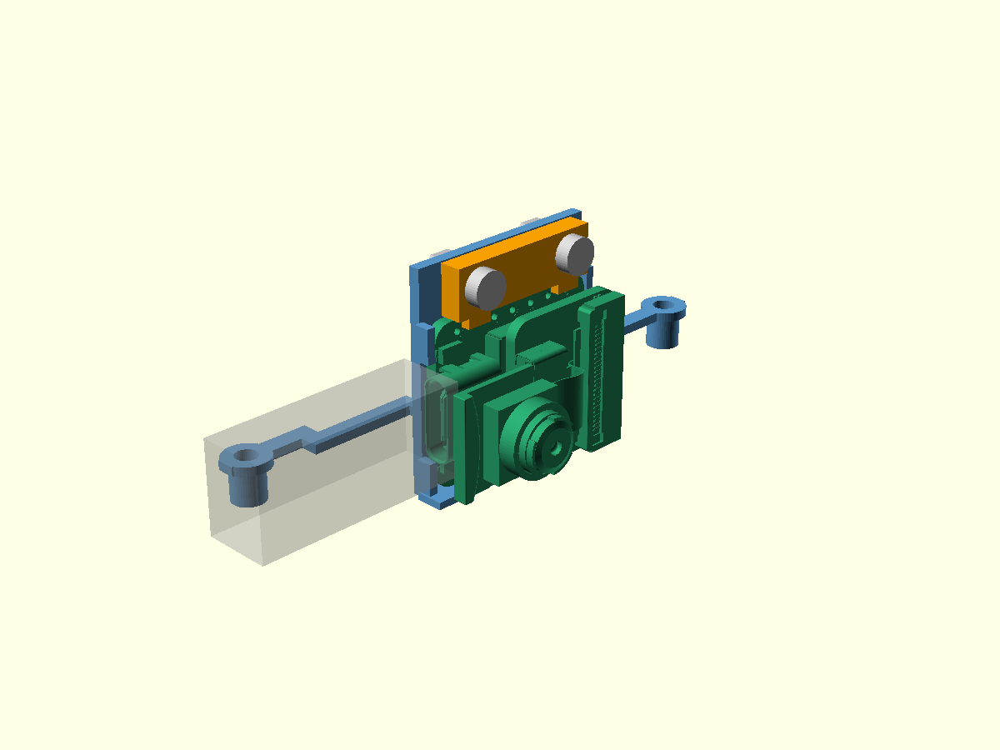

# Съёмный держатель XIAO — предложение 0.1

15 сентября 2026. Продолжение компоновки 0.5 для начального положения плат/камеры
0/+3 мм. Подготовлены опора, верхний прижим, крепёжные резервы и новые трассы.
Это конструкция для примерки по справочной STEP, не испытанный держатель.



[Вся сборка](../../docs/evidence/xiao-mount-assembly.png) ·
[Редактируемый держатель](../xiao-mount.scad) ·
[Редактируемая сборка](../xiao-mount-assembly.scad) ·
[Числовой отчёт](../../docs/evidence/xiao-mount-v01.json).

## Исправленная ориентация разъёмов

Разбор именованных узлов STEP установил: USB XIAO выходит **по +X**, вправо по
машине. Старый резерв `service_usb` в компоновке 0.5 был ошибочно направлен по −X.
Его нельзя использовать для оценки доступа. В новой сцене резерв штекера начинается
при X=35,36 мм: 24×7,5×10 мм, для подключения со снятым кузовом. Это оценка
оболочки штекера/начала кабеля, не чертёж конкретного кабеля пользователя.

Узел `USB TYPE C PORT/.../CHAMFER9` соответствует телу 18 в импортированной сборке.
Именованный `U.FL-R-SMT-1_10_ v1` находится слева внизу основной платы, тело 35;
его исходные границы сохранены в отчёте. Прежняя условная точка начала антенного
провода также не соответствовала этому разъёму.

Источник — [неизменённая STEP Seeed 2023 года](../components/xiao-sense-2023.step),
[архив производителя](https://files.seeedstudio.com/wiki/SeeedStudio-XIAO-ESP32S3/res/seeed-studio-xiao-esp32s3-sense-3d_model.zip).
SHA256 `a37c6b41d5660cd3310fea05edde0238762fe00da4de623936b7ca66814cb698`.
Соответствие заказанной ревизии OV3660 ещё не установлено; источник не масштабировался.
Это не доказательство совместимости с произвольной платой XIAO.

## Конструкция

- Нижняя полка и задняя стенка поддерживают плату; боковые направляющие справа
  разорваны в области USB, чтобы не перекрывать его корпус.
- Верхний прижим снимается после удаления двух поперечных винтов. Предложены
  отверстия Ø2,4 под крепёж класса M2; конкретные винты, гайки и их длины ещё не выбраны.
- Правое крепление площадки перенесено с Y=81 на Y=77 мм в существующем пазу.
  В поддоне предложена локальная выемка у правого края; используйте
  `tray_clearance.stl` вместе с этим держателем. Старый поддон даёт пересечение около 0,400 мм³.
- Заложены зазоры около 0,2 мм снизу, 0,3 мм сзади и 0,2 мм перед основной PCB.
  Это CAD-зазоры, не измеренная посадка. Мягкие диэлектрические прокладки, их
  сжатие, прижим и отсутствие нагрузки на пайку ещё требуют проработки/примерки.
- Антенный провод обходит левую сторону камеры и проходит над преобразователем;
  серво- и управляющий жгуты проходят выше сервисного USB. Их новые геометрические
  длины примерно 69,6 / 70,2 / 18,1 мм не являются длинами отрезания.
  Реальные ответные разъёмы, GPIO-контакты, сечения, изгибы и фиксаторы не подобраны.

## Что проверено

1. Для каждого из **103 тел STEP** построен отдельный ограничивающий объём.
   Новая опора, прижим, два набора крепежа и резерв USB с ними не пересекаются.
   Это консервативная проверка свободного пространства, не анализ давления на PCB.
2. Эти детали проходят проверки относительно перечисленных в скрипте элементов
   компоновки и укладываются в условный кузов. Резерв сервисного кабеля проверяется
   со снятым кузовом. Пересечений опоры/прижима между собой не найдено.
3. Новые трассы свободны от держателя, объёмов компонентов, резерва USB и стенок
   условного кузова. Контакт концов с резервами драйвера/FPC-антенны намеренный и
   записан в отчёте; он не устанавливает электрическую распиновку.
4. При снятых винтах прижим можно сначала поднять на 1,1 мм, затем вывести вперёд
   на 8 мм: **28 выбранных положений** свободны от проверяемых тел. Непрерывный
   путь, пальцы и фактическое разъединение разъёмов этим не проверены.
5. Опора и прижим — отдельные замкнутые связные тела. Экспорты для примерки
   поставлены на Z=0: опора 60×24,5×10,3 мм, прижим 18×6,6×2,45 мм.

Для этого нового держателя ещё не пересчитаны все регулировки, ход подвески и
снятие всего кузова. Результаты шести положений/обслуживания старой опоры не
переносятся автоматически. Кузов условный; готовые PCB зарядки и драйвера отсутствуют.

## Файлы для примерки

[Опора](cradle_print.stl) · [Прижим](cap_print.stl) · [Поддон с выемкой](tray_clearance.stl).
Сборочные STL также сохранены рядом. `tray_clearance.stl` оставлен в координатах
сборки: перед печатью его нужно положить на стол в слайсере.

Опора имеет выступающие монтажные ножки; предложенная ориентация сама по себе
не гарантирует печать без поддержек. Профиль K1C, сопло, поддержки, режим пластика
и фактическая печать не проверены. Начинать примерку по прибывшей плате следует
без затяжки на компоненты; размеры этой справочной ревизии нужно сверить.

Воспроизведение из корня:

```powershell
uv run --with-requirements tools/cad-candidate-requirements.txt python tools/build_xiao_mount.py
```

Сборка основана на прежних исходниках [zcar/GPL-3.0](../reference/NOTICE.md),
[SG90/CC-BY-3.0 и Waveshare](../packaging-v05/NOTICE.md). Новые опора/прижим
построены в SCAD; STEP и исходная механика не изменены.
