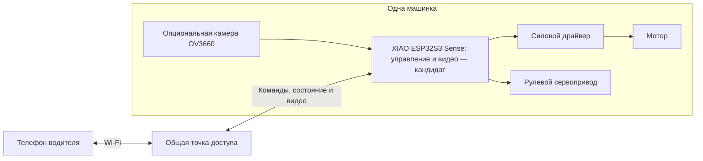
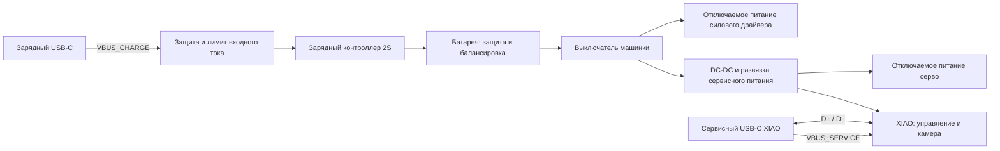

# Архитектура и known unknowns

Дата: 2026-09-14. Редакция: 0.3. Статус: требования пользователя и предложения для первого прототипа, не утверждённая электрическая схема. Ближайшие физические этапы и недостающие данные собраны в [first-prototype.md](first-prototype.md).

Пользователь считает общую идею USB-C → плата → зарядка аккумулятора подходящей основой. Это поддержка функциональной организации: выбор зарядника, разъёма, распиновки и гарантии совместимости остаются открытыми.

Уже установлено: 4–6 одинаковых машинок, начать с одной; только дома по ровной поверхности; Android и iPhone; Wi-Fi-управление; сменные кузова; FPV-камера опциональна, минимум 30 FPS, желательно 60 FPS; USB-C; разумный гибкий бюджет и покупка деталей в России. Основа питания — **три имеющихся LW 601844HP, 7,4 В, 600 мА·ч, 20C**, с быстрой заменой. При отказе управления остановка обязательна; при отказе только камеры управление сохраняется.

Пользователь предложил кузов на магнитах. Это приоритетный вариант крепления для CAD-проверки, не требование держать кузов на месте во время замены батареи. План механики — в [battery-and-body.md](battery-and-body.md).

## Предлагаемая организация

### Управление и видео

Общая локальная сеть с точкой доступа. Для езды не нужен облачный сервер или интернет. Телефон выбирает машину, получает право управления, показывает её видео и состояние. Точка доступа передаёт трафик; отдельный игровой сервер для первого варианта не предлагается.

Текущий компактный кандидат — XIAO ESP32S3 Sense с OV3660 для управления и видео на одной плате. Для него уже есть совместные окружения `xiao-car-qvga` / `xiao-car-vga` в соседнем репозитории. Получение платы и реальные FPV-результаты не подтверждены. Контроллер самостоятельно следит за свежестью команд; работа видеокода не должна быть условием выполнения остановки.

Прежнее разделение на WROOM и отдельную камеру остаётся вариантом сравнения стендов, не целевой комплектацией по умолчанию. WROOM-32U используется как имеющееся экспериментальное оборудование. Единая плата должна пройти те же требования остановки и независимости управления от отказа видео. Выбор сенсора OV3660 не доказывает 30/60 свежих FPS на телефоне; [план FPV](fpv-bench.md) сохраняет отдельное измерение задержки.

Предлагаемая программная организация:

- Прошивка движения: периодический приём актуального газа/руля, калибровка, измерение питания, тайм-аут команд, управление драйвером и серво.
- Видеомодуль: захват, передача и восстановление потока с ограничением очередей устаревших кадров.
- Приложение: выбор машины, сессия одного водителя, управление, видео, состояние батареи/связи, явное отображение потери видео. По FAIL-01 отказ только видео не блокирует управление и не требует нового разрешения при возврате картинки; прежнее предложение обратного отменено.
- Для управления реализован [Control v1](control-v1.md): один владелец, явный ARM, отсутствие очереди устаревших команд, клиентский тайм-аут 200 мс и watchdog 250 мс. Это текущие настройки стенда, не измеренный тормозной путь.

В Android есть настройка/режим заезда и MJPEG, в прошивке — протокол и программный план привода. [Тесты Samsung с программными серверами](driving-ui.md) прошли; [полные радиосценарии ESP32](drive-device-bench.md) не прошли. GPIO привода выключены, физическая камера и движение не проверены. Прежний аудит заготовки не описывает нынешний объём реализации.

### Питание и USB

Питание и отсек проектируются под три существующих LW 601844HP (2S, 600 мА·ч). Модель и количество заданы; измеряются физические размеры, разъёмы, состояние и уточняется паспортный зарядный ток. Каждая подаренная машинка заряжается от обычного USB-блока; имеющийся у пользователя зарядник остаётся оборудованием стенда. Пользователь разрешил отдельный зарядный порт без данных и дополнительные компоненты. Текущее предложение — зарядный порт на шасси, сервисный USB-C XIAO под кузовом.

Функциональные стрелки не задают порядок подключения к BMS, общую землю, номиналы или разводку проводов. Эти детали должны быть на электрической схеме. Напряжение серво и число DC-DC пока открыты. Питание тяги блокируется при подключённом USB; способ блокировки предстоит спроектировать.

Предложение: USB-питание зарядки 5 В без обязательного QC/PD, заряд при выключенной машинке. Это не гарантирует одинаковую скорость зарядки от любого источника. Зарядный узел определяет допустимый входной ток; сервисный USB не питает зарядник. VBUS двух портов не объединять; питание логики от батареи развязывается от сервисного USB. Подключение обоих кабелей входит в будущую проверку.

M85K/MC002/FMC002 — кандидат внешнего разъёма/замены micro-USB, не ограничение для выбора внутреннего зарядника. IP2326 ещё не выбран: требуется проверить настройку, точность напряжения и завершение заряда малой батареи. Линии определения зарядного источника не соединяются с USB-данными XIAO. Подробности и источники — в [usb-c-power.md](usb-c-power.md).

Для текущего кандидата XIAO Sense управление и камера работают на одном ESP32-S3; прошивка идёт через штатный сервисный USB-C. Владельцу подарка не требуется пользоваться данными или разбираться с прошивкой. Сервисный доступ и восстановление загрузчика остаются задачами сборки и обслуживания.

| Режим — предложение | Движение | Логика | Зарядка |
| --- | --- | --- | --- |
| Езда от батареи | Только после подключения водителя и разрешения | Управление; видео при установленной камере | Нет |
| Зарядный USB, машинка выключена | Заблокировано | XIAO выключена; индикация у зарядного узла | С параметрами выбранной батареи и источника |
| Только сервисный USB от компьютера | Заблокировано | Прошивка и диагностика XIAO | Нет заряда 2S |
| Оба USB одновременно | Заблокировано | Прошивка и диагностика XIAO | От отдельного зарядного источника, после проверки развязки |

### Механическая сборка

Одинаковое шасси, кузов на магнитах с направляющими как основной кандидат, продольно регулируемая электроника. Камеру и зарядный порт предлагается оставить на шасси: кузов снимается без их проводов. Для батареи — доступный сверху фиксатор/кассета после снятия кузова; отдельный выдвижной лоток не обязателен. Зарядный разъём должен быть удобен для подключения и скрываться/маскироваться, например крышкой или вставкой кузова. Заднее расположение и стилизация под выхлоп необязательны. Сервисный USB предлагается оставить под кузовом. Крепление порта, пространство для штекера/пальцев и снятие маскировки ещё проверить в CAD и на печати.

### Android и iPhone

Предложенная реализация — KMP + Compose Multiplatform. Общие слои: протокол, сессия водителя, состояние/настройки, экран управления и индикация отказов. За платформенными интерфейсами оставить декодирование/вывод видео, обнаружение устройств, разрешения локальной сети и жизненный цикл приложения. Для сети можно рассмотреть Ktor с платформенными движками; выбор транспорта и видеокодека ещё открыт. KMP не означает автоматической переносимости нынешнего Retrofit/Android-кода.

Android и iOS указаны как stable для KMP и Compose Multiplatform в [документации JetBrains](https://kotlinlang.org/docs/multiplatform/supported-platforms.html). Для iOS-сборки требуется macOS/Xcode; доступ к Mac/CI и реальные телефоны для замера видео ещё нужно определить. [Подготовка окружения](https://kotlinlang.org/docs/multiplatform/quickstart.html). В этом задании меняется план, исходный Android-проект ещё не мигрирован.

Для стенда — доступные модули и документированные соединения. После проверки — одна воспроизводимая разводка/плата соединений и крепления для всей серии, если это оправдано размерами и стоимостью. Собственная плата с интеграцией всех микросхем не является обязательной целью.

## Реестр известных неизвестных

Реестр обновлён после ответов пользователя: закрытые части явно перечислены в строках, оставшиеся вопросы требуют разработки или проверки. P0 — влияет на архитектуру и проверяется раньше; P1 — закрыть до серии. Бюджет без числового потолка не является блокировкой. Приоритеты предложены агентом. Стендовые измерения требуют физических деталей; работа агента — подбор, схема, CAD, ПО и анализ результатов.

| ID | Приоритет | Что не знаем | На что влияет | Как закрыть / результат | Контракты |
| --- | --- | --- | --- | --- | --- |
| KU-01 | P0 | Частично закрыто: только дома, ровная поверхность. Открыты скорость, дистанция, свет, длительность | Механика, мотор, объектив, сеть, батарея | Зафиксировать оставшиеся цели в м/с, м и мин; тип домашнего покрытия | TRACK-01, MECH-01, POWER-01, VIDEO-01 |
| KU-02 | P1 | Подход закрыт: разумный гибкий бюджет. Неизвестна полная цена вариантов | Выбор компонентов и допустимость своей платы | Агент завершает сравнимые BOM с фасовками/доставкой, обосновывает доплаты; сумму повторно не требовать | BOM-01, SUPPLY-01 |
| KU-03 | P0 | Разрешение, максимальная задержка картинки/управления, допустимые просадки FPS | Выбор видеотракта и критерий пригодности | Согласовать критерии; отдельно измерять свежие кадры/с, медианную/p95 задержку изображения и задержку реакции привода | CAMERA-03, VIDEO-01, CONTROL-01 |
| KU-04 | P0 | Даёт ли доступный видеомодуль требуемое FPV | Контроллер, кодирование, бюджет, размер и потребление | Стенд сцена → камера → сеть → реальный телефон, одновременно команды; одно устройство, затем 4–6 потоков | VIDEO-01 |
| KU-05 | P0 | Мотор, его ток при старте/блокировке, передача, нужный момент | ESC/H-мост, батарея, защита и нагрев | Точный артикул + документация и контролируемое измерение токов; выбор драйвера по результату | DRIVE-01, POWER-01 |
| KU-06 | P0 | 3 LW 601844HP; пользователь подтвердил Amazon B09TDR57K2. Ориентир 49 × 18 × 15 мм; фото силового 2-pin и балансировочного 3-pin с тремя проводами. Открыты физические размеры, точный pinout, состояние, зарядный ток, защита и зарядник | Отсек, быстрая замена, автономность, USB и защита | Измерение имеющихся батарей/средней точки; схема и полный цикл заряда, включая снятую батарею; источники в battery-and-body.md | BATTERY-01, SWAP-01, CHARGE-01, USB-01, POWER-01 |
| KU-07 | P0 | Поместится ли весь комплект под выбранным кузовом | Одна/две платы, размер батареи и шасси | CAD-компоновка по размерам конкретных деталей, затем примерка; учесть разъёмы, провода и доступ к крепежу | MECH-01, MOUNT-01 |
| KU-08 | P1 | Какая сеть выдержит 4–6 машинок с FPV на нужной дистанции | Точка доступа, битрейт, каналы, восстановление связи | Групповой тест команд и видео; записать условия, FPS, задержки и обрывы. Один успешный поток не закрывает вопрос | CONTROL-01, VIDEO-01 |
| KU-09 | P0 | Первым выбран Android, Samsung SM-G973F / Android 12 подключён. iOS пока отложен; Mac/CI и KMP открыты | Приложение, видеотранспорт и сборка | Android-стенд, затем KMP и iPhone | CLIENT-01, CONTROL-01, VIDEO-01 |
| KU-10 | P1 | Control v1 реализует одного владельца, ARM/STOP и проверку свежести; надёжная полная радиосессия не доказана | Отклик, независимость машин и воспроизводимость ПО | Длительный тест после подключения антенны, затем реальная камера и конкурирующий второй водитель; прежние неудачные серии не считать успехом | CONTROL-01, STOP-01 |
| KU-11 | P1 | Правило закрыто; программные тайм-ауты 200/250 мс и явный новый ARM реализованы. Открыты физическая остановка, сброс питания, разряд и восстановление собранной машины | Управляемость и восстановление | Проверить FAIL-01 на приводе, потерю видео отдельно от команд, одновременную потерю и возврат связи. Код и программный сервер не заменяют остановку колёс | FAIL-01, STOP-01, VIDEO-01, POWER-01 |
| KU-12 | P1 | Раздельные зарядный и сервисный USB разрешены; открыты развязка питания, доступ к загрузчику, крепление и маскировка зарядного порта | USB-питание, зарядка при выключенной машинке, обслуживание и сменные кузова | Проверка каждого порта и обоих одновременно, восстановления загрузчика, обеих ориентаций C–C и подключения обычных кабелей с кузовом | USB-01, USB-REQ-02, USB-MOUNT-01 |
| KU-13 | P1 | Печать, паяльник и мультиметр есть. Открыты качество шасси и одинаковость поставок | Цена сборки, люфты, ремонтопригодность | Тестовая печать посадок, ревизии деталей, список заменяемых узлов и инструкция | FLEET-01, MECH-01, BOM-01 |
| KU-14 | P1 | Реальные автономность, нагрев, помехи питания и устойчивость креплений | Пригодность к целому заезду и срок службы | Собранная машина: полный заезд, повороты/старты/видео; замеры тока/напряжения/температуры и осмотр после заезда | POWER-01, MOUNT-01 |

## Порядок снятия неопределённостей

1. Использовать подтверждённые условия, батареи и платформы; уточнить оставшиеся критерии FPV и заезда (KU-01/03). Подбор по гибкому бюджету продолжать без числового потолка.
2. Параллельные направления работ: FPV-стенд (KU-04), механическая компоновка (KU-07) и подбор/расчёт двигателя и питания (KU-05/06). Это направления работ, не требование запускать параллельных агентов.
3. По результатам выбрать один комплект, подготовить схему, CAD и полную смету. Непроверенные платы из таблицы цен не становятся выбранными автоматически.
4. Собрать первый целевой экземпляр; закрыть управление, USB и поведение при отказах (KU-10/11/12/14).
5. Нарастить проверку сети до целевой нагрузки (KU-08), зафиксировать сборку и обслуживание (KU-13); после тиражирования повторить тест всей группы.

Этот документ не заменяет [контракты](contracts.md), [таблицу деталей](parts.md) и [план проекта](project-brief.md). По мере получения ответа обновлять строку KU и соответствующий контракт с источником/результатом проверки.

Обновление стенда 2026-09-13: KU-10/11 частично реализованы в [Control v1](control-v1.md). Программный watchdog и кодеки проверены; физический привод ещё отсутствует. У WROOM-32U не подключена внешняя антенна (ответ пользователя), поэтому текущие обрывы не дают оценки пригодности нормального радиотракта.
