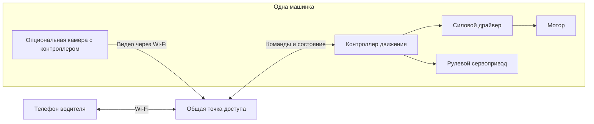
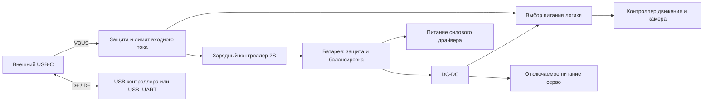

# Архитектура и known unknowns

Дата: 2026-09-13. Редакция: 0.2. Статус: требования пользователя и предложения для первого прототипа, не утверждённая электрическая схема.

Пользователь считает общую идею USB-C → плата → зарядка аккумулятора подходящей основой. Это поддержка функциональной организации: выбор зарядника, разъёма, распиновки и гарантии совместимости остаются открытыми.

Уже установлено: 4–6 одинаковых машинок, начать с одной; только дома по ровной поверхности; Android и iPhone; Wi-Fi-управление; сменные кузова; FPV-камера опциональна, минимум 30 FPS, желательно 60 FPS; USB-C; разумный гибкий бюджет и покупка деталей в России. Основа питания — **три имеющихся LW 601844HP, 7,4 В, 600 мА·ч, 20C**, с быстрой заменой. При отказе управления остановка обязательна; при отказе только камеры управление сохраняется.

Пользователь предложил кузов на магнитах. Это приоритетный вариант крепления для CAD-проверки, не требование держать кузов на месте во время замены батареи. План механики — в [battery-and-body.md](battery-and-body.md).

## Предлагаемая организация

### Управление и видео

Общая локальная сеть с точкой доступа. Для езды не нужен облачный сервер или интернет. Телефон выбирает машину, получает право управления, показывает её видео и состояние. Точка доступа передаёт трафик; отдельный игровой сервер для первого варианта не предлагается.

Для первого стенда предлагается отдельный контроллер движения и отдельный съёмный модуль камеры. Камера привязывается к постоянному ID машины, а не только к изменяемому IP-адресу. Контроллер движения самостоятельно следит за свежестью команд; работа видеокода не должна быть условием выполнения остановки.

Разделение добавляет плату, питание, место и второй Wi-Fi-узел на машину; оно не гарантирует отсутствие общих отказов сети/питания. Если единая плата с камерой проходит те же критерии и выигрывает по компоновке/цене, можно выбрать её до фиксации первого целевого комплекта. ESP32-CAM/OV2640 остаётся бюджетным кандидатом измерений; 30/60 FPS и подходящая задержка в нашем приложении не подтверждены. [Документация esp32-camera](https://github.com/espressif/esp32-camera) описывает поддержку ESP32/S2/S3, влияние PSRAM, формата и буферов; наличие поддерживаемого сенсора не является испытанием нашего FPV-тракта.

Предлагаемая программная организация:

- Прошивка движения: периодический приём актуального газа/руля, калибровка, измерение питания, тайм-аут команд, управление драйвером и серво.
- Видеомодуль: захват, передача и восстановление потока с ограничением очередей устаревших кадров.
- Приложение: выбор машины, сессия одного водителя, управление, видео, состояние батареи/связи, явное отображение потери видео. По FAIL-01 отказ только видео не блокирует управление и не требует нового разрешения при возврате картинки; прежнее предложение обратного отменено.
- Интерфейсы описываются общей спецификацией версий и примерами пакетов; сетевой транспорт и частоты команд ещё выбираются.

Это объём разработки: существующий Android-код требует исправлений, а прошивка ESP32 пока заготовка. Проверка сборки из [аудита](project-brief.md) не подтверждает работу описанных функций.

### Питание и USB

Питание и отсек проектируются под три существующих LW 601844HP (2S, 600 мА·ч). Модель и количество заданы; измеряются физические размеры, разъёмы, состояние и уточняется паспортный зарядный ток. Один внешний USB-C соединяется с внутренней электроникой; зарядка снятого аккумулятора во время езды предлагается через отдельную подставку с тем же батарейным интерфейсом.

Функциональные стрелки не задают порядок подключения к BMS, общую землю, номиналы или разводку проводов. Эти детали должны быть на электрической схеме. Напряжение серво и число DC-DC пока открыты. Питание тяги блокируется при подключённом USB; способ блокировки предстоит спроектировать.

Предложение: в первой реализации USB-питание 5 В без обязательного QC/PD; это не гарантирует одинаковую скорость зарядки от любого источника. При подключении к ПК заряд ограничивается по доступному входному току или отключается на время прошивки. Два источника питания логики развязываются от обратного тока.

M85K/MC002/FMC002 — кандидат внешнего разъёма/замены micro-USB, не ограничение для выбора внутреннего зарядника. IP2326 ещё не выбран: требуется проверить настройку, точность напряжения, завершение заряда малой батареи и отделение его QC-линий от USB-данных. Подробности и источники — в [usb-c-power.md](usb-c-power.md).

USB-C прошивает основной контроллер через его USB или USB–UART. У [ESP32-C3 встроен USB Serial/JTAG](https://espressif.github.io/esp32-c3-book-en/chapter_5/5.3/5.3.3.html); у имеющейся WROOM-платы схема несущей платы ещё не изучена. Для отдельной камеры предложен сервисный интерфейс первого программирования, далее можно рассмотреть OTA. Если один внешний USB должен также восстанавливать прошивку камеры, это отдельное требование к переключению данных/загрузчику, пока не решённое.

| Режим — предложение | Движение | Логика | Зарядка |
| --- | --- | --- | --- |
| Езда от батареи | Только после подключения водителя и разрешения | Управление; видео при установленной камере | Нет |
| USB от зарядного адаптера | Заблокировано | Индикация состояния; камера может быть отключена | С параметрами выбранной батареи и источника |
| USB от компьютера | Заблокировано | Прошивка и диагностика | Ограничена или отключена по бюджету входного тока |

### Механическая сборка

Одинаковое шасси, кузов на магнитах с направляющими как основной кандидат, фиксированные крепления электроники и разъёма. Камеру предлагается оставить на шасси: кузов снимается без её проводов. Для батареи — доступный сверху фиксатор/кассета после снятия кузова; отдельный выдвижной лоток не обязателен. USB и выключатель доступны снаружи. Возможность реализации проверить в CAD.

### Android и iPhone

Предложенная реализация — KMP + Compose Multiplatform. Общие слои: протокол, сессия водителя, состояние/настройки, экран управления и индикация отказов. За платформенными интерфейсами оставить декодирование/вывод видео, обнаружение устройств, разрешения локальной сети и жизненный цикл приложения. Для сети можно рассмотреть Ktor с платформенными движками; выбор транспорта и видеокодека ещё открыт. KMP не означает автоматической переносимости нынешнего Retrofit/Android-кода.

Android и iOS указаны как stable для KMP и Compose Multiplatform в [документации JetBrains](https://kotlinlang.org/docs/multiplatform/supported-platforms.html). Для iOS-сборки требуется macOS/Xcode; доступ к Mac/CI и реальные телефоны для замера видео ещё нужно определить. [Подготовка окружения](https://kotlinlang.org/docs/multiplatform/quickstart.html). В этом задании меняется план, исходный Android-проект ещё не мигрирован.

Для стенда — доступные модули и документированные соединения. После проверки — одна воспроизводимая разводка/плата соединений и крепления для всей серии, если это оправдано размерами и стоимостью. Собственная плата с интеграцией всех микросхем не является обязательной целью.

## Реестр известных неизвестных

Реестр обновлён после ответов пользователя: закрытые части явно перечислены в строках, оставшиеся вопросы требуют разработки или проверки. P0 — влияет на архитектуру и проверяется раньше; P1 — закрыть до серии. Бюджет без числового потолка не является блокировкой. Приоритеты предложены агентом. Стендовые измерения требуют физических деталей; работа агента — подбор, схема, CAD, ПО и анализ результатов.

| ID | Приоритет | Что не знаем | На что влияет | Как закрыть / результат | Контракты |
| --- | --- | --- | --- | --- | --- |
| KU-01 | P0 | Частично закрыто: только дома, ровная поверхность. Открыты скорость, дистанция, свет, длительность | Механика, мотор, объектив, сеть, батарея | Зафиксировать оставшиеся цели в м/с, м и мин; тип домашнего покрытия | TRACK-01, MECH-01, POWER-01, VIDEO-01 |
| KU-02 | P1 | Подход закрыт: разумный гибкий бюджет. Неизвестна полная цена вариантов | Выбор компонентов и допустимость своей платы | Агент завершает сравнимые BOM с фасовками/доставкой, обосновывает доплаты; сумму повторно не требовать | BOM-01, SUPPLY-01 |
| KU-03 | P0 | Разрешение, максимальная задержка картинки/управления, допустимые просадки FPS | Выбор видеотракта и критерий пригодности | Согласовать критерии; отдельно измерять свежие кадры/с, медианную/p95 задержку изображения и задержку реакции привода | CAMERA-03, VIDEO-01, CONTROL-01 |
| KU-04 | P0 | Даёт ли доступный видеомодуль требуемое FPV | Контроллер, кодирование, бюджет, размер и потребление | Стенд сцена → камера → сеть → реальный телефон, одновременно команды; одно устройство, затем 4–6 потоков | VIDEO-01 |
| KU-05 | P0 | Мотор, его ток при старте/блокировке, передача, нужный момент | ESC/H-мост, батарея, защита и нагрев | Точный артикул + документация и контролируемое измерение токов; выбор драйвера по результату | DRIVE-01, POWER-01 |
| KU-06 | P0 | 3 LW 601844HP; пользователь подтвердил Amazon B09TDR57K2. Ориентир 49 × 18 × 15 мм; фото силового 2-pin и балансировочного 3-pin с тремя проводами. Открыты физические размеры, точный pinout, состояние, зарядный ток, защита и зарядник | Отсек, быстрая замена, автономность, USB и защита | Измерение имеющихся батарей/средней точки; схема и полный цикл заряда, включая снятую батарею; источники в battery-and-body.md | BATTERY-01, SWAP-01, CHARGE-01, USB-01, POWER-01 |
| KU-07 | P0 | Поместится ли весь комплект под выбранным кузовом | Одна/две платы, размер батареи и шасси | CAD-компоновка по размерам конкретных деталей, затем примерка; учесть разъёмы, провода и доступ к крепежу | MECH-01, MOUNT-01 |
| KU-08 | P1 | Какая сеть выдержит 4–6 машинок с FPV на нужной дистанции | Точка доступа, битрейт, каналы, восстановление связи | Групповой тест команд и видео; записать условия, FPS, задержки и обрывы. Один успешный поток не закрывает вопрос | CONTROL-01, VIDEO-01 |
| KU-09 | P0 | Платформы закрыты: Android+iPhone. Открыты целевые телефоны, Mac/CI и детали переноса на KMP | Приложение, видеотранспорт и сборка | Общий прототип KMP-клиента и платформенный вывод видео; проверить на Android и iPhone | CLIENT-01, CONTROL-01, VIDEO-01 |
| KU-10 | P1 | Протокол, частота команд, захват машины водителем, поведение после разрыва | Отклик, независимость машин и воспроизводимость ПО | Спецификация пакетов/версий и тест с двумя водителями; переподключение и устаревшие команды | CONTROL-01, STOP-01 |
| KU-11 | P1 | Правило закрыто: остановка по потере управления, продолжение управления при отказе только камеры. Открыты тайм-аут, сброс, разряд и возобновление после потери команд | Управляемость и восстановление | FAIL-01 + таблица состояний и тесты; потеря видео отдельно от команд, одновременная потеря, возврат связи | FAIL-01, STOP-01, VIDEO-01, POWER-01 |
| KU-12 | P1 | Нужно ли прошивать и восстанавливать оба контроллера через внешний USB | Коммутация USB/UART, сервисный доступ, OTA | Решение по пользовательскому сценарию; тест восстановления загрузчика, режим ПК/зарядка и обе ориентации C–C | USB-01 |
| KU-13 | P1 | Доступность печати/пайки/измерений, качество шасси и одинаковость поставок | Цена сборки, люфты, ремонтопригодность | Уточнить инструменты; тестовая печать посадок, ревизии деталей, список заменяемых узлов и инструкция | FLEET-01, MECH-01, BOM-01 |
| KU-14 | P1 | Реальные автономность, нагрев, помехи питания и устойчивость креплений | Пригодность к целому заезду и срок службы | Собранная машина: полный заезд, повороты/старты/видео; замеры тока/напряжения/температуры и осмотр после заезда | POWER-01, MOUNT-01 |

## Порядок снятия неопределённостей

1. Использовать подтверждённые условия, батареи и платформы; уточнить оставшиеся критерии FPV и заезда (KU-01/03). Подбор по гибкому бюджету продолжать без числового потолка.
2. Параллельные направления работ: FPV-стенд (KU-04), механическая компоновка (KU-07) и подбор/расчёт двигателя и питания (KU-05/06). Это направления работ, не требование запускать параллельных агентов.
3. По результатам выбрать один комплект, подготовить схему, CAD и полную смету. Непроверенные платы из таблицы цен не становятся выбранными автоматически.
4. Собрать первый целевой экземпляр; закрыть управление, USB и поведение при отказах (KU-10/11/12/14).
5. Нарастить проверку сети до целевой нагрузки (KU-08), зафиксировать сборку и обслуживание (KU-13); после тиражирования повторить тест всей группы.

Этот документ не заменяет [контракты](contracts.md), [таблицу деталей](parts.md) и [план проекта](project-brief.md). По мере получения ответа обновлять строку KU и соответствующий контракт с источником/результатом проверки.
