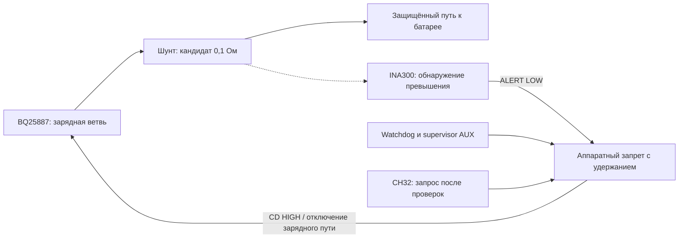

# Независимое обнаружение повышенного зарядного тока

14 сентября 2026. CHARGE-OC-01 v0.1 — **проработка кандидата**, без электрической
схемы, платы и измерений. Цель — остановить нештатный заряд BQ25887 после
сброса настроек независимо от программы CH32. Сам INA300 не ограничивает
ток и не доказывает безопасность аккумулятора.

## Что проверено

[TI INA300 SBOS613C, июнь 2021](https://www.ti.com/lit/ds/symlink/ina300.pdf):
компаратор измеряет падение на шунте при синфазном напряжении 0…36 В,
питается от 2,7…5,5 В, выдаёт открытый сток ALERT и умеет удерживать ошибку.
В таблице 6.5 максимальное потребление при −40…125 °C — 150 мкА;
135 мкА относится к 25 °C. Это дополнительная нагрузка AUX, не отдельный
источник питания и не измеритель напряжений ячеек.

По [BQ25887 SLUSD89B](https://www.ti.com/lit/gpn/bq25887), §§6, 8.3–8.5:
сброс возвращает ICHG к 1,5 А; CD=HIGH запрещает преобразователь, но имеет
внутреннюю подтяжку 900 кОм к земле. Следовательно, нужны внешний запрет
при старте и цепь снятия разрешения, действующая независимо от MCU.
Замкнуть ALERT напрямую на CD нельзя: активные уровни противоположны.
Периодический опрос ADC/I²C и watchdog MCU сами по себе не закрывают
отдельный сброс зарядника.

## Предлагаемая структура

Стрелки описывают функцию, не монтаж. Место шунта и исполнительная цепь
ещё не выбраны. Шунт должен видеть зарядную ветвь; тягу через него не
пропускаем. Нельзя обходить защиту земли измерительными проводами. Силовой
ток и измерительные дорожки шунта требуют раздельного Kelvin-подключения.

Особенность BQ25887: SNS pins 15/16 — силовой Sense Output с требованием
44 мкФ, **не свободный вход удалённого измерения батареи**. BAT pins 13/14
имеют собственную ёмкость; MID и CBSET — разные измерительная/силовая
цепи средней точки. Нельзя произвольно переставлять эти подключения,
чтобы компенсировать падение на шунте. При шунте между BAT и сборкой
меняются наблюдаемые напряжения и токи балансировки; нужны проверка
по полной схеме и стенд с имитатором ячеек. Через CBSET возможны токи,
которые нельзя считать измеренными одним шунтом общего плюса.

## Порог для исследования

Предложение для стенда, **не паспортный режим LW**:
RSENSE=0,1 Ом ±1%, RLIMIT=1,74 кОм ±1%, задержка INA300 50 мкс.
В этом режиме NAF=500 мкВ не добавляется: он относится только к 10 мкс.
Номинальный порог `20 мкА × 1740 Ом / 0,1 Ом = 0,348 А`.

[Воспроизводимый расчёт](../tools/calculate_charge_guard.py) и
[результат](evidence/charge-current-guard.json) складывают допуски источника
19,85…20,15 мкА, резисторов, условный запас на смещение/температуру/питание
и синфазное напряжение. Это оценка отдельных слагаемых, не гарантированный
диапазон готового узла. TCR конкретных резисторов, разводка и пульсации
ещё не учтены. Допустимый зарядный ток и импульсный режим LW неизвестны;
число 0,348 А не становится разрешённым током батареи.

При номинальных 250 мА шунт даст 25 мВ и 6,25 мВт; при условных 1,5 А —
150 мВ и 225 мВт. При верхнем программируемом режиме 2,2 А — 220 мВ
и 484 мВт. Номинал мощности/импульсная стойкость шунта ещё не выбраны.
Малая мощность при нормальном заряде не доказывает пригодность к отказу.

## Соединения самого кандидата INA300

Распиновка по таблице 5-1 для INA300AIDSQR, WSON-10 2×2 мм:

| Pin | Сигнал | Предложение |
| --- | --- | --- |
| 1 / 2 | IN+ / IN− | Kelvin к сторонам шунта; положительная разность соответствует заряду |
| 3 | LIMIT | 1,74 кОм на землю; не задавать порог через MCU/DAC |
| 4 | ENABLE | HIGH при исправном AUX; MCU не должен выключать защиту во время заряда |
| 5 | ALERT | Открытый сток, 10 кОм к AUX; LOW входит в аппаратный запрет |
| 6 | LATCH | HIGH для удержания ошибки; не отдавать MCU возможность держать прозрачный режим при заряде |
| 7 | DELAY | GND для 50 мкс |
| 8 / 9 | GND / VS | Земля логики / AUX; локальные 100 нФ |
| 10 | HYS | Свободен для 2 мВ; не добавлять произвольную подтяжку |
| EP | Теплоплощадка | TI допускает землю или свободное состояние; выбрать при разводке |

Чтобы очистить защёлку, LATCH должен быть LOW не менее 20 мкс при токе
ниже порога. Такая операция допускается только при аппаратно запрещённом
заряде. После очистки — возврат LATCH HIGH, новая проверка и только затем
возможный запуск. Исполнительная цепь и защита от застрявшего LOW на LATCH
не реализованы. Потеря питания детектора не равна разрешению заряда.

## Что именно нужно доказать до выбора B

50 мкс — настройка компаратора, не время остановки всего узла. Внутри
используются окна сравнения 10 мкс; входной фильтр добавляет задержку.
После ALERT ещё срабатывают логика/ключи/CD, а выходные конденсаторы могут
передать энергию батарее. Нельзя обещать «ток никогда не превысит порог»
на основании наличия компаратора.

Приёмка требует измеренных пика, длительности и повторяемости импульса
и их сравнения с допустимым режимом конкретной LW. Пока ни этот режим,
ни осциллограммы не получены — CHARGE-GATE-01 остаётся открытым. Расчёт
заряда/энергии прямоугольных импульсов в JSON — иллюстрация чувствительности
к времени, не прогноз и не разрешение таких импульсов.

| Проверка на имитаторе, до LiPo | Требуемое наблюдение |
| --- | --- |
| MCU заморожен с запросом заряда, ICHG изменён с 250 мА на 1,5 А и 2,2 А | Аппаратное отключение, измеренный импульс, удержание запрета |
| Сброс только BQ25887 при исправном MCU | Те же измерения; readback не заменяет аппаратную реакцию |
| Исчезновение/просадка AUX при наличии USB и батареи | Запрет сохраняется, запуск детектора не создаёт окна разрешения |
| Ток падает после ошибки; LATCH пытаются сбросить | Заряд не возобновляется без полной процедуры; зависший MCU не создаёт серию импульсов |
| Подключение батареи, работа балансировки, обрыв MID и цепей шунта | Проверка всех путей, ложных/пропущенных срабатываний и напряжений ячеек |

14 сентября запрошено наличие осциллографа/доступа к нему. Ответ пока не
получен. Мультиметр не подтверждает короткий импульс. Лабораторный БП
с ограничением тока и оборудование для QFN также ещё не подтверждены.

## Цена и следующий шаг

Карточки прочитаны 14 сентября, обе без местного остатка в Чебоксарах:

- [8017654261](https://www.chipdip.ru/product/ina300aidsqr-wson-10-2x2-current-sensing-texas-instruments-8017654261):
  370 ₽ от одной штуки; 34 шт., склад не указан, 5–6 недель,
  магазин Чебоксар ориентировочно 23 октября бесплатно.
- [8060314732](https://www.chipdip.ru/product/ina300aidsqr-texas-instruments-8060314732):
  120 ₽, **минимум 5**, остаток 260 в Москве, 7 дней,
  магазин Чебоксар ориентировочно 21 сентября бесплатно.

Минимальный расход на IC для 1/4/6 машин: 370/600/720 ₽, покупка 1/5/6.
Это альтернативные предложения одной детали, их нельзя суммировать.
Шунт, цепь запрета и монтаж в цену не входят. Заказов нет.

Следующий шаг — выбрать аппаратное удержание запрета, supervisor и
исполнительную цепь; затем построить и проверить полную схему на имитаторе.
INA300 остаётся кандидатом обнаружения. Его добавление не закрывает сброс
BQ25887 и не является основанием заказывать B для серии.

Продолжение: [CHARGE-PERMIT-01 v0.2](../hardware/charge-permit/README.md)
теперь содержит схему supervisor/буферов/защёлки с логическими проверками.
Она сохраняет запрет после импульса ошибки при застывшем ARM, но повторные
фронты MCU могут разрешить заново. [Цепь CD](charge-cd-actuator.md) добавлена,
но INA300/LATCH ещё не соединены; переходы питания и ток не проверены.
