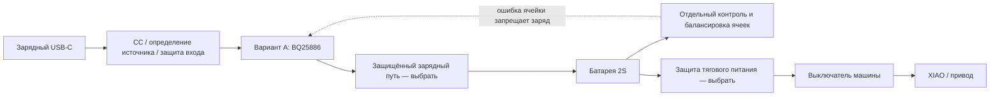
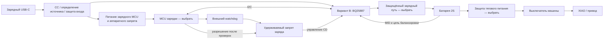

# Зарядный узел: сравнение двух схем

14 сентября 2026, предложение 0.1. Исследование начато 13 сентября. Это функциональные схемы и условия проектирования, **не схема для пайки, не готовая разводка PCB и не приёмка зарядки**. Основа — отдельный зарядный USB-C, LW 601844HP 2S/600 мА·ч, работа при выключенной XIAO. Паспортные токи и состояние батарей ещё неизвестны.

## Состав вариантов

| Функция | A: автономный BQ25886 | B: управляемый BQ25887 |
| --- | --- | --- |
| Заряд 2S от 5 В | BQ25886 + дроссель, конденсаторы, настройка резисторами | BQ25887 + дроссель, конденсаторы, настройка по I²C |
| Контроль/выравнивание ячеек | Отдельный узел; BQ29209 проверен как кандидат, ограничений ниже недостаточно для окончательного выбора | Встроенная балансировка + внешний токозадающий резистор и измерительная цепь MID |
| Контроллер заряда при выключенной машине | Отдельная прошивка не нужна | Отдельный небольшой MCU, питаемый от зарядного USB; модель ещё выбрать |
| Сбой управляющей программы | Не является зависимостью настройки тока | Нужны аппаратный запрет заряда, внешний watchdog и удержание запрета после его срабатывания |
| USB-C/источник | Цепи CC, ограничение входа; в BQ25886 есть определение по D+/D− | Цепи CC, отдельное определение источника; PSEL сам источник не распознаёт |
| Защита батареи при езде | Отдельная защита ячеек/силовые ключи, ещё выбрать | То же; зарядник не заменяет защиту тяговой нагрузки |
| Температура и статус | Датчик у батареи, индикация зарядника, обработка ошибок узла ячеек | Датчик у батареи; MCU может различать заряд/готовность/ошибку по регистрам |
| Дополнительные зависимости CAD | Балансировщик и, возможно, внешние ключи/резисторы | MCU с питанием, watchdog/блокировка, балансировочный резистор |
| Цена готового узла и поставка | Не установлены | Не установлены |

Обе схемы требуют отдельного зарядного разъёма с креплением и жгута к штатным разъёмам батареи. Найдены [предложения ключевых микросхем в ChipDip](charge-parts.md), включая минимальные партии и доставку в Чебоксары. Цены одной микросхемы или размер её корпуса не являются ценой и размером платы. Полная закупка не сформирована; HY2120-CB доступен, но его запуск после смены батареи требует отдельного решения.

Стрелки не назначают контакты неизвестной BMS. Особенно важно не объединить B− и P− через измерительные/USB-провода, если выбранная защита разрывает минус: такой обход может сделать её бесполезной. Земля сервисного USB XIAO и зарядного порта также учитывается при выборе силового пути. До выбора защиты эти диаграммы нельзя превращать в монтажную инструкцию.

## Что добавляет отдельная балансировка

[BQ29209, TI SLUSA52C, март 2016](https://www.ti.com/lit/ds/symlink/bq29209.pdf) — **вторичная** защита от перенапряжения с балансировкой, а не полная BMS. Порог OVP 4,30 В; внутренний балансировочный ток до 15 мА. Типовое включение балансировки при разнице 30 мВ; больший ток требует внешних ключей/резисторов (рис. 11). OUT не является силовым разрывом. Не смешивать BQ29209 с BQ29200 (4,35 В) или автоматически подменять ревизией -Q1.

Расчётная нижняя граница времени исправления **разницы заряда**, при непрерывных 15 мА: `t = ΔQ / I`. Для 6/30/60 мА·ч это 0,4/2/4 часа. Реальное время может быть больше из-за порогов, пауз и меньшего тока. Разницу напряжений нельзя просто переводить в мА·ч. Поэтому «600 мА·ч — маленькая батарея» не доказывает достаточность 15 мА.

Пример ограничения регулирования только суммы: 4,30 + 4,10 = 8,40 В. Это не разрешённое состояние LW, а демонстрация, почему правильное напряжение сборки не доказывает правильное напряжение обеих ячеек. Порог вторичной защиты нельзя использовать как штатную цель заряда. Вариант A требует отдельной проверки завершения и ограничения напряжения каждой ячейки, включая заметный начальный разбаланс.

## Разрешение заряда у BQ25887

По [TI SLUSD89B, ноябрь 2019](https://www.ti.com/lit/ds/symlink/bq25887.pdf), CD=1 запрещает заряд и переводит устройство в HIZ, но сохраняет I²C/ADC; внутри CD подтянут к земле через 900 кОм. Внешняя цепь обязана удерживать запрет при старте и потере питания MCU. Ещё одна ловушка: сигнал PG становится активным только при CD=0. Нельзя ждать PG как единственное условие первого снятия CD — получится взаимная блокировка. Наличие допустимого входа проверяется независимо.

При зависании MCU внутренний watchdog зарядника способен вернуть ток к 1,5 А. Предложение — внешний watchdog и удерживаемый запрет. Программное отключение внутреннего watchdog не защищает от перезапуска самого зарядника или ошибочной записи регистров; эти случаи остаются отдельными проверками и могут потребовать независимого аппаратного контроля тока.

У [TPS3431, TI SNVSB66A, октябрь 2021](https://www.ti.com/lit/ds/symlink/tps3431.pdf) выход WDO выдаёт импульс запрета на 170–230 мс, а не сохраняет ошибку навсегда. Поэтому один WDO нельзя считать постоянным разрешением/запретом зарядки: после окончания импульса неисправный MCU не должен снова разрешить заряд. Нужна защёлка ошибки либо схема сброса MCU, которая гарантированно удерживает CD до новой настройки. Конкретная реализация/номиналы ещё не выбраны.

Предлагаемое поведение CHARGE-GATE-01:

| Событие | Обязательное состояние проектируемого узла |
| --- | --- |
| USB подключён, MCU ещё не запущен | CD=1; заряд не начинается с заводским током |
| Источник распознан, MCU запущен | CD=1; запись и чтение обратно всех параметров, проверка батареи/температуры |
| Параметры проверены, ошибок нет | Разрешение заряда; периодическая проверка параметров и свежести измерений |
| I²C завис, readback неверен, MCU сброшен или watchdog сработал | CD=1; ошибка удерживается до успешной полной повторной инициализации |
| Импульс WDO закончился | Запрет сохраняется; окончание импульса не является восстановлением |
| Сам зарядник перезапустился при работающем MCU | Не считать его настройки сохранёнными; доказать отсутствие зарядного импульса выше допустимого тока. Пока не закрыто |
| Батарея/средняя точка отключена | Запрет; вставка батареи запускает новую проверку, а не продолжение прежнего разрешения |
| Зарядный USB отключён | Заряд прекращён; движение только после отдельного разрешения управления |

Heartbeat должен зависеть от успешно завершённой проверки, а не генерироваться автономным PWM/таймером независимо от основной программы. Тайм-ауты и допустимая длительность переходных процессов определяются после выбора схемы; нынешний документ их не объявляет измеренными.

## Тепло и входной ток

При условных 8,4 В × 0,3 А и КПД 85% зарядник получает около 2,96 Вт, теряет около 0,44 Вт и требует примерно 0,624 А от входа 4,75 В, **без** расхода управляющей электроники. Это оценка, не спецификация КПД или разрешение тока LW. От разрешённого источника 500 мА ток заряда придётся уменьшать.

Для BQ25887 формула балансировки: `I = Vcell / (Rext + Ron)`. При условных 4,2 В, 100 мА и Ron=1 Ом получается Rext≈41 Ом; на нём около 0,41 Вт, на внутреннем ключе около 0,01 Вт. Это исследовательский режим, не выбранный резистор. Одновременно с потерями преобразования под кузовом появляется заметный источник тепла; нельзя молча вписать его в прежний брусок зарядника 33×16×8 мм без тепловой проверки. Паспортный предел 400 мА не является рекомендуемым режимом нашего изделия.

## Решение после сравнения

Преимущество A — аппаратная настройка тока. Преимущество B — интегрированная балансировка и измерения. **Преимущество A по общей цене/размеру пока не доказано:** добавление полноценного контроля ячеек может его устранить. Следующий выбор должен закрыть конкретную защиту батареи, доступные детали и запрет нештатного заряда; одна пара BQ25886+BQ29209 не объявлена готовым решением.

Практическая приёмка обоих вариантов: разряженный/заряженный и разбалансированный имитатор батареи, обрыв средней точки, зависание/сброс MCU для B, переподключение USB, обе ориентации C–C, одновременный сервисный USB, полный цикл реальной исправной LW и температура под кузовом. Сейчас выполнены чтение даташитов и арифметические оценки; монтажа, осциллограмм, полной BOM с ценами и этих испытаний нет.
