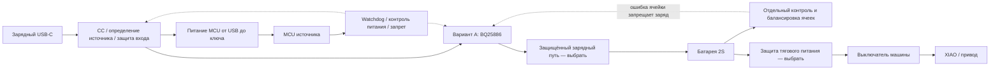
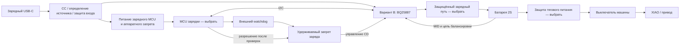

# Зарядный узел: сравнение двух схем

14 сентября 2026, предложение 0.6. Исследование начато 13 сентября. Это функциональные схемы и условия проектирования, **не схема для пайки, не готовая разводка PCB и не приёмка зарядки**. Основа — отдельный зарядный USB-C, LW 601844HP 2S/600 мА·ч, работа при выключенной XIAO. Паспортные токи и состояние батарей ещё неизвестны.

Дополнение: [анализ CHARGE-SENSE-01](charge-sense-paths.md) показывает,
что один шунт BAT→плюс не контролирует обе ячейки с одинаковым порогом
при балансировке. Следующая оценка B должна учитывать два канала или
обоснованный запас на обходной ток. Текущие 3053/9082/12032 ₽ известных
частей B включают один канал и не являются сметой такого завершённого узла.
Новые детали не выбраны и не заказаны; вариант A остаётся резервом.

В 0.6 добавлен [отдельный регулятор CD U406](charge-bias.md): ещё
40/160/240 ₽ на 1/4/6 машин. B с регулируемым питанием CD —
2916/8774/11610 ₽ известных частей. Полной сметы и аппаратной приёмки нет.
Предыдущие суммы ниже сохранены как промежуточные этапы сравнения.

В 0.5 добавлена [цепь CD для B](charge-cd-actuator.md): два TMUX1219,
200/550/660 ₽ на 1/4/6 машин. B с INA300, защёлкой и CD теперь составляет
2876/8614/11370 ₽ известных частей. Для A равноценная исполнительная цепь
ещё не оценена; сравнение ниже сохраняется как промежуточный расчёт 0.4.
Питание CHG_BIAS и переходные процессы не согласованы, готовой платы нет.

В 0.4 добавлена [логическая защёлка CHARGE-PERMIT-01](../hardware/charge-permit/README.md).
Она имеет проверенную схему соединений, но пока без исполнительной цепи
и доказанного запрета при всех состояниях AUX. При условном добавлении
одного такого набора IC к каждому варианту на 1/4/6 машин прибавляется
146/584/876 ₽: A — 2709/8257/11743 ₽, B с INA300 — 2676/8064/10710 ₽.
Число защёлок и полная обвязка ещё требуют интеграции, поэтому это отдельная
надбавка в расчёте, а не утверждённая комплектация. Разница известных
частей 33/193/1033 ₽ сохраняется и не доказывает выгоду готового изделия.

В 0.3 добавлена [проработка независимого обнаружения тока INA300](charge-current-guard.md).
Она не закрывает аппаратное отключение: компаратор имеет задержку, шунт
влияет на измерения батареи, а полный импульс после сброса не измерен.
После добавления только IC преимущество B по известной цене на один
прототип сокращается до 33 ₽; комплект для серии по-прежнему не выбран.

В 0.2 учтён PI3USB9201: теперь оба варианта требуют автономного MCU для
USB-распознавания. Кандидат — [CH32V003F4P6](charger-mcu.md), 90 ₽, TSSOP20;
есть карта выводов, но нет схемы/прошивки/монтажа. Следующая приоритетная
проверка — аппаратное ограничение нештатного заряда у BQ25887: по известным
позициям он дешевле, но возврат настроек при сбросе ещё не закрыт. Это
приоритет разработки, не выбор комплектующих для покупки всей серии.

## Состав вариантов

Для варианта A теперь есть [электрическая схема самого преобразователя](../hardware/charge-core/README.md) на BQ25886 с ERC и проверкой соединений. Это не завершает сравнение полных зарядных узлов: контроль/балансировка ячеек, защита, источник и разрешение заряда ещё не реализованы. Принята для проработки номинальная настройка около 250 мА, вместо прежнего расчётного ориентира 300 мА; это предложение агента, а не подтверждённый режим LW. Точность при малом токе, отсутствие отключения SYS через CE и противоречия JEITA учтены как ограничения.

| Функция | A: BQ25886 с аппаратной настройкой тока | B: управляемый BQ25887 |
| --- | --- | --- |
| Заряд 2S от 5 В | BQ25886 + дроссель, конденсаторы, настройка резисторами | BQ25887 + дроссель, конденсаторы, настройка по I²C |
| Контроль/выравнивание ячеек | Отдельный узел; BQ29209 проверен как кандидат, ограничений ниже недостаточно для окончательного выбора | Встроенная балансировка + внешний токозадающий резистор и измерительная цепь MID |
| Контроллер при выключенной машине | CH32V003 — кандидат для PI3USB9201/разрешения источника; отдельная программа теперь нужна | Тот же кандидат MCU дополнительно настраивает зарядник по I²C |
| Сбой управляющей программы | Ток задаётся резистором, но источник/разрешение требуют внешнего watchdog, контроля питания и аппаратного запрета | Те же функции плюс защита от возврата ICHG к 1,5 А при watchdog/сбросе самого зарядника |
| USB-C/источник | Общие CC, PI3USB9201, входной ключ и AUX; детектор BQ25886 изолирован локально в ядре v0.2 | Те же внешние цепи; PSEL сам источник не распознаёт |
| Защита батареи при езде | Отдельная защита ячеек/силовые ключи, ещё выбрать | То же; зарядник не заменяет защиту тяговой нагрузки |
| Температура и статус | Датчик у батареи, индикация зарядника, обработка ошибок узла ячеек | Датчик у батареи; MCU может различать заряд/готовность/ошибку по регистрам |
| Дополнительные зависимости CAD | Общий MCU/питание/watchdog плюс отдельный контроль/балансировка ячеек | Общий MCU/питание/watchdog плюс балансировочный резистор и защита от нештатного тока |
| Цена готового узла и поставка | Не установлены | Не установлены |

Обе схемы требуют отдельного зарядного разъёма с креплением и жгута к штатным разъёмам батареи. Найдены [предложения ключевых микросхем в ChipDip](charge-parts.md), включая минимальные партии и доставку в Чебоксары. Цены одной микросхемы или размер её корпуса не являются ценой и размером платы. Полная закупка не сформирована; HY2120-CB доступен, но его запуск после смены батареи требует отдельного решения.

Стрелки не назначают контакты неизвестной BMS. Особенно важно не объединить B− и P− через измерительные/USB-провода, если выбранная защита разрывает минус: такой обход может сделать её бесполезной. Земля сервисного USB XIAO и зарядного порта также учитывается при выборе силового пути. До выбора защиты эти диаграммы нельзя превращать в монтажную инструкцию.

## Что добавляет отдельная балансировка

[BQ29209, TI SLUSA52C, март 2016](https://www.ti.com/lit/ds/symlink/bq29209.pdf) — **вторичная** защита от перенапряжения с балансировкой, а не полная BMS. Порог OVP 4,30 В; внутренний балансировочный ток до 15 мА. Типовое включение балансировки при разнице 30 мВ; больший ток требует внешних ключей/резисторов (рис. 11). OUT не является силовым разрывом. Не смешивать BQ29209 с BQ29200 (4,35 В) или автоматически подменять ревизией -Q1.

Расчётная нижняя граница времени исправления **разницы заряда**, при непрерывных 15 мА: `t = ΔQ / I`. Для 6/30/60 мА·ч это 0,4/2/4 часа. Реальное время может быть больше из-за порогов, пауз и меньшего тока. Разницу напряжений нельзя просто переводить в мА·ч. Поэтому «600 мА·ч — маленькая батарея» не доказывает достаточность 15 мА.

Пример ограничения регулирования только суммы: 4,30 + 4,10 = 8,40 В. Это не разрешённое состояние LW, а демонстрация, почему правильное напряжение сборки не доказывает правильное напряжение обеих ячеек. Порог вторичной защиты нельзя использовать как штатную цель заряда. Вариант A требует отдельной проверки завершения и ограничения напряжения каждой ячейки, включая заметный начальный разбаланс.

## Разрешение заряда у BQ25887

По [TI SLUSD89B, ноябрь 2019](https://www.ti.com/lit/ds/symlink/bq25887.pdf), CD=1 запрещает заряд и переводит устройство в HIZ, но сохраняет I²C/ADC; внутри CD подтянут к земле через 900 кОм. Внешняя цепь обязана удерживать запрет при старте и потере питания MCU. Ещё одна ловушка: сигнал PG становится активным только при CD=0. Нельзя ждать PG как единственное условие первого снятия CD — получится взаимная блокировка. Наличие допустимого входа проверяется независимо.

При зависании MCU внутренний watchdog зарядника способен вернуть ток к 1,5 А. Предложение — внешний watchdog и удерживаемый запрет. Программное отключение внутреннего watchdog не защищает от перезапуска самого зарядника или ошибочной записи регистров; эти случаи остаются отдельными проверками и могут потребовать независимого аппаратного контроля тока.

У [TPS3431, TI SNVSB66A, октябрь 2021](https://www.ti.com/lit/ds/symlink/tps3431.pdf) выход WDO выдаёт импульс запрета на 170–230 мс, а не сохраняет ошибку навсегда. Поэтому один WDO нельзя считать постоянным разрешением/запретом зарядки: после окончания импульса неисправный MCU не должен снова разрешить заряд. Нужна защёлка ошибки либо схема сброса MCU, которая гарантированно удерживает CD до новой настройки. Конкретная реализация/номиналы ещё не выбраны.

Предлагаемое поведение CHARGE-GATE-01:

| Событие | Обязательное состояние проектируемого узла |
| --- | --- |
| USB подключён, MCU ещё не запущен | CD=1; заряд не начинается с заводским током |
| Источник распознан, MCU запущен | CD=1; запись и чтение обратно всех параметров, проверка батареи/температуры |
| Параметры проверены, ошибок нет | Разрешение заряда; периодическая проверка параметров и свежести измерений |
| I²C завис, readback неверен, MCU сброшен или watchdog сработал | CD=1; ошибка удерживается до успешной полной повторной инициализации |
| Импульс WDO закончился | Запрет сохраняется; окончание импульса не является восстановлением |
| Сам зарядник перезапустился при работающем MCU | Не считать его настройки сохранёнными; доказать отсутствие зарядного импульса выше допустимого тока. Пока не закрыто |
| Батарея/средняя точка отключена | Запрет; вставка батареи запускает новую проверку, а не продолжение прежнего разрешения |
| Зарядный USB отключён | Заряд прекращён; движение только после отдельного разрешения управления |

Heartbeat должен зависеть от успешно завершённой проверки, а не генерироваться автономным PWM/таймером независимо от основной программы. Тайм-ауты и допустимая длительность переходных процессов определяются после выбора схемы; нынешний документ их не объявляет измеренными.

## Тепло и входной ток

При условных 8,4 В × 0,3 А и КПД 85% зарядник получает около 2,96 Вт, теряет около 0,44 Вт и требует примерно 0,624 А от входа 4,75 В, **без** расхода управляющей электроники. Это оценка, не спецификация КПД или разрешение тока LW. От разрешённого источника 500 мА ток заряда придётся уменьшать.

Для BQ25887 формула балансировки: `I = Vcell / (Rext + Ron)`. При условных 4,2 В, 100 мА и Ron=1 Ом получается Rext≈41 Ом; на нём около 0,41 Вт, на внутреннем ключе около 0,01 Вт. Это исследовательский режим, не выбранный резистор. Одновременно с потерями преобразования под кузовом появляется заметный источник тепла; нельзя молча вписать его в прежний брусок зарядника 33×16×8 мм без тепловой проверки. Паспортный предел 400 мА не является рекомендуемым режимом нашего изделия.

## Стоимость известных позиций

Расчёт [tools/compare_charger_cost.py](../tools/compare_charger_cost.py) читает
[таблицу предложений](charge-parts.csv), выбирает одно предложение каждой
альтернативной детали по минимальному расходу с достаточным указанным
остатком и учитывает минимальные партии. [Результат с каждой строкой и ссылкой](evidence/charger-cost-comparison.json).
Карточки CH32V003, BQ25886, обоих предложений BQ25887 и BQ29209 повторно
прочитаны 14 сентября; остальные цены — записанный снимок того же дня.

| Покупка на число машин | Общие известные позиции, ₽ | A: известная часть, ₽ | B: известная часть, ₽ | Разница A−B, ₽ |
| --- | ---: | ---: | ---: | ---: |
| 1 | 1530 | 2563 | 2160 | 403 |
| 4 | 5200 | 7673 | 6880 | 793 |
| 6 | 7434 | 10867 | 9114 | 1753 |

Таблица выше сохраняет состав 0.2 без независимого детектора тока B.
С новым кандидатом INA300 расход на 1/4/6 увеличивается ещё на
370/600/720 ₽ (покупка 1/5/6), и известная часть B становится
**2530/7480/9834 ₽**, разница с A — **33/193/1033 ₽**.
Это также не полный узел: нет стоимости шунта/исполнительной цепи и
доказательства, что они обеспечивают требуемое отключение. Нельзя
выбирать B по прежней разнице 403 ₽ на одну машину, игнорируя эту функцию.

Общие строки: PI3USB9201, TUSB320LAI, TPS25200, TPS70933, CH32V003,
TPS3431, HY2120-CB и одно USB4105-GF-A на машину. Они всё ещё кандидаты,
не готовая совместимая схема. A добавляет BQ25886 и минимальную партию
7 BQ29209; B — BQ25887 (одна штука за 630 ₽ либо партия 6 за 1680 ₽).
Для четырёх BQ25887 дешевле купить шесть, два останутся. Для одной детали
в карточке BQ25887RGE ещё нужно подтвердить полный заказной суффикс.

**Это не полная цена зарядки.** Не включены PCB/монтаж, дроссель/пассивы,
NTC, жгуты, силовые MOSFET, обвязка защёлки/исполнительная цепь, согласование уровней,
полный контроль ячеек A и независимая защита тока B, доставка и инструмент
прошивки. У TPS3431 записан остаток только 2 шт.: суммы на 4/6 условны,
закупка по этим предложениям целиком невозможна. Нужен доступный watchdog
или другое предложение. Дешевизна законченного варианта B ещё не доказана.

## Размер и сложность сборки

Оба зарядных IC имеют корпус 4×4 мм. MCU TSSOP20 занимает номинально
6,4×6,5 мм с выводами в обоих вариантах, поэтому его появление не является
добавочной площадью только варианта B. В A есть ещё корпус BQ29209 3×3 мм,
но у B внешний балансировочный резистор и его тепло могут потребовать
больше места, чем одна микросхема. Складывать площади корпусов и объявлять
результат площадью PCB нельзя: нужны трассировка, зазоры, тепловые области,
разъёмы и крепёж. Прежний CAD-резерв 33×16×8 мм не подтверждён для A или B.
В обоих вариантах остаются QFN и теплоплощадки; MCU в TSSOP не устраняет
необходимость такой технологии монтажа.

## Решение после сравнения

Преимущество A — аппаратная настройка тока. Преимущество B — интегрированная
балансировка/измерения и меньший расход по известным позициям. Следующая
проработка — B с аппаратной защитой от сброса настроек тока, после чего
пересчёт дополнительных деталей и проверка компоновки. Для реактивного
детектора нужны измеренные пик/длительность остаточного импульса и их
допустимость для LW; сам порог INA300 этого не доказывает. Если отсутствие
недопустимого зарядного импульса не удаётся обеспечить, B нельзя принимать
только из-за цены; возвращаемся к A с полноценным контролем ячеек.
Готовую схему ядра A сохраняем как резерв. Одна пара BQ25886+BQ29209
по-прежнему не является полным зарядным узлом.

Практическая приёмка обоих вариантов: разряженный/заряженный и разбалансированный имитатор батареи, обрыв средней точки, зависание/сброс MCU для A и B, отдельный сброс зарядника B, переподключение USB, обе ориентации C–C, одновременный сервисный USB, полный цикл реальной исправной LW и температура под кузовом. Сейчас выполнены чтение даташитов и арифметические оценки; монтажа, осциллограмм, полной BOM с ценами и этих испытаний нет.
