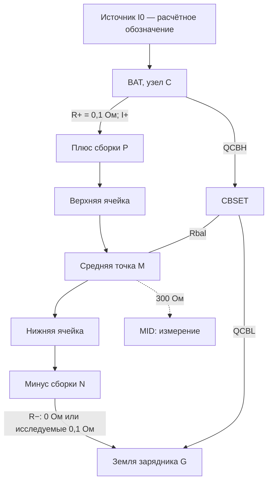

# Где измерять ток двух ячеек

14 сентября 2026. **CHARGE-SENSE-01 v0.1 — расчёт топологии, не схема для монтажа.**
Схема INA300 [CHARGE-OC-01 v0.2](../hardware/charge-overcurrent/README.md)
остаётся отдельным стендовым листом. Её J702 ещё не назначен на контакты батареи.

## Результат для выбора схемы

Один шунт между BAT BQ25887 и плюсом сборки **не контролирует максимальный
зарядный ток обеих ячеек с тем же порогом**. При включённой балансировке
верхней ячейки её обходной ток проходит мимо такого шунта и попадает в нижнюю.
Перенос единственного шунта в минус меняет местами неполностью наблюдаемые
режимы. Поэтому перенос существующего R702 в BAT сам по себе не закрывает
независимую защиту BQ25887 при сбросе.

Следующее направление для сравнения — два измерения в зарядных проводах
плюса и минуса, с общим запретом от любого превышения. Это предложение,
а не выбранный второй INA300: сначала требуется согласовать земли и защиту
батареи, оценить ошибки напряжений и стоимость. Простой провод между
зарядной землёй и минусом батареи обойдёт нижний шунт. Сохраняем вариант A
как резерв; текущая смета B не включает второй канал.

## Основание и допущения

Первичные документы TI, прочитаны 14 сентября:

- [SLUA938, март 2019](https://www.ti.com/lit/an/slua938/slua938.pdf),
  §2 и §3.1: балансировка уменьшает ток одной ячейки обходной ветвью;
  напряжения измеряются между BAT/MID и MID/GND. Рисунки 1 и 3 описывают
  соответствующие пути. Формулы ниже — наш вывод для добавленных шунтов.
- [SLUSD89B, ноябрь 2019](https://www.ti.com/lit/gpn/bq25887), §6:
  BAT — pins 13/14, MID — pin 9, CBSET — pin 10; SNS — pins 15/16,
  силовой выход, не отдельный Kelvin-вход. MID подключается к средней
  точке через рекомендованные 300 Ом; CBSET — через силовой резистор.
  §8.3.4.3 задаёт балансировочный ток через сопротивление внешнего резистора
  и включённого ключа.
- [Ответ TI о шунтах EVM](https://e2e.ti.com/support/power-management-group/power-management/f/power-management-forum/1414859/bq25887-bq25887evm-schematic-questions):
  R1/R6 необязательны для работы зарядника. Это не подтверждение нашей
  защиты или номинала 0,1 Ом. Полное графическое соединение EVM в этом
  исследовании не сверено: загрузка PDF для локального просмотра не удалась.

Ниже источник `I0` означает ток, поступающий во внутренний узел BAT до
разветвления. Это обозначение расчёта, **не ещё один доступный вывод IC**.
Ячейки идеальны, тяга и питание XIAO отключены; утечки, конденсаторы и BMS
опущены. Анализ устанавливает слепую зону, но не предсказывает реальный
переходный процесс или работу автоматического алгоритма балансировки.

## Узлы и токи



QCBH и QCBL в расчёте никогда не включены вместе. Положительный ток ячейки
означает заряд; `IH` — обход верхней ячейки от C к M, `IL` — обход нижней
от M к G. Балансировочный резистор общий, но направление тока в нём меняется.

Из закона Кирхгофа:

```text
Iверх = I+ = I0 − IH
Iниз = I− = I0 − IL

Балансировка верхней: IH > 0, IL = 0 → Iниз = I+ + IH.
Балансировка нижней:  IH = 0, IL > 0 → Iверх = I− + IL.
```

При указанных допущениях оба положительных тока не выше `I0`, но внешнего
вывода, в который можно просто вставить R702 до обоих внутренних
балансировочных ответвлений и сохранить штатные соединения, этим не найдено.

## Численный контрпример

Условные значения: верхняя ячейка 4,1 В, нижняя 3,9 В, `I0 = 0,4 А`,
`R+ = 0,1 Ом`, `R− = 0`, `Rbal = 41 Ом`, `Ron = 1 Ом`.
Последние два значения — иллюстрация, не выбранные компоненты и не пределы
с допусками. Включён QCBH.

Падение на R+ влияет и на обходную ветвь, поэтому учитываем его совместно:

```text
IH = (Vверх + R+ × I0) / (Rbal + Ron + R+)
   = 4,14 / 42,1 = 0,098337 А
I+ = 0,4 − IH = 0,301663 А
Iниз = 0,4 А
```

При постоянном таком токе идеальный порог 348 мА в плюсовой ветви не
пересечён, хотя нижняя ячейка получает 400 мА. Это не проблема задержки
50 мкс — вход компаратора вообще ниже порога. Когда I+ достигнет 348 мА,
нижняя ячейка в этой модели уже получит около **446,45 мА**.
Возврат `I0` к 1,5 А и 2,2 А превышает порог и в плюсовой ветви; контрпример
не означает, что этот шунт пропускает любой сброс. Он опровергает более
сильное обещание контроля обеих ячеек на уровне 348 мА.

## Что меняют варианты подключения

| Вариант | Что непосредственно измерено | Ограничение |
| --- | --- | --- |
| Только R+ между BAT и P | Ток верхней ячейки | При QCBH не хватает IH до тока нижней |
| Только R− между N и G | Ток нижней ячейки | При QCBL не хватает IL до тока верхней; возможен обход через общую землю |
| R+ и R−, запрет от любого | Оба тока в идеальной модели | Два канала, независимый зарядный возврат, проверка BMS/земель/USB и ошибок напряжений |
| Один канал и запас на максимальный обходной ток | Консервативная оценка второго тока | Нужно гарантировать максимум IH/IL с допусками/отказами и согласовать порог с LW; уменьшение номинального балансировочного тока само по себе этого не доказывает |

Оба внешних шунта вносят ошибку в наблюдаемые зарядником напряжения:
`Vверх_изм = Vверх + R+ × Iверх`,
`Vниз_изм = Vниз + R− × Iниз` (утечка MID здесь опущена).
Например, 250 мА дают 25 мВ на каждом установленном шунте 0,1 Ом.
При отрицательном токе знак ошибки меняется. Нельзя компенсировать её
произвольным повышением уставки напряжения или перестановкой SNS/BAT.

Полноценная защита требует также обнаружения обрывов/коротких замыканий,
поведения при пропадании питания и независимого запрета; два показания
тока сами по себе это не реализуют. Разряд через балансировщик не покрыт
однополярным порогом положительного зарядного тока.

## Воспроизведение и следующий монтажный барьер

Запуск: `python tools/analyze_charge_sense_paths.py`.
[JSON](evidence/charge-sense-paths.json) содержит восемь разобранных режимов,
378 сочетаний для проверки законов Кирхгофа и идеального покрытия двумя
измерениями, допущения и SHA-256 скрипта. Это расчёт постоянного тока,
**не SPICE, не ERC и не проверка INA300 во времени**.

До изменения силовой схемы нужно определить защищённые P+/P− и доступ
к средней точке LW, проверить отсутствие параллельного зарядного возврата
через тяговую плату/USB/отладчик и сопоставить допустимый ток LW с полной
погрешностью/импульсом отключения. Второй канал, номинал Rbal, общий BOM,
PCB и физический заряд пока не утверждены и не выполнены.
