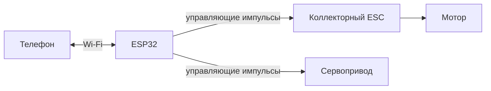

# Кандидаты шасси

Проверено: 13 сентября 2026 года. Статус: изучены источники и геометрия STL, конструкция для серии не выбрана.

## AlexY / zcar

Пользователь считает этот проект близким к желаемому результату; хочет Wi-Fi-управление и опциональную камеру.

Источники:

- [Ссылка пользователя: MakerWorld 26911, profileId 2189745](https://makerworld.com/ru/models/26911-fully-printed-1-28-rc-car-chassis-mini-z-compatibl#profileId-2189745).
- [Исходный репозиторий автора — alexyu132/zcar](https://github.com/alexyu132/zcar). MakerWorld напрямую направляет сюда за актуальными деталями.
- Проверенный HEAD `master`: `4b714e63fa30ed2030a8a48ab15f1e4a5fa380c4`. [README этой ревизии](https://github.com/alexyu132/zcar/blob/4b714e63fa30ed2030a8a48ab15f1e4a5fa380c4/README.md).

### Что подтверждено первичными источниками

По описанию автора: масштаб 1:28, база **90 мм (M)**, задний привод, независимая передняя и шарнирная задняя подвеска. Указан проверенный кузов Kyosho MZQ101 AE86. Универсальная совместимость с любым Mini-Z не заявлена.

В BOM используются мотор 130 для 2S, SG90, отдельные коллекторный ESC и радиоприёмник, четыре подшипника 625 и крепёж M3. Автор даёт ориентиры: батарея до примерно **45 × 23 × 16 мм**, приёмник менее примерно **34 × 22 × 13 мм**. Наши компоненты ещё не примерялись.

В GitHub есть STL и исходник `zcar.skp`. README описывает несколько передач с соответствующими креплениями мотора; раздел сборки не завершён. Часть печати выполняется слоями 0,1–0,15 мм; для нагревающихся деталей рассматриваются ABS/PETG. Репозиторий скачан в игнорируемый `build/upstream/zcar`, STL проверены ниже. Исходник SketchUp пока не редактировался; профиль MakerWorld не проверен по геометрии.

MakerWorld удалось прочитать через браузер после ошибки веб-инструмента. Видимый профиль отличается настройками от README; совпадение файлов профиля с GitHub пока не установлено. Брать набор файлов и BOM нужно из одной зафиксированной ревизии, а не смешивать публикации.

### Проверка файлов CAD

Проверена указанная выше ревизия. Воспроизводимый [скрипт](../tools/inspect_zcar.py) сохраняет SHA-256 файлов, габариты и число связных компонентов в [отчёт](evidence/zcar-mesh-audit.json). Проверка выполнена с Trimesh 5.1.0; стандартная загрузка объединяет совпадающие вершины, исправление отверстий при разделении отключено.

| Файл | Результат |
| --- | --- |
| `stl/zcar.stl` | Сборочная модель, габариты 65 × 123,625 × 35,25 мм; сетка не замкнута, 442 связных компонента. Это не 442 физические детали. Не использовать как готовое единое тело для печати или проверки пересечений объёмов |
| `stl/tray1.stl` | 7 из 7 компонентов имеют замкнутую сетку |
| `stl/tray2.stl` | 14 из 14 компонентов имеют замкнутую сетку |

Единицы STL явно не заданы; миллиметры приняты по размерам деталей из описания автора. Габариты основной рамы в `tray1`, компонент 3: **49,5 × 117,375 × 23,25 мм**. Это внешний размер детали, **не размер свободного батарейного отсека**. Замкнутость сеток не доказывает технологичность печати, прочность или посадки.

Ориентир нашей батареи 49 × 18 × 15 мм отличается от рекомендованных автором примерно 45 × 23 × 16 мм. Последующая [компоновка в CAD](../cad/README.md) нашла поперечное размещение и свободный путь бокового извлечения макета без расширения рамы; прямой подъём пересекает центральную полку. Это проверка габаритного параллелепипеда, а не готовый держатель. Примерка полного объёма батареи с проводами и кузовом остаётся открытой частью MOUNT-01/SWAP-01. Физические размеры трёх батарей ещё не измерены; печать адаптации не начиналась.

Повторить проверку из корня RaceRemote (для нового клона):

```powershell
git clone https://github.com/alexyu132/zcar.git build/upstream/zcar
git -C build/upstream/zcar checkout 4b714e63fa30ed2030a8a48ab15f1e4a5fa380c4
uv run --with trimesh==5.1.0 --with numpy==2.4.6 --with networkx==3.6.1 python tools/inspect_zcar.py build/upstream/zcar --output docs/evidence/zcar-mesh-audit.json
```

Скрипт не меняет исходные STL. Для новой [общей компоновки](../cad/assembly.md) в `cad/reference` включены сборочный STL после переноса начала координат и неизменённый редактируемый `zcar.skp`, с источником и GPL-3.0. Исходные печатные наборы остаются в закреплённом клоне. Включение сборки для просмотра не означает, что она адаптирована под выбранные покупные компоненты.

### Оценка адаптации — предложение, не подтверждённая сборка

Механика не требует конкретного радиопротокола. Поэтому разумный кандидат для первого варианта электроники:



Это функциональная схема, не электрическая: питание, уровни сигналов, распиновка, нейтраль и поведение при потере связи ещё открыты. Wi-Fi может работать через общую точку доступа; топология на рисунке не утверждается.

При таком подходе ESP32 выполняет роль приёмника команд, а ESC сохраняет управление силовой частью. Вариант собственной силовой платы, например на TA6586, следует сравнить отдельно по размерам, стоимости и объёму разработки. Покупка ESC не утверждена.

Для камеры нужно зарезервировать место, питание, обзор и способ связи. Ни место камеры, ни размещение платы ESP32 с micro-USB под кузовом сейчас не подтверждены. Ёмкость и маркировка аккумулятора не доказывают, что он войдёт в отсек.

### Следующая проверка кандидата

1. Выбрать интересующие кузова и проверить, подходит ли база 90 мм; изменение базы потребует согласованного комплекта механических деталей.
2. Осмотреть CAD выбранной ревизии и составить компоновку контроллера, питания, батареи, сервопривода и камеры.
3. Выбрать одинаковые покупные компоненты с точными артикулами. Размер «130» и название «SG90» сами по себе недостаточны для гарантии одинаковой комплектации от разных поставщиков.
4. Напечатать и проверить посадки, люфты, прямолинейность и нагрев на одном экземпляре; по результатам определить материалы и допуски для всей серии.
5. Составить собственную инструкцию сборки и проверки, а также полный BOM с ценой и запасными деталями.

### Альтернативная версия автора

[zcar2](https://github.com/alexyu132/zcar2) — отдельная полноприводная версия для дрифта с другой механикой и комплектующими. Её нельзя считать обновлением деталей, взаимозаменяемым с `zcar`; если рассматривать её дальше, вести отдельную спецификацию. Для нашего проекта тип привода и режим заездов пока не выбраны.

### Происхождение файлов

На просмотренной странице MakerWorld отображалась CC BY-NC-SA, в GitHub — GPL-3.0. Это наблюдение о разных публикациях, не заключение об их взаимозаменяемости. При включении сторонних файлов в проект сохранять их конкретный источник, ревизию и сопровождающую лицензию.
