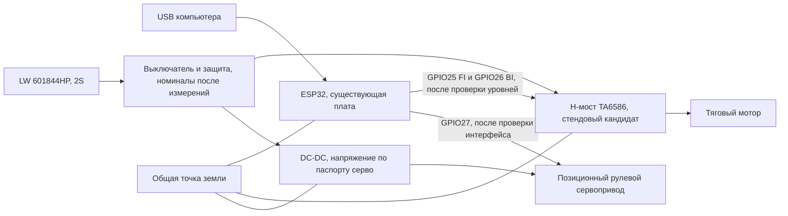

# Первый стенд привода: проект соединений

2026-09-13, редакция 0.1. Статус: **предложение для подготовки монтажа**, DRIVE-01/STEER-01 ещё не проверены. Текущая прошивка не управляет GPIO двигателя или серво. Это описание не означает, что собранную силовую часть уже можно включать через приложение.

Цель этапа — получить измеренные газ, руль и остановку на одном экземпляре, используя имеющуюся ESP32, затем перенести проверенные интерфейсы на одинаковую целевую комплектацию. Плата WROOM-32U с micro-USB используется как стендовая; её размеры не задают окончательную компоновку Mini-Z.

## Выбор первого механического привода

Для независимого от K989 стенда найдены [F130-08450 12 V и SG90 в ChipDip](drive-candidates.md). Это конкретные доступные образцы-кандидаты; покупок и подтверждённого pinout нет. Малый паспортный ток мотора не переносить на штатный мотор K989.

Пользователь разрешил временно использовать мотор и рулевой узел K989 для стенда, но отложил физические работы на другой раз: сейчас устал. Повторно спрашивать разрешение на использование этих узлов не нужно. Число проводов и распиновка остаются неизвестными; разборка и подключение не выполнены. До возвращения пользователя к физическим работам продолжать только независимую подготовку.

- Если узел имеет три провода, сначала определить питание, землю и сигнал. Само количество проводов ещё не доказывает стандартный сервопротокол.
- Если пять — сначала установить назначение каждого. Возможный вариант «два вывода двигателя + три потенциометра» требует отдельного замкнутого регулятора положения; подать стандартный сервосигнал на произвольный провод нельзя.
- Если K989 остаётся штатной, первый целевой привод собирается отдельно: мотор формата 130 с подтверждённой работой от 2S и позиционный трёхпроводный сервопривод. Для zcar исходный BOM использует SG90, но конкретная ревизия и продавец ещё не выбраны.

Таким образом, до физического подключения нужны: назначение проводов руля, допустимое питание, модель/характеристики тягового мотора и фото/маркировка несущей платы ESP32. Отсутствующие сведения не заменять выводами по цветам проводов.

## Функциональная схема питания и управления

Предложенные GPIO25/26/27 — имена сигналов ESP32, не номера ножек разъёма платы. Их доступность на конкретной плате нужно сверить. Земля серво возвращается через DC-DC к силовой общей точке. Ток мотора не должен идти через тонкий провод земли ESP32 или USB. Выход DC-DC не соединять с USB 5 В платы в этом стенде: ESP32 питается отдельно по micro-USB; общая только земля. Проект общего USB-C/аккумуляторного питания описан отдельно в [usb-c-power.md](usb-c-power.md).

Камера пока отсутствует. Силовой выключатель должен обесточивать мотор и серво независимо от состояния приложения. Номинал предохранителя, защита 2S и номинальный ток DC-DC открыты до измерения нагрузок. KIA7805 не принят в качестве питания серво: его тепловые потери и запас напряжения уже рассмотрены в project-brief.

## TA6586: установленная распиновка

Основание: [даташит производителя, копия «Чип и Дип», 2011.7](https://static.chipdip.ru/lib/923/DOC012923012.pdf), [английская копия того же документа](https://components101.com/sites/default/files/component_datasheet/ta6586-datasheet.pdf). Сверять ориентацию DIP-8 по метке первого вывода; не считать номера на плате ESP32 совпадающими с номерами TA6586.

| Вывод TA6586 | Назначение | Проект соединения |
| --- | --- | --- |
| 1 BI | Вход обратного направления | GPIO26 после проверки логических уровней |
| 2 FI | Вход прямого направления | GPIO25 после проверки логических уровней |
| 3 GND | Земля | Общая силовая точка |
| 4 VCC | Питание моста | Питание мотора после выключателя/защиты |
| 5 и 6 FO | Один выход моста | Объединённая пара к одному выводу мотора |
| 7 и 8 BO | Второй выход моста | Объединённая пара к другому выводу мотора |

Рабочее питание микросхемы 3–14 В охватывает 2S, но это не доказывает допустимость 8,4 В для выбранного мотора. В типовой схеме показаны 100 нФ и 470 мкФ по питанию. Для стенда предлагаются керамика 100 нФ и электролит 470 мкФ / 16 В рядом с мостом; достаточность ёмкости проверить по просадкам и выбросам. В документации указана необходимость медного теплоотвода у силовых выводов; рекламные «7 А» не являются гарантией для монтажа на проводах.

| FI | BI | FO / BO | Поведение |
| --- | --- | --- | --- |
| 0 | 0 | Оба отключены | Свободный выбег |
| 1 | 0 | Высокий / низкий | Одно направление |
| 0 | 1 | Низкий / высокий | Противоположное направление |
| 1 | 1 | Оба низкие | Электрическое торможение |

В таблице электрических параметров при VCC=6 В для высокого входа приведены 2,2 / 3,5 / 6 В (min/typ/max). Этого недостаточно, чтобы объявить запас помехоустойчивости от ESP32 гарантированным на всём диапазоне питания батареи. Сначала проверить каждый вход без мотора при 3,3 В управления; при необходимости выбрать согласование уровней с известными порогами. Не подтягивать GPIO ESP32 к напряжению аккумулятора.

Предложение для внешних подтяжек FI/BI — по 10 кОм к GND, чтобы сброс ESP32 давал `0/0`. Сопротивление и дополнительный буфер уточнить при проверке входов. После монтажа до подключения мотора измерить состояния обеих пар выходов для всех четырёх комбинаций. Показание мультиметра на отключённом выходе не доказывает способность отдавать ток; режим проверять также под небольшой известной тестовой нагрузкой.

## Как превратить логический STOP в остановку колёс

Сейчас v1 гарантирует только сброс логических значений и закрытие сессии. `throttle=0` ещё не назначен конкретной комбинацией FI/BI. Предлагается отдельно определить:

- запуск, сброс и снятие силового питания: отсутствие тяги; внешние подтяжки дают выбег;
- отпускание газа: режим нейтрали выбрать по замеру пути остановки;
- STOP/потеря управления при исправном питании: проверить электрическое торможение и нагрев, затем выбрать режим;
- смена знака газа: пройти через нейтраль; задержку и нарастание PWM подобрать по току и механике.

Не делать мгновенный полный реверс способом торможения. PWM, предел газа и пауза реверса пока не утверждены. Нулевая команда не доказывает, что колёса уже остановились: для STOP-01 дополнительно измерить время/путь остановки на полу при выбранном ограничении скорости.

## Порядок первого включения

1. Отключить аккумулятор и USB. Зафиксировать распиновку платы, драйвера, мотора и руля; исключить параллельное подключение штатной силовой платы к тому же мотору.
2. Проверить силовые соединения, полярность и отсутствие короткого замыкания. Выбрать ограничение тока первого испытания по мотору; если лабораторного источника нет, сначала подготовить отдельный проверяемый способ ограничения. Не измерять стопорный ток прямым удержанием мотора на полностью заряженной 2S.
3. Без мотора проверить питание и четыре состояния TA6586; определить необходимость согласования 3,3 В. ESP32 всё ещё питается только по USB.
4. Отдельно проверить питание и центр сервопривода со снятой тягой, затем выставить механические пределы. Произвольные 1000–2000 мкс не считать подтверждённым рабочим диапазоном неизвестного рулевого узла.
5. Добавить отдельную конфигурацию прошивки с подтверждённым pinout и малым ограничением газа. На вывешенных колёсах проверить направления, отпускание, STOP, фон приложения и потерю связи; записать фактический ток и нагрев.
6. Повторить при питании от батареи, затем на полу с небольшой скоростью. По результатам выбрать H-мост/ESC и серво для повторяемой целевой конструкции.

Пока ни один физический пункт этого списка не отмечен выполненным. Уже доказанные сетевые команды и отпускание — в [control-bench.md](control-bench.md).

## Альтернативы H-мосту

Если TA6586 требует неудобной обвязки или перегревается, сравнить готовый коллекторный ESC с реверсом и документированный драйвер. [TI DRV8833](https://www.ti.com/product/DRV8833) имеет диапазон 2,7–10,8 В, но допустимый ток зависит от корпуса/монтажа; не выбирать до измерения мотора. [TI DRV8871](https://www.ti.com/product/DRV8871) имеет регулирование тока, однако минимум 6,5 В требует проверки работы при разряде и просадках 2S. Ни одна из этих альтернатив пока не добавлена в обязательную закупку.
