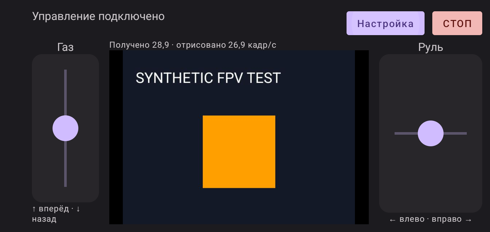

# Режим заезда Android

14 сентября 2026. **DRIVE-UI-01 v0.1 — реализация для испытаний.**
Проверено на Samsung SM-G973F / Android 12, пакет `vea.raceremote`.
Это управление программным контроллером на телефоне; мотор, ESP32 и
реальная камера в этих тестах не участвовали.

## Использование

В настройке подключить машинку; при необходимости включить видео, задать
адрес потока и нажать «Смотреть». Кнопка **«Заезд»** скрывает адреса,
увеличивает область видео и размещает газ слева, руль справа. «Настройка»
возвращает поля. Оба перехода обнуляют ввод, сохраняя исправное подключение
управления и существующий видеопоток. Режим работает и без камеры.



Начало касания задаёт нейтральную точку. Движение пальца вверх/вниз задаёт
газ вперёд/назад, вправо/влево — руль. Малое движение в пределах системного
порога жеста сохраняет ноль; больший ход пропорционально задаёт −1…+1.
Это нормализованное пожелание водителя, не PWM, скорость или угол колёс.
Ограничение скорости и калибровка остаются задачами прошивки и стенда.

Каждой зоной управляет первый коснувшийся её палец. Отпускание, отмена
жеста или выход за границы зоны обнуляют **эту ось**, сохраняя другую.
Второй палец, уже удерживаемый в той же зоне, не наследует управление:
для следующего жеста нужно убрать пальцы с зоны. Газ и руль можно держать
одновременно разными пальцами. Красный СТОП доступен в обоих режимах.

При потере соединения зоны блокируются и обнуляются. При уходе приложения
в фон управление отключается; возврат не подключает машинку автоматически.
Отказ только видео не является запретом управления. СТОП использует
существующий протокол и watchdog; UI-проверка не доказывает доставку STOP
или остановку физического мотора.

## Реализация и проверка

[DrivingPad](../app/src/main/java/vea/raceremote/control/DrivingPad.kt) использует
Compose pointer input с отслеживанием исходного указателя и обнулением
в `finally`; актуальный callback сохраняется через `rememberUpdatedState`.
Основа API — [документация Android о жестах](https://developer.android.com/develop/ui/compose/touch-input/pointer-input/understand-gestures);
сборка проверена с фактической Compose UI 1.3.3 проекта.
Переход компоновки не пересоздаёт `MjpegVideoView` и HTTP-запрос.
Учтён вырез экрана; другие размеры экрана пока не проверены.
Стендовые слайдеры остаются в настройке; удобство двух зон требует
оценки при реальном вождении.

Проверены **27 JVM-тестов и 4 instrumentation-теста**, без ошибок.
[DrivingModeTest](../app/src/androidTest/java/vea/raceremote/DrivingModeTest.kt)
проверяет одновременно ненулевые газ/руль, отпускание одной оси, ACTION_CANCEL,
выход за границу, отсутствие перехвата вторым пальцем, СТОП во время газа,
уход в фон во время газа и отсутствие автоматического переподключения.
В тесте с видео проверены увеличение площади View более чем в 1,3 раза,
сохранение одного HTTP-запроса при смене режима и продолжение DRIVE/ACK
после ручного выключения видео. Отдельный существующий тест проверяет HTTP
503 камеры при исправном управлении и остановку сессий в фоне.

Видеосервер повторяет синтетический JPEG. Это проверка отображения и
жизненного цикла, **не свежие кадры камеры, не проверка 30/60 FPS и не
замер задержки FPV**. Снимок показаний FPS не является результатом приёмки.
[Отчёт, исходные XML, хеши APK и исходников](evidence/driving-mode-2026-09-14/manifest.json).

```powershell
$env:ANDROID_HOME = 'C:/Users/Evgeny/AppData/Local/Android/Sdk'
$env:ANDROID_SDK_ROOT = $env:ANDROID_HOME
./gradlew.bat :app:testDebugUnitTest :app:connectedDebugAndroidTest '-Pandroid.testInstrumentationRunnerArguments.class=vea.raceremote.DrivingModeTest,vea.raceremote.VideoControlIsolationTest,vea.raceremote.ExampleInstrumentedTest' --console=plain
```

Испытания физического прототипа остаются открытыми: стабильная связь с
антенной, проводка и калибровка привода, камера/задержка, питание и зарядка,
механическая сборка. Этот экран не закрывает ни один из этих аппаратных этапов.
