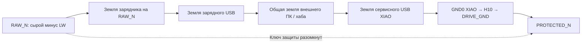

# Земли питания, зарядки и сервисного USB

15 сентября 2026. POWER-GROUND-01 v0.1 — предложение границ соединений, **не готовая схема защиты или инструкция подключения LW**. [Воспроизводимая проверка](../tools/check_power_ground_domains.py), [результаты](evidence/power-ground-v01.json).

Вариант защиты, разрывающий минус батареи, требует различать сырой минус `RAW_N` и внешний минус `PROTECTED_N`. В текущей плате H3/H5/H10 и GND драйвера электрически принадлежат одной DRIVE_GND: это сверено с netlist платы 0.3. Добавленная H10 разделяет места пайки, но не электрические земли.

## Обнаруженный обход

Если земля неразвязанного зарядника подключена к сырому минусу, а XIAO получает землю после защиты, два USB-кабеля к одному ПК/хабу могут восстановить разорванное соединение:



Это вывод из проводных соединений. Выключатель только в плюсовой ветви привода его не устраняет. Схема не рассчитывает ток кабеля, транзисторы защиты или последствия для конкретного аккумулятора. Физического опыта не проводилось.

Второй обход возникает без USB: если батарейный монитор питается относительно RAW_N, его землю нельзя напрямую соединить с DRIVE_GND ради «общей опоры» сигнала. Тот же вопрос относится к программатору и измерительным приборам, подключённым к разным доменам. Передача сигнала может потребовать развязки либо другого расположения защиты; конкретный интерфейс пока не выбран.

## Предлагаемая внешняя граница

Для рассматриваемой защиты в минусе обычные внешние земли предлагается держать со стороны PROTECTED_N. Это необходимое ограничение проводки, но не достаточная проверка зарядника с доступом к средней точке ячеек.

| Узел | Предлагаемое соединение | Что ещё не доказано |
| --- | --- | --- |
| H5 общей платы | Силовой возврат к PROTECTED_N | Конкретная защита, провод, ток и разъём |
| Waveshare: входная земля | Отдельная ветвь к PROTECTED_N | Физический входной жгут и шумы питания |
| Waveshare: выходная земля → H3 | DRIVE_GND | Токи между параллельными возвратами, выбросы |
| GND0 XIAO → H10 | DRIVE_GND; сервисный USB относится к этому домену | Работа при обоих USB и всех переходах питания |
| Земля неразвязанного зарядного USB/зарядника | Предварительно PROTECTED_N | Совместимость конкретного зарядного контроллера с отключением минуса |
| Монитор/балансир непосредственно на ячейках | RAW_N и соответствующие сырые выводы | Изолированный переход сигналов, внутренние обходные пути и горячее подключение |
| Металлические экраны USB | Назначить явно в полной схеме | Контакт через оба кабеля и механический крепёж |

**Среднюю точку нельзя считать только высокоомным измерением.** У кандидата BQ25887 MID (9) измеряет её через рекомендованный последовательный резистор, а CBSET (10) связан с ней через токозадающий резистор балансировки. Значит, до выбора точки GND требуется проверить и эти ветви, а не только BAT+/BAT−. Назначение выводов заново сверено по [TI SLUSD89B, раздел Pin Functions](https://www.ti.com/lit/ds/symlink/bq25887.pdf). Совместимость BQ25887 с предложенной границей **не установлена**. Предыдущий [анализ токов балансировки](charge-sense-paths.md) не моделировал защитные ключи.

Зарядка непосредственно со стороны сырых ячеек также не получает защиту автоматически от ключа в нагрузочной ветви: её собственный путь отключения должен быть доказан отдельно. Отсутствие найденной связи земель в одном сценарии не означает безопасность всего зарядного пути.

## Что проверяет модель

- 32 комбинации идеального контакта защиты, плюсового выключателя, двух USB-кабелей и общей земли источников. В предложенной внешней проводке разомкнутый контакт не соединяется обратно через **смоделированные провода**.
- 16 комбинаций для ошибочной земли зарядника на RAW_N при разомкнутой защите. Обход через хаб появляется в двух случаях: оба кабеля подключены к общей земле, выключатель привода может быть включён или выключен.
- Намеренное прямое соединение земли сырого монитора с DRIVE_GND даёт второй контрпример.
- Фактический netlist платы 0.3 подтверждает общую DRIVE_GND и разные VM, WAVE_5V, XIAO_BAT. Их различие не является доказательством отсутствия обратного питания через компоненты.

Модель — граф проводов и идеальных контактов. Она **не включает** ячейки как источники, MID/CBSET и внутренние цепи зарядника, диоды MOSFET/ESD, утечки, экраны, GPIO и преобразователи в переходных состояниях. Она не подтверждает отключение заряда/разряда реальной BMS, токовую защиту, аппаратный запрет движения при USB или пригодность LW.

```powershell
python tools/check_power_ground_domains.py
```

## Следующий проектный шаг

Выбрать и проверить согласованную схему защиты и зарядки, указав для каждого силового, измерительного, балансировочного и сигнального вывода домен и поведение при открытом ключе. Вариант с иным расположением ключей допустим, если устраняет обходы и проходит отдельную проверку. После этого можно назначить физические контакты входного жгута к H4/H5 и Waveshare, выключатель и предохранитель. Пока точки аккумулятора в CAD не соединяются произвольными проводами ради завершённого вида.
