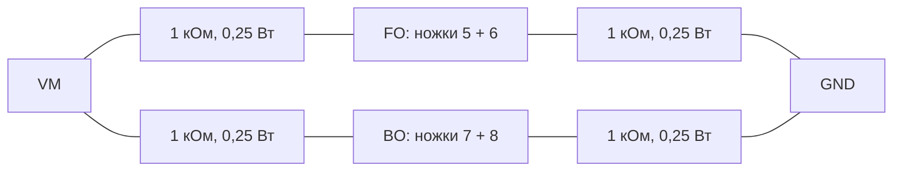

# TA6586: входы и проверка без мотора

13 сентября 2026, DRIVE-01, проект проверки 0.1. Физических измерений нет. Цель — проверить три имеющихся TA6586 до подключения привода. Мотор, серво и GPIO текущей прошивки в этом испытании не задействованы.

Дополнение 15 сентября: лабораторного БП у пользователя нет. Для первой низковольтной статической проверки подготовлен [вариант USB с последовательным резистором](ta6586-usb-fixture.md), отдельным расчётом и журналом. Он не выполняет описанные ниже испытания при 6/8,4 В и не разрешает подключать LW или мотор. На XIAO используются ручные 3V3-перемычки, не номера GPIO25/26 из старого стенда WROOM.

## Что уточнено в документации

На странице 2 [даташита TA6586, 2011.7](https://static.chipdip.ru/lib/923/DOC012923012.pdf) строка `ViH` содержит min=2,2, typ=3,5, max=6 В при общих условиях VCC=6 В, 25 °C. **3,5 В нельзя трактовать как минимальное необходимое напряжение входа.** Стандартное чтение обозначения ViH допускает высокий уровень от 2,2 В в указанных условиях. Также статический ток в этом документе нормирован при входе 3 В. Для ViL указан максимум 0,7 В, ток входа при 3 В — максимум 150 мкА.

Это основание начать с прямого управления 3,3 В, а не добавлять буфер только из-за числа 3,5. Таблица не даёт зависимости входов от VCC/температуры для всего диапазона 2S, поэтому запас на реальном стенде ещё проверить. SHA256 прочитанного PDF: `73ad4ae4cc75fb6555e9cb36b9e8129c6dbaed010ead0c3fd987e807721a084c`.

Для ESP32 [даташит WROOM-32U v2.7, таблица 15](https://www.espressif.com/sites/default/files/documentation/esp32-wroom-32d_esp32-wroom-32u_datasheet_en.pdf) даёт VOH не ниже 0,8×VDD в указанных условиях: при 3,3 В это 2,64 В. С последовательными 100 Ом, внешними 10 кОм на землю и условным входным током 150 мкА получается `(2,64 − 100×0,00015)/(1+100/10000) ≈ 2,60 В`. Это иллюстрация запаса около 0,40 В относительно 2,2 В; перенос тока, указанного при входе 3 В, на другие точки не является строгой гарантией worst-case. Порог/нагрузка при 8,4 В питания моста пока неизвестны.

## Статические входы вместо прошивки

Для **каждого** входа FI (ножка 2) и BI (ножка 1): источник высокого уровня 3,3 В → съёмная перемычка → 100 Ом → вход; от входа 10 кОм к общей земле. Без перемычки вход остаётся низким. Первую проверку можно выполнить от отдельно подтверждённой линии 3,3 В, без GPIO: это проверяет микросхему и проводку, но не выходные уровни ESP32. Лишь после неё и проверки распиновки платы подключать GPIO25/26 в отдельной стендовой конфигурации. Текущая прошивка остаётся без управления выводами привода.

VM подключается только к ножке 4 TA6586 и нагрузочной цепи, GND — к ножке 3. Конденсаторы 100 нФ и 470 мкФ/16 В — между VM и GND у моста. 3,3 В и VM — разные цепи, общая только земля. Последовательный резистор не превращает GPIO в устойчивый к 5 В вход и не является изоляцией. Высокие входы подавать только при включённом питании моста, перед выключением снять их.

## Нагрузка, различающая выключение и тормоз

На каждом объединённом выходе нужна пара одинаковых резисторов:

Мультиметр измеряет каждый выход относительно общей земли. В выключенном состоянии делитель устанавливает примерно VM/2; при торможении выход активно притянут к земле. Без делителей плавающий выход может показывать произвольное напряжение и давать ложное заключение.

| FI | BI | Ожидаемый FO | Ожидаемый BO |
| --- | --- | --- | --- |
| 0 | 0 | VM/2 | VM/2 |
| 1 | 0 | Около VM | Около 0 |
| 0 | 1 | Около 0 | Около VM |
| 1 | 1 | Около 0 | Около 0 |

При VM=8,4 В худшая мощность одного резистора — `VM²/1000 = 0,07056 Вт`; поэтому 0,25 Вт имеет запас. Два активно переключённых выхода потребляют через тестовые резисторы суммарно до 16,8 мА, плюс ток самой микросхемы и входов. Это малая нагрузка, она **не проверяет** способность моста питать мотор.

Минимальный комплект: TA6586 из инвентаря, 4×1 кОм, 2×100 Ом, 2×10 кОм, 100 нФ, 470 мкФ/16 В, перемычки/монтаж и измеренные источники VM/3,3 В. Для резисторов предлагается 1%, 0,25 Вт. Наличие пассивных деталей и регулируемого источника у пользователя не подтверждено; это не уже собранный стенд и не повод сейчас просить его заниматься монтажом.

## Запись результата

Для каждой микросхемы записать обозначение экземпляра, фактические VM и 3,3 В, четыре комбинации FI/BI, измеренные напряжения обоих входов/выходов и общий ток. Повторить 00 после снятия перемычек. Табличная контрольная точка VM=6 В полезна при наличии регулируемого источника; затем проверить рабочие точки питания 2S, включая 8,4 В, с согласованным ограничением тока. Не заменять отсутствующий регулируемый источник неподтверждённой схемой питания.

Для первичной диагностики предлагаются окна: низкий выход ≤0,15×VM, высокий ≥0,85×VM, отключённый 0,4…0,6×VM. Это наши широкие диагностические границы, не новые паспортные допуски. Несоответствие — повод проверить монтаж/экземпляр, а не подключать мотор. Результаты заносить в [пустой журнал](evidence/ta6586-measurement-template.csv), сохраняя шаблон пустым и создавая отдельный файл измерений.

Только после статической проверки остаются PWM/фронты, питание/сброс ESP32, совместное переключение нагрузок, моторный ток/нагрев и физическая остановка. Если входного запаса недостаточно, 5-вольтовый буфер с TTL-входами можно рассмотреть отдельно; тип, включение/выключение питания и согласование при обесточенных узлах ещё спроектировать. Буфер сейчас не включён в обязательную закупку.
