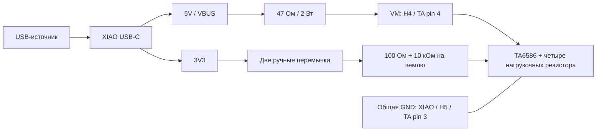

# Статическая проверка TA6586 от USB

15 сентября 2026. **TA-USB-STATIC-01 v0.1: предложение агента, расчёт выполнен; стенд не собран.** Это первый этап DRIVE-01, доступный без лабораторного БП. Печать и монтаж пользователь сейчас не выполняет. Заказанный XIAO ещё не получен.

Проверяем четыре состояния одного TA6586 на резисторах. LW, мотор, серво, Waveshare и зарядный узел в этом стенде отсутствуют. После проверки они не подключаются автоматически: питание привода от 2S и USB-C зарядка остаются отдельными незавершёнными этапами рабочего прототипа.

## Соединения

Один обычный USB-источник питает штатный USB-C XIAO. С его контакта **5V/VBUS** берётся питание моста **через 47 Ом ±5%, 2 Вт**. Контакт **3V3** питает только ручные входные перемычки. Это использование выходящего из USB питания; внешнее питание на 5V/BAT XIAO не подаётся. На полученной плате сначала подтвердить маркировку и ревизию: [официальная схема Seeed, страница 4](https://files.seeedstudio.com/wiki/SeeedStudio-XIAO-ESP32S3/new-res/202003753_XIAO%20ESP32S3%20Sense_v1.5_SCH_260226.pdf.pdf) соединяет боковой 5V непосредственно с VBUS. Подробнее — [разбор питания XIAO](xiao-usb-power.md).

| Откуда | Куда | Примечание |
| --- | --- | --- |
| XIAO 5V | RUSB 47 Ом → H4/VM | RUSB до всех цепей моста; удобные изолированные точки замера с обеих сторон |
| XIAO GND | H5/DRIVE_GND | Общая земля только этого USB-стенда |
| XIAO 3V3 | Съёмная перемычка JF → H1/CMD_FI | Без подключения D0/GPIO1 |
| XIAO 3V3 | Съёмная перемычка JB → H2/CMD_BI | Без подключения D1/GPIO2 |
| H4/VM | RFU 1 кОм → H6/FO → RFD 1 кОм → H5/GND | Два отдельных резистора, каждый 1%, 0,25 Вт |
| H4/VM | RBU 1 кОм → H7/BO → RBD 1 кОм → H5/GND | Верхние резисторы подключены **после** RUSB |

H1…H7 — площадки [носителя TA6586](../hardware/motor-carrier/README.md), а не покупные разъёмы. H3 не используется: на PCB он соединён с H5. На носителе уже предусмотрены 100 Ом последовательно каждому входу, 10 кОм с каждого входа на землю, 100 нФ и 470 мкФ/16 В между VM и GND. Их не дублировать.

Носитель ещё не изготовлен. Для первого навесного макета сохранить те же сети: TA pin 4=VM, pin 3=GND, pin 2=FI, pin 1=BI, соединённые pin 5+6=FO, pin 7+8=BO. Добавить указанные входные резисторы и конденсаторы самостоятельно. Нумерацию DIP8 определять по метке корпуса/даташиту, а не по ориентации рисунка соединений. У электролита плюс к VM. Подробности входной цепи — [основной метод](ta6586-input-check.md).

Дополнение к уже описанному комплекту статической проверки — **один RUSB на весь стенд**, не по одному на каждую машинку. Кандидат: Vishay PR02 с медными выводами, 47 Ом/5%/2 Вт; [даташит 28729, 08-Jul-2025](https://www.vishay.com/docs/28729/pr010203.pdf), стр. 1–3. Вариант PR02 с FeCu-выводами имеет другое значение допустимой мощности; название серии само по себе недостаточно. Точный доступный артикул, стоимость и наличие пассивных деталей не подтверждены, ничего не заказано. Можно подобрать эквивалент с подтверждённой мощностью/температурным режимом. Это внешняя оснастка, геометрия автомобильного носителя не меняется.

## Что даёт резистор

При измеренных 4,75…5,25 В до RUSB и предполагаемом фактическом сопротивлении 44,65…49,35 Ом расчёт даёт при коротком замыкании **после RUSB** до 117,6 мА от источника и 0,618 Вт на RUSB. Это оценка при заданных сопротивлении и напряжении, не гарантированный порог защиты с учётом нагрева, дрейфа и неисправностей. Резистор держать открытым для охлаждения, отдельно от пластика/проводов; при подозрении на короткое замыкание сразу отключить USB. Не создавать короткое специально для проверки.

RUSB не защищает цепи перед собой или сам XIAO. Он также не ограничивает начальный разряд конденсатора 470 мкФ, установленного после него: при условных +20% ёмкости и 5,25 В там около 7,77 мДж. Это не предохранитель, не стабилизатор тока и не ограничитель силовой цепи 2S.

В идеальной DC-модели с четырьмя 1 кОм ±1% и условным собственным током TA 0…7 мА VM остаётся около 4,01…5,03 В. **7 мА указаны производителем при VCC=6 В**, поэтому этот диапазон VM не гарантирован для настоящего экземпляра. Модель не содержит утечки, падения на ключах, переходных процессов или входных токов от 3V3. Последние не проходят через RUSB. Полные интервалы и проверка баланса токов/мощности: [расчёт](evidence/ta6586-usb-calculation.json), воспроизведение `python tools/calculate_ta6586_usb_fixture.py`.

## Порядок будущего измерения

1. Без USB и без аккумулятора проверить монтаж, номиналы, полярность электролита, отсутствие обхода RUSB. GPIO и высокие перемычки отключены. Сопротивление измерять только на обесточенном узле после разряда конденсаторов; записать отдельно измеренный RUSB. Камера/радио для этого опыта не нужны.
2. Подать USB сначала на XIAO без подключённого стенда. Измерить 5V и 3V3 относительно GND. Предложенные условия этого опыта: VBUS 4,75…5,25 В, 3V3 3,15…3,45 В. При выходе за них не продолжать; это наши условия испытания, не паспортный допуск USB или XIAO. Отключить USB, присоединить стенд, снова подать питание.
3. С перемычками снятыми измерить VBUS, VM и выходы. Продолжать только при **VM ≥3,5 В**, VM ≤VBUS и сохранении указанных напряжений XIAO. Предел 3,5 В выбран для этого опыта, чтобы питание моста оставалось выше применяемых входных уровней; он не заменяет паспортных порогов TA.
4. Выполнить последовательность **00 → 10 → 00 → 01 → 00 → 11 → 00**, где первая цифра FI. Единица — установленная ручная перемычка от 3V3. До установки каждой перемычки проверить VM; после изменения снова измерить питание и входы/выходы. При просадке, сбросе XIAO или неверном состоянии снять обе перемычки и отключить USB. Это ручная проверка, автоматического отключения нет.
5. Для каждого состояния записать измерения в [копию пустого журнала](evidence/ta6586-usb-measurement-template.csv). Мультиметр остаётся на DCV 20, чёрный щуп COM, красный V; для напряжений узлов чёрный на GND. Для падения на RUSB: красный на VBUS, чёрный на VM. Оценка тока ветви: `1000 × падение_В / измеренное_RUSB_Ом`, в мА. Это ток VM-ветви вместе с делителями, **не общий ток USB/XIAO и не полный ток микросхемы**. Погрешность измерения малой разности и изменение сопротивления при нагреве ограничивают точность.
6. Снять обе перемычки, отключить USB, дождаться и проверить разряд VM до <0,1 В перед перемонтажом/сменой TA. Конденсатор разряжается через делители; не замыкать его щупом. Каждый из трёх TA проверяется отдельно.

| FI/BI | FO относительно VM | BO относительно VM |
| --- | --- | --- |
| 00 | 0,4…0,6 | 0,4…0,6 |
| 10 | ≥0,85 | ≤0,15 |
| 01 | ≤0,15 | ≥0,85 |
| 11 | ≤0,15 | ≤0,15 |

Это диагностические окна проекта, не паспортные допуски. Основание последовательности состояний — [TA6586, 2011.7, стр. 1–2](https://static.chipdip.ru/lib/923/DOC012923012.pdf). Несоответствие означает остановку и разбор монтажа/измерений, а не разрешение подключить мотор. Успех подтверждает только статические состояния данного экземпляра при записанных напряжениях; уровни GPIO, PWM, 2S, нагрузочный ток, нагрев и физическая остановка остаются непроверенными.
