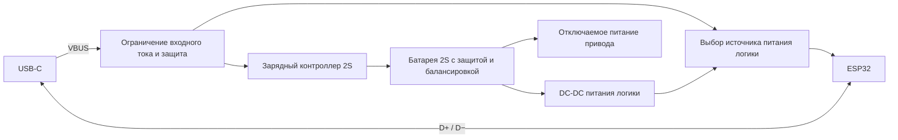

# USB-C: зарядка и прошивка

Дата исследования: 2026-09-13. Статус: кандидаты и архитектурное предложение, электрическая схема не утверждена.

Пользователь хочет удобно заряжать машинку через USB-C и при необходимости прошивать её через этот же разъём. Существующая плата ESP32 имеет micro-USB; замена её разъёма не добавляет зарядку аккумулятора.

Основа питания уточнена: **3 имеющихся LW LiPo 601844HP, 7,4 В, 600 мА·ч, 20C**. Пользователь хочет быструю замену. Предложено сохранить зарядку внутри машинки и добавить отдельную USB-C-подставку для снятой батареи; конструкция и число зарядных каналов пока не выбраны. [Батарея и кузов](battery-and-body.md).

## Найденные варианты

Пользователь дополнительно предложил [AliExpress, товар 1005009992298687, SKU 12000059797728061](https://aliexpress.ru/item/1005009992298687.html?sku_id=12000059797728061). После прохождения капчи пользователем 2026-09-13 удалось осмотреть карточку в его открытом окне Chrome через снимок окна Windows. Браузерный MCP переподключился к отдельному пустому окну, поэтому доступ к DOM этой вкладки не получен.

Название карточки: **M85K Адаптеры Micro USB to Type C**, магазин Shop1105058421 Store. В окне выбран вариант **10pcs**, показана цена **832 ₽**, остаток «99+», доставка отдельно (видимый вариант от 162 ₽). Привязку этого видимого выбора к исходному SKU по DOM не проверяли. Это предложение AliExpress; наличие на складе в РФ не установлено.

По фото: миниатюрные платы **MC002 / FMC002** с разъёмом USB-C, пятью контактными площадками и обвязкой R1/R2; микросхемы зарядника не видно. Назначение — заменить micro-USB на существующей плате. Оценка: кандидат разъёма/переходника, **не зарядный контроллер 2S**. Надпись о поддержке зарядки означает возможность передачи питания к существующей схеме, а не заряд аккумулятора самой переходной платой.

На основном фото пять MC002 и пять FMC002 с разным расположением площадок. Комплектность, соответствие посадке имеющейся ESP32-платы, разводку D+/D− и работу данных при обеих ориентациях USB-C проверить перед выбором. Номиналы R1/R2 и корректность цепей CC по доступному фото не установлены. Даже если комплект содержит десять плат, не считать их десятью одинаковыми разъёмами для серии без проверки вариантов.

Для использования с ESP32 возможна передача данных через существующий USB–UART-мост после подходящей замены разъёма, но остаются отдельные зарядник 2S, защита батареи и коммутация питания. Перепайка пользователем не запрошена и не выполнялась. В основной BOM переходник не выбран.

| Вариант | Цена | Наличие на дату проверки | Применимость |
| --- | ---: | --- | --- |
| [IP2326, Type-C, 2S — PCUS, модель 18650-2s](https://pcus.ru/moduli-pitaniya/plata-zaryada-s-zaschitoj-type-c-dlya-li-ion-batarej-2s) | 160 ₽ | Есть; подтверждено открытой страницей в браузере, количество не указано | Кандидат для стенда зарядки; для батареи 600 мА·ч и общего USB-порта нужна проверка и доработка |
| [IP2326, Type-C, 2S — RoboShop, 1011066](https://roboshop.spb.ru/modules/moduli-zaryada-akkumulyatorov/charge-type-c-2s) | 130 ₽ | Нет по карточке | Запасной поставщик, не доступная сейчас покупка |
| [USB-C на плате, 8 выводов — Voltiq, 53C-6](https://voltiq.ru/shop/usb-type-c-dip-adapter-8-pin/) | 75 ₽ | 114 по карточке | Кандидат внешнего разъёма с линиями данных; распиновку и CC проверить. Контроллера зарядки нет |
| [USB-C на плате, 4 вывода — Voltiq, 43E-4](https://voltiq.ru/shop/usb-type-c-female-4-pin-connector/) | 73 ₽ | 158 по карточке | VBUS/GND/D+/D−; доступ и обвязка CC не подтверждены. Контроллера зарядки нет |

160 ₽ — цена только зарядной платы. 160 + 75 = 235 ₽ — только две заготовки, не стоимость готового узла зарядки/прошивки. Нужны обвязка, защита, коммутация питания, монтаж и проверка. Доставка не включена.

## Почему IP2326 пока не выбран для серии

По [даташиту Injoinic IP2326 V1.11, копия у M5Stack](https://m5stack-doc.oss-cn-shenzhen.aliyuncs.com/1132/IP2326.pdf): это повышающий CC/CV-контроллер для 2S/3S, с балансировкой только 2S. Работает от 5 В при отсутствии согласования быстрой зарядки. Для балансировки нужен вывод средней точки батареи. Ток задаётся резистором. В режиме 2S целевое напряжение по умолчанию 8,4 В; таблица допускает 8,3–8,5 В. Порог завершения заряда в таблице 200–300 мА. Быстрая зарядка использует DP/DM и может поднимать входное напряжение выше 5 В. Источник: страницы 1–4 и 9.

Следствия для проекта:

- Заявленные магазином 1,5 А составляют **2,5C** для 600 мА·ч. Маркировка батареи «20C» не устанавливает допустимый зарядный ток. Нужна спецификация батареи; 0,3 А (0,5C) можно рассматривать лишь как предварительный ориентир, не разрешённый режим.
- Высокий порог завершения и допуск напряжения требуют проверки именно с малой LiPo-сборкой. Простое уменьшение зарядного тока не доказывает корректный полный цикл.
- Название магазина «с защитой/BMS» не доказывает отключение тяговой нагрузки при переразряде или КЗ. Схему защиты батареи и силовой путь проверять отдельно.
- Неизвестно, выведена ли средняя точка у имеющейся батареи. Без неё балансировку этого модуля нельзя считать работающей.
- Наличие USB-C не доказывает работу с кабелем C–C: нужно проверить CC и обе ориентации штекера.

TP4056 и встроенную зарядку 1S у некоторых ESP32-плат нельзя подключать к имеющемуся аккумулятору 2S. Переход на 1S изменил бы также выбор двигателя и питание сервопривода; он не принят. [Пример документации платы с зарядкой батареи 3,7 В: Seeed XIAO](https://wiki.seeedstudio.com/xiao_esp32s3_getting_started/).

## Один внешний разъём — предлагаемая архитектура

Это функциональная схема, не инструкция по пайке:

Для ESP32-C3 доступна прошивка через встроенный USB Serial/JTAG: GPIO19 — D+, GPIO18 — D−. У исходного ESP32-WROOM-32U нужен USB–UART-мост на несущей плате. Подключение выбранной платы и загрузочные кнопки ещё не определены. [Espressif: прошивка и отладка ESP32-C3](https://espressif.github.io/esp32-c3-book-en/chapter_5/5.3/5.3.3.html).

Если использовать IP2326, на схеме выше его QC-линии должны быть отделены от USB D+/D− контроллера. Предложение для дешёвого варианта — питание USB 5 В без QC, с изоляцией DP/DM зарядника; конкретный способ требует схемы и проверки платы. Нельзя напрямую объединять два потребителя линий данных или допускать повышенное QC-напряжение на входе 5 В ESP32-платы.

Для USB-C sink нужны корректные цепи CC1/CC2; обычный вариант — отдельные Rd 5,1 кОм. Эти резисторы не дают разрешения потреблять произвольный ток: источник и допустимый ток нужно определять, заряд от ПК ограничивать или отключать на время прошивки. [TI: конфигурация USB-C sink](https://e2e.ti.com/support/power-management-group/power-management/f/power-management-forum/1287225/bq24075t-charging-li-ion-battery-from-usb-c).

Нужен выбор между питанием от USB и батареи без обратной подачи в компьютер. На время зарядки предложено отключать тягу и серво; логика должна оставаться доступной для прошивки. Зарядка и питание работающего устройства — разные функции, простое соединение выходов двух источников не заменяет их развязку.

Если простая плата не пройдёт проверку, ориентир для собственной платы — класс контроллеров с power path, например [TI BQ25883](https://www.ti.com/product/BQ25883). Он объединяет зарядку 2S и распределение питания, но не снимает задачу защиты/балансировки батареи. Недорогой готовый модуль в наличии в РФ в этом исследовании не подтверждён; в смету не включён.

Отдельная ESP32-CAM имеет свой микроконтроллер. USB основного ESP32 не прошивает камеру автоматически: для неё пока предполагается сервисный UART/программатор, позднее возможно OTA. Требование одного внешнего порта для прошивки обоих контроллеров потребует отдельного решения.

## Что закрывает следующий стенд

1. Точная ревизия платы, размеры, схема, настройка тока и напряжения; спецификация и средняя точка батареи.
2. Полный цикл заряда с измерением обеих ячеек, тока, нагрева и корректного завершения.
3. USB-A–C и C–C, обе ориентации, блок питания и ПК; доступный входной ток.
4. Отсутствие обратного питания USB, устойчивость переключения источников и доступность загрузчика при отключённой тяге.

Связанные открытые контракты: CHARGE-01, USB-01, POWER-01, STOP-01 в [реестре](contracts.md).
