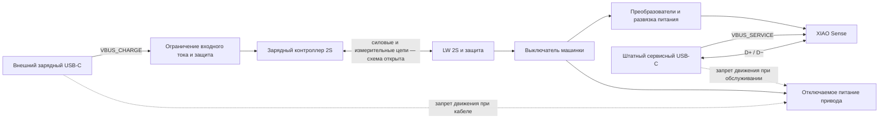

# USB-C: зарядка и прошивка

Добавлена [схема входного ключа TPS25200](../hardware/usb-input-gate/README.md), USB-INPUT-GATE-01 v0.1. ERC и соединения проверены; питания/распознавания источника перед ключом ещё нет. Условный clamp до 5,55 В не подтверждает прежний диапазон CHG_VBUS до 5,5 В и не ограничивает все выбросы; прямое объединение схем пока не принято.

Дата исследования: 2026-09-13. Статус: кандидаты и архитектурное предложение, электрическая схема не утверждена.

Пользователь хочет удобно заряжать машинку через USB-C. По последнему уточнению **отдельный зарядный порт разрешён; данные через него не требуются**. Дополнительные компоненты допустимы ради качественного готового изделия. Главное — удобное подключение кабеля и возможность скрыть/замаскировать порт. Заднее расположение и оформление под выхлоп — примеры, не обязательные требования. Существующая WROOM-плата имеет micro-USB; замена разъёма сама по себе не добавляет зарядку аккумулятора.

Основа питания уточнена: **3 имеющихся LW LiPo 601844HP, 7,4 В, 600 мА·ч, 20C**. Пользователь хочет быструю замену. Предложено сохранить зарядку внутри машинки и добавить отдельную USB-C-подставку для снятой батареи; конструкция и число зарядных каналов пока не выбраны. [Батарея и кузов](battery-and-body.md).

**Уточнение пользователя:** зарядное устройство уже есть, но готовые машинки будут подарены друзьям. Каждая должна заряжаться через свой USB-C от доступного владельцу обычного зарядного блока. Общий внешний модельный зарядник не является обязательной частью использования подарка. Для реализации предложен базовый режим USB 5 В без требования PD/QC; конкретные допустимые токи источника и работа кабелей A–C/C–C ещё подлежат проверке. Имеющийся зарядник остаётся оборудованием стенда, его модель и характеристики пока неизвестны.

## Найденные варианты

Пользователь дополнительно предложил [AliExpress, товар 1005009992298687, SKU 12000059797728061](https://aliexpress.ru/item/1005009992298687.html?sku_id=12000059797728061). После прохождения капчи пользователем 2026-09-13 удалось осмотреть карточку в его открытом окне Chrome через снимок окна Windows. Браузерный MCP переподключился к отдельному пустому окну, поэтому доступ к DOM этой вкладки не получен.

Название карточки: **M85K Адаптеры Micro USB to Type C**, магазин Shop1105058421 Store. В окне выбран вариант **10pcs**, показана цена **832 ₽**, остаток «99+», доставка отдельно (видимый вариант от 162 ₽). Привязку этого видимого выбора к исходному SKU по DOM не проверяли. Это предложение AliExpress; наличие на складе в РФ не установлено.

По фото: миниатюрные платы **MC002 / FMC002** с разъёмом USB-C, пятью контактными площадками и обвязкой R1/R2; микросхемы зарядника не видно. Назначение — заменить micro-USB на существующей плате. Оценка: кандидат разъёма/переходника, **не зарядный контроллер 2S**. Надпись о поддержке зарядки означает возможность передачи питания к существующей схеме, а не заряд аккумулятора самой переходной платой.

На основном фото пять MC002 и пять FMC002 с разным расположением площадок. Комплектность, соответствие посадке имеющейся ESP32-платы, разводку D+/D− и работу данных при обеих ориентациях USB-C проверить перед выбором. Номиналы R1/R2 и корректность цепей CC по доступному фото не установлены. Даже если комплект содержит десять плат, не считать их десятью одинаковыми разъёмами для серии без проверки вариантов.

Для использования с ESP32 возможна передача данных через существующий USB–UART-мост после подходящей замены разъёма, но остаются отдельные зарядник 2S, защита батареи и коммутация питания. Перепайка пользователем не запрошена и не выполнялась. В основной BOM переходник не выбран.

| Вариант | Цена | Наличие на дату проверки | Применимость |
| --- | ---: | --- | --- |
| [IP2326, Type-C, 2S — PCUS, модель 18650-2s](https://pcus.ru/moduli-pitaniya/plata-zaryada-s-zaschitoj-type-c-dlya-li-ion-batarej-2s) | 160 ₽ | Есть; подтверждено открытой страницей в браузере, количество не указано | Кандидат для стенда зарядки; для батареи 600 мА·ч и общего USB-порта нужна проверка и доработка |
| [IP2326, Type-C, 2S — RoboShop, 1011066](https://roboshop.spb.ru/modules/moduli-zaryada-akkumulyatorov/charge-type-c-2s) | 130 ₽ | Нет по карточке | Запасной поставщик, не доступная сейчас покупка |
| [USB-C на плате, 8 выводов — Voltiq, 53C-6](https://voltiq.ru/shop/usb-type-c-dip-adapter-8-pin/) | 75 ₽ | 114 по карточке | Кандидат внешнего разъёма с линиями данных; распиновку и CC проверить. Контроллера зарядки нет |
| [USB-C на плате, 4 вывода — Voltiq, 43E-4](https://voltiq.ru/shop/usb-type-c-female-4-pin-connector/) | 73 ₽ | 158 по карточке | VBUS/GND/D+/D−; доступ и обвязка CC не подтверждены. Контроллера зарядки нет |

160 ₽ — цена только зарядной платы. 160 + 75 = 235 ₽ — только две заготовки, не стоимость готового узла зарядки/прошивки. Нужны обвязка, защита, коммутация питания, монтаж и проверка. Доставка не включена.

## Почему IP2326 пока не выбран для серии

По [даташиту Injoinic IP2326 V1.11, копия у M5Stack](https://m5stack-doc.oss-cn-shenzhen.aliyuncs.com/1132/IP2326.pdf): это повышающий CC/CV-контроллер для 2S/3S, с балансировкой только 2S. Работает от 5 В при отсутствии согласования быстрой зарядки. Для балансировки нужен вывод средней точки батареи. Ток задаётся резистором. В режиме 2S целевое напряжение по умолчанию 8,4 В; таблица допускает 8,3–8,5 В. Порог завершения заряда в таблице 200–300 мА. Быстрая зарядка использует DP/DM и может поднимать входное напряжение выше 5 В. Источник: страницы 1–4 и 9.

Следствия для проекта:

- Заявленные магазином 1,5 А составляют **2,5C** для 600 мА·ч. Маркировка батареи «20C» не устанавливает допустимый зарядный ток. Нужна спецификация батареи; 0,3 А (0,5C) можно рассматривать лишь как предварительный ориентир, не разрешённый режим.
- Высокий порог завершения и допуск напряжения требуют проверки именно с малой LiPo-сборкой. Простое уменьшение зарядного тока не доказывает корректный полный цикл.
- Название магазина «с защитой/BMS» не доказывает отключение тяговой нагрузки при переразряде или КЗ. Схему защиты батареи и силовой путь проверять отдельно.
- Неизвестно, выведена ли средняя точка у имеющейся батареи. Без неё балансировку этого модуля нельзя считать работающей.
- Наличие USB-C не доказывает работу с кабелем C–C: нужно проверить CC и обе ориентации штекера.

TP4056 и встроенную зарядку 1S у некоторых ESP32-плат нельзя подключать к имеющемуся аккумулятору 2S. Переход на 1S изменил бы также выбор двигателя и питание сервопривода; он не принят. [Пример документации платы с зарядкой батареи 3,7 В: Seeed XIAO](https://wiki.seeedstudio.com/xiao_esp32s3_getting_started/).

## Дополнительный отбор для 600 мА·ч и снятых батарей

Проверка 13 сентября 2026. Пользователь подтвердил существующий зарядник и сценарий подарка. UC2/ToothStor ниже сохраняются как исследование; из ближайшей закупки исключены. Следующий подбор направлен на встроенный зарядный узел каждой машинки.

| Кандидат | Установлено по производителю | Следующий шаг |
| --- | --- | --- |
| [ISDT UC2](https://www.isdt.co/uc2-2.html?lang=en) | USB-C, 1S/2S LiPo, XH, заявлен ток 0,8 А | Для 600 мА·ч это 1,33C; документированной настройки на 0,3 А не найдено. Не выбирать автоматически из-за маленького размера |
| [VIFLY ToothStor](https://viflydrone.com/products/vifly-toothstor-4-port-2s-balance-charger-with-storage-mode) | Четыре независимых канала 2S, заряд через балансировочный разъём, режим хранения; USB-C PD3.0, производитель указывает питание 65 Вт. Вариант с JST-XH интересен для наших батарей | Кандидат общего внешнего зарядника. Проверить доступные малые токи по инструкции выбранной ревизии и фактический разъём батареи. На сайте $33,99 и Sold Out; рублёвую цену/доставку привычных площадок не подтвердили |
| [TI BQ25887](https://www.ti.com/lit/ds/symlink/bq25887.pdf), Rev. B | Повышающий зарядник 2S с балансировкой, вход 3,9–6,2 В; настройка ICHG 100–2200 мА шагом 50 мА, завершение от 50 мА | Технический кандидат собственного встроенного узла, не готовая покупка |

Для BQ25887 обнаружено существенное поведение отказа: зарядный ток по умолчанию **1,5 А**, регистр ICHG сбрасывается при истечении watchdog. Одной записи 0,3 А при запуске недостаточно. Нужны запрет заряда через CD до настройки, проверка readback и решение, которое сохраняет безопасный ток при зависании/сбросе управляющего контроллера. Это требование к будущей схеме, не уже реализованная защита. Значение 0,3 А остаётся предложением для исследования; паспорт LW по допустимому заряду не найден. Для подаренных машинок настройка тока должна быть внутренней функцией изделия, а не действием друга перед каждой зарядкой.

Готовый [MIKROE-3853 Balancer 5 Click](https://www.mikroe.com/balancer-5-click) использует BQ25887, доступны схема и 3D-файлы. Его плата 42,9×25,4 мм: она больше условного места 33×16 мм в текущем CAD, поэтому не считается подходящей заменой макета зарядника. Это источник схемы/вариант измерительного стенда; поставка через предпочтительные магазины и цена в рублях не подтверждены. Полноценное управление питанием машины и защита батареи требуют отдельной проверки.

IP2326 остаётся дешёвым исследовательским вариантом с прежними ограничениями по завершению и точности напряжения. Не превращать найденную настройку тока другой микросхемы в подтверждение пригодности IP2326. Сейчас ни встроенный зарядный модуль, ни внешний зарядник не выбраны окончательно.

## Отдельный зарядный порт — текущее предложение

14 сентября уточнено [распознавание USB-источника](usb-source-qualification.md): BQ25886 не позволяет назначить ILIM ниже 500 мА; его PG/CE не заменяют разрешение питания от источника. Найдены доступные кандидаты TUSB320LAI и BQ24392, но прямое присоединение к текущим CC/D+/D− недопустимо: нужны согласованная комплектация Rd, изоляция детекторов и отдельный силовой ограничитель. Полная электрическая схема входа ещё не реализована.

Подготовлено [сравнение полных зарядных узлов A/B](charge-node-comparison.md): состав, функциональные схемы, режимы отказа и оценки тепла. У BQ29209 выявлено ограничение балансировочного тока, у варианта BQ25887 — необходимость удерживать запрет после импульса внешнего watchdog и независимо проверять питание до снятия CD. Окончательный выбор и полная смета остаются открытыми.

Дополнен [отбор автономных контроллеров](standalone-charger-selection.md): BQ25886 предложен для следующего сравнения схем с отдельным контролем/балансировкой ячеек. MP2672 и MP2639A не назначены заменой из-за ограничений малотокового режима и завершения заряда. Это исследование по даташитам, без подтверждённой поставки или монтажа.

Предложение v0.2: внешний зарядный USB-C на отдельной небольшой плате, штатный USB-C XIAO под съёмным кузовом для обслуживания. Зарядный узел работает при выключенной машинке и не требует запуска приложения или ручной настройки владельцем. Схему выбираем с учётом этого режима; отдельный управляющий микроконтроллер допустим, но ещё не выбран и не обязательно нужен. Зарядный контроллер и плата с самим разъёмом могут размещаться раздельно.

Это функциональная схема, не инструкция по пайке:

VBUS_CHARGE и VBUS_SERVICE не объединять напрямую. Общая земля и силовые/измерительные цепи защиты ещё требуют электрической схемы; эта диаграмма не назначает контакты BMS. Зарядная ветвь должна оставаться работоспособной при выключенном питании тяги/логики. Аппаратная блокировка привода при подключённом кабеле пока не реализована; отключение кабеля не должно автоматически разрешать движение.

Пользовательские данные через зарядный порт не нужны, но D+/D− могут понадобиться выбранному узлу для определения источника питания; автоматически исключать их из покупки переходника нельзя. Эти линии не соединяются с USB XIAO. Базовое предложение — заряд от 5 В без обязательного QC/PD; отдельный разъём сам по себе не определяет допустимый ток и напряжение.

Для USB-C sink нужны корректные цепи CC1/CC2; обычный вариант — отдельные Rd 5,1 кОм. Эти резисторы не дают разрешения потреблять произвольный ток: источник и допустимый ток нужно определять. Если зарядный порт подключён к ПК, заряд ограничивается или отключается по доступному бюджету; наличие второго сервисного порта этого не меняет. [TI: конфигурация USB-C sink](https://e2e.ti.com/support/power-management-group/power-management/f/power-management-forum/1287225/bq24075t-charging-li-ion-battery-from-usb-c).

Отдельный зарядный порт не устраняет задачу развязки сервисного USB XIAO от батареи. По [проверенной заводской схеме](xiao-usb-power.md) боковой 5V напрямую связан с VBUS. Питание логики через дополнительный DC-DC/диод к BAT0 остаётся исследовательским вариантом; реальную 2S к BAT0 напрямую не подключать. При зарядке сервисный USB может быть отключён, а XIAO — выключен; при обслуживании XIAO доступна по своему штатному USB.

Если простая плата не пройдёт проверку, ориентир для собственной платы — класс контроллеров с power path, например [TI BQ25883](https://www.ti.com/product/BQ25883). Он объединяет зарядку 2S и распределение питания, но не снимает задачу защиты/балансировки батареи. Недорогой готовый модуль в наличии в РФ в этом исследовании не подтверждён; в смету не включён.

Текущий кандидат XIAO Sense объединяет камеру и управление на одном ESP32-S3. Для него предполагается один штатный сервисный порт. Предшествующая архитектура с отдельной ESP32-CAM не задаёт нынешнюю покупку или обязательное переключение USB между двумя контроллерами.

### Доступ и маскировка разъёма

Предложение USB-MOUNT-01 v0.4: [CAD-примерка бокового порта с магнитной крышкой](../cad/usb-port-study.md) и [пассивная PCB со схемой](../hardware/usb-port/README.md) 26×7,6×1 мм, GCT USB4105-GF-A. Вход X=59,1 мм, отверстия/площадки экспортированы из KiCad. Разъём остаётся на шасси, рамка крышки встроена в условный печатный кузов. Созданы STL крышки/образцов, проверены снятие и зазоры. При снятии всего кузова нужен составной путь: +2 мм вверх, +1 мм к USB, далее вверх; крепление кузова ещё проектируется. ERC/DRC платы прошли ранее; печать, удержание магнитов, фиксация жгута и физические проверки открыты. На плате порта уже есть два Rd 5,1 кОм; основная плата не должна дублировать их. Определение тока источника и защита остаются задачами основного зарядного узла. Общие критерии:

- Крепить порт к шасси; нагрузку от вставки/извлечения передавать на крепление, не на провода. Кузов снимается без отключения зарядного жгута.
- Предусмотреть сменную крышку, вставку бампера или небольшой лючок под конкретный кузов. Выхлопное оформление — необязательный вариант; место выбирается по доступу и свободному объёму.
- При обычной зарядке открывается крышка/вставка без инструмента и снятия всего кузова. Это предложение для удобства, а не уже проверенное свойство конструкции.
- В CAD учитывать корпус штекера, место для пальцев и изгиб кабеля, а не только отверстие USB-C. Размеры и глубину утопления назначить после выбора разъёма и измерения нескольких обычных кабелей A–C/C–C.
- Проверить полную вставку и извлечение с установленным кузовом, удержание порта, доступ к индикации заряда и отсутствие касаний колёс/подвески. Индикатор настоящего зарядника 2S не подменять штатным CHG XIAO.

Приоритет следующего подбора — автономный зарядный узел для 2S/600 мА·ч с подходящим током и завершением заряда, затем его реальные габариты, внешний разъём и крепление. Механическое оформление не закрывает выбор зарядника или проверку аккумулятора.

## Что закрывает следующий стенд

1. Точная ревизия платы, размеры, схема, настройка тока и напряжения; спецификация и средняя точка батареи.
2. Полный цикл заряда с измерением обеих ячеек, тока, нагрева и корректного завершения.
3. USB-A–C и C–C, обе ориентации, блок питания и ПК; доступный входной ток.
4. Отсутствие обратного питания USB, устойчивость переключения источников и доступность загрузчика при отключённой тяге.

Связанные открытые контракты: CHARGE-01, USB-01, POWER-01, STOP-01 в [реестре](contracts.md).
