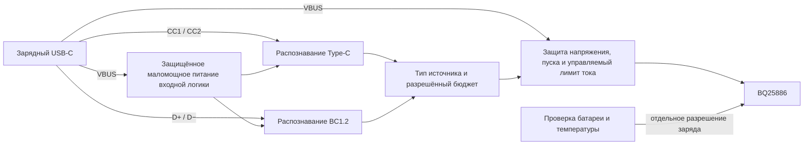

# Распознавание USB-источника: проектирование входа

14 сентября 2026. USB-SOURCE-01 v0.1 — **предложение интерфейса**, не готовая
электрическая схема. Уточняет недостающий узел между пассивным зарядным портом
и BQ25886. Источник должен распознаваться при выключенной машинке; запуск
Android/XIAO или ручная настройка владельцем для зарядки не предполагаются.

## Ограничения имеющегося ядра

По [TI BQ25886, SLUSD88A](https://www.ti.com/lit/gpn/bq25886), pin ILIM,
таблице электрических характеристик и §§8.3.3.2, 8.3.4:

- ILIM не поддерживает уставку ниже 500 мА. При настройке 500 мА таблица
  указывает 457/505/553 мА min/typ/max в своих условиях. «Настроить 500 мА»
  не означает гарантировать потребление не выше 500 мА.
- Внутренний D+/D−-детектор назначает SDP и неизвестному источнику 500 мА.
  PG сообщает о завершении распознавания, но не выводит отдельный код типа
  источника. Поэтому PG нельзя использовать как разрешение брать 810 мА.
- Ток ограничивается сочетанием ILIM, результата распознавания и ICO для DCP.
  ICO ищет рабочую точку источника; он не заменяет разрешённый USB-бюджет.
- CE запрещает заряд батареи, но не выключает SYS. Запрет заряда не заменяет
  отключение питания преобразователя до готовности входного узла.

R102=1,37 кОм в существующей схеме даёт лишь номинальный ориентир 1110/1370
≈0,810 А. Ни эта величина, ни минимальный режим ILIM не делают ядро готовым
потребителем от произвольного USB-порта. Ток самого входного детектора,
развязки, индикации и пусковой ток добавляются к току преобразователя.

## Предлагаемая организация

У GATE запрет по умолчанию; питание маломощного распознавателя — отдельная
ветвь перед ним. Иначе возникает замкнутая зависимость «распознать источник,
чтобы запитать распознаватель». Защита этой ветви, её потребление при
подключении к ПК и переходы при просадке тоже входят в будущую схему.

| Состояние источника | Предлагаемое поведение |
| --- | --- |
| Нет подключения, распознавание не окончено, ошибка входного питания | Основной преобразователь обесточен; заряд запрещён |
| Type-C сообщает 1,5 А или 3 А | Разрешается назначить собственный меньший бюджет в пределах объявления; это не команда заряжать батарею таким током |
| Type-C сообщает default | Сам по себе этот признак не разрешает уставку 810 мА; нужен результат BC1.2 или отдельное согласование с USB-host |
| BC1.2 сообщает зарядный источник | Выбрать бюджет по результату распознавания с учётом ограничителя и остальных нагрузок; затем проверить остальные условия заряда |
| Обычный SDP/неизвестный адаптер, согласования с ПК нет | Для текущего проекта основной заряд выключен. Малый режим возможен только с отдельно проверенным ограничением всего входного тока |
| Объявленный ток уменьшился или кабель отключён | Снять/уменьшить разрешение без ожидания приложения; время реакции ещё определить по выбранной реализации и проверить |
| Источник исправен, но батарея/термодатчик/средняя точка не прошли проверку | Источник не отменяет запрет заряда; состояние батареи — отдельный участник |

Источник и ток заряда батареи — разные ограничения. Для масштаба: при
8,4 В × 0,25 А, входе 4,75 В и **условном** КПД 85% требуется около 0,520 А
без расхода остальных цепей. При верхней прежней арифметической оценке
тока 0,316 А — около 0,657 А. Это не измеренный КПД/зарядный режим LW и не
обещание времени зарядки. Слабый разрешённый источник потребует снижения
зарядного тока или запрета, а не увеличения входного бюджета вслепую.

## Доступные кандидаты и конфликты интеграции

**TUSB320LAIRWBR** — кандидат CC-узла. По
[TI SLLSEQ8D](https://www.ti.com/lit/gpn/tusb320lai), §§7.2.4, 7.3.3:
GPIO-режим задаётся свободным ADDR; PORT должен задавать UFP/SNK, не DRP.
OUT1/OUT2 сообщают default/unattached, default/attached, 1,5 А и 3 А.
Это выходы с открытым стоком, требующие корректного питания подтяжек.
Контроллер имеет собственные Rd, включая обесточенное состояние.

**Он несовместим с прямым подключением к нынешней плате порта, где R1/R2 уже
установлены.** Для его применения потребуется отдельная согласованная ревизия
комплектации без внешних Rd на маленькой плате. Две пары параллельно не
допускаются. Текущая USB-PORT-01 v0.2 остаётся с R1/R2, её схема/PCB не менялись.
Другой путь — высокоомный CC-детектор, совместимый с текущими Rd; его схема
пока не выбрана. Нельзя незаметно смешивать эти два варианта в BOM.

**BQ24392RSER** — кандидат отдельного BC1.2-детектора. По
[TI SLIS146G](https://www.ti.com/lit/gpn/bq24392), таблицам 1–2 и §8.1.1:
CHG_AL_N отдельно сообщает разрешение, CHG_DET — класс low/high current.
Числовой бюджет задаёт система; один CHG_DET не является измерителем ампер.
GOOD_BAT влияет на классификационное поведение CDP и таймер dead-battery;
при постоянном низком уровне заряд может запрещаться после этого таймера.
Не соединять его с непроверенным напряжением сборки и не считать заменой BMS.
CHG_DET имеет push-pull уровни, зависящие от VBUS; прямое соединение с 3,3 В
входом не спроектировано.

На одних внешних D+/D− нельзя одновременно запускать детекторы BQ24392 и
BQ25886: оба воздействуют на линии. Нужна явная изоляция/последовательность
и проверка того, какой результат получит ядро после неё. Состояние внутренних
USB-ключей BQ24392 зависит от типа источника; нельзя предполагать, что линии
всегда проходят насквозь. Этот участок ещё не решён электрически.

Итого: пара позволяет рассматривать распознавание без обязательного MCU,
но **не выбрана окончательно**. Открыты управление силовым ключом, ограничения
пуска/тока/напряжения, уровень сигналов, маршрутизация D+/D− и совместимая
комплектация CC. Связать две найденные микросхемы с ядром проводами пока нельзя.

## Стоимость образцов

Карточки ChipDip прочитаны в браузере 14 сентября; обе позиции со склада
Москвы, срок 7 дней, привоз в магазин Чебоксар ориентировочно 21 сентября.

| Позиция | Цена и минимальный заказ | Расход на 1 / 4 / 6 машинок |
| --- | --- | --- |
| [BQ24392RSER, 8003769667](https://www.chipdip.ru/product/bq24392rser-texas-instruments-8003769667) | 150 ₽; минимум 2, шаг 1; от 5 — 110 ₽; остаток 644 | 300 / 600 / 660 ₽, покупка 2 / 4 / 6 |
| [TUSB320LAIRWBR, 8002948931](https://www.chipdip.ru/product/tusb320lairwbr-texas-instruments-8002948931) | 300 ₽; минимум 1; от 2 — 230 ₽, от 5 — 169 ₽; остаток 275 | 300 / 920 / 1 014 ₽, покупка 1 / 4 / 6 |

Всего для этих двух кандидатов: **600 / 1 520 / 1 674 ₽** с учётом минимальных
покупок и указанных скидок. Это не цена зарядника: плата, монтаж, ограничитель,
защита, пассивные детали и доставка сюда не входят. Нужны QFN-монтаж или сборка
на заказ; наличие соответствующего оборудования у пользователя не подтверждено.
Заказов не сделано. Числа добавлены в [таблицу зарядных деталей](charge-parts.csv).

Следующий шаг — выбрать и связать конкретный силовой ограничитель и способ
изоляции D+/D−. После полной схемы испытать имитаторы источников: SDP без
согласования, DCP/CDP, default/1,5/3 А Type-C, обе ориентации кабеля, смену
объявления, медленное подключение и сброс питания. Пока подтверждены источники
данных и расчёты, а не перечисленные электрические режимы.
