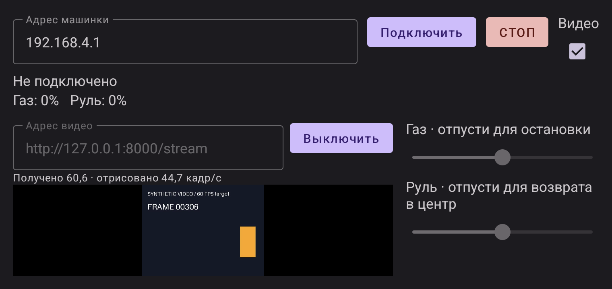
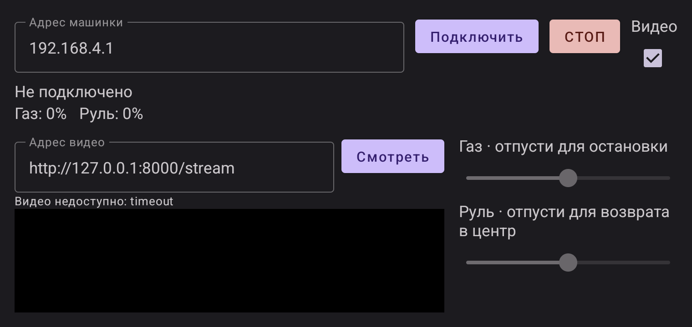

# Android MJPEG-приёмник: стендовая версия 0.1

**Обновление 0.2, 15 сентября:** [проверка меток захвата и номера кадра](video-freshness.md) отбрасывает повторы до декодера и не продлевает ими тайм-аут видео. В интерфейсе счётчик переименован в «Принято». Ниже сохранены первоначальные физические результаты версии 0.1; они не доказывают запуск новой версии на телефоне.

2026-09-13. Реализован в приложении `vea.raceremote`, проверен на Samsung SM-G973F / Android 12. Это часть FPV-стенда, не подтверждение пригодности выбранной камеры или завершение VIDEO-01/CAMERA-03.

## Использование

На экране управления включить флажок «Видео», ввести адрес потока, нажать «Смотреть». Камера и управление подключаются отдельно; камера может иметь другой IP. Пример адреса для CameraWebServer — `http://<IP камеры>:81/stream`. IP/порт конкретной прошивки нужно сверить. Кнопка «Выключить» останавливает только видео; «СТОП» по-прежнему останавливает управление. Ошибка видео не выключает исправное управление. Повторное подключение видео выполняется вручную и не требует нового ARM для уже работающего управления.



После паузы/ухода приложения в фон обе сессии закрываются, старое изображение очищается, автоматического возобновления нет. Если видео не нужно, убрать флажок: остаются обычные органы управления. 14 сентября добавлен [режим заезда](driving-ui.md): крупное видео и отдельные зоны газа/руля, с проверкой жестов на Samsung. Оценка удобства при физическом вождении ещё впереди.

## Интерфейс и ограничения

Участники: сервер камеры → `MjpegStream` → декодер → `MjpegVideoView`. Стендовый контракт 0.1:

- HTTP(S), `multipart/x-mixed-replace` с `boundary`; каждая часть содержит `Content-Type: image/jpeg` и обязательный `Content-Length`. Именно такой формат использует [CameraWebServer Espressif 2.0.17](https://github.com/espressif/arduino-esp32/blob/2.0.17/libraries/ESP32/examples/Camera/CameraWebServer/app_httpd.cpp). Другие форматы MJPEG без длины части, H.264, RTSP и WebRTC пока не поддерживаются.
- JPEG до 512 КиБ; строка заголовка до 4096 символов, заголовки части суммарно до 16 КиБ; декодируемый кадр до 1920 × 1080. Эти ограничения выбраны для стенда, не согласованы как окончательные параметры камеры. Ошибки формата/обрыв части закрывают только видео.
- Не более одного ожидающего JPEG и одного последнего декодированного изображения, дополнительно может декодироваться один кадр. Новые JPEG заменяют ожидающий. Это ограничение очереди приложения; буферы TCP и камеры отдельно не контролируются.
- Получение, декодирование и обновление экрана разделены. Экран берёт последнее изображение на своём такте; повторная отрисовка того же кадра не увеличивает счётчик. Старые callbacks после выключения/новой сессии не могут вернуть кадр предыдущей сессии.
- Начальное ожидание полного кадра — до 4 с. После первого полного JPEG отсутствие следующего в течение 1,5 с завершает видео; проверка каждые 250 мс. Отдельный тайм-аут чтения — 1,5 с без сетевых данных. Это диагностические значения агента, не допустимая задержка для езды. При тайм-ауте изображение убирается; управление не блокируется.
- Сетевой клиент и отмена видео независимы от `CarControlClient`. При наличии Wi-Fi-сети выбирается её socket factory; в режиме точки на телефоне используется обычный маршрут. Wi-Fi lock удерживается, пока работает управление или видео. В этой итерации видеопоток по радио не проверялся.
- URL вводится вручную. Автоматическое обнаружение, привязка камеры к машинке, авторизация и согласование режима потока ещё не реализованы. Редиректы и автоматические повторы HTTP отключены.

## Что означают показатели

В версии 0.1 «Получено» — число полных JPEG за окно примерно 1 с; начиная с 0.2 «Принято» — число кадров после фильтра метаданных. «Отрисовано» — число разных принятых кадров, переданных в `Canvas` через `onDraw`, за то же окно. Дополнительно в logcat с тегом `RaceRemoteVideo` записывается частота декодирования. Частота повторного рисования одного Bitmap не засчитывается.

Это **не оптическое измерение реально показанных экраном кадров** и не задержка от сцены до телефона. Без меток камеры получатель не распознаёт повторную передачу старой фотографии как новый JPEG. Начиная с 0.2 серверные `X-Timestamp`/`X-Sequence` используются для порядка/повторов по отдельному контракту; часы камеры и телефона не вычитаются. Для CAMERA-03 всё ещё нужны сцена с изменениями, внешний замер, согласованный режим и работа управления одновременно с реальной камерой.

## Выполненные проверки

- `:app:testDebugUnitTest :app:assembleDebug`: **24 JVM-теста, 0 провалов**. Новые проверки покрывают фрагментированные чтения, границы/длины частей, оборванный/невалидный JPEG и сохранение управления после окончания видео. Последняя проверка продолжает отправлять изменённые газ/руль и получает ACK через исходный WebSocket.
- `:app:connectedDebugAndroidTest`: **2 теста на Samsung, 0 провалов**. Новый тест открывает настоящий экран приложения, подключает локальный mock-контроллер, получает HTTP 503 от mock-камеры, проверяет доступность газа/руля и дальнейшие DRIVE/ACK. Затем переводит Activity в фон и обратно: обе сессии остаются остановленными. Второй тест проверяет пакет приложения. Это программные серверы, не физические мотор/ESP32.
- Ручной сценарий через ADB: синтетический JPEG 640 × 480 с меняющимся номером и движущейся фигурой, источник задаёт 60 кадров/с в течение 20 с, затем перестаёт слать данные при открытом сокете. На телефоне изображение отображалось и очистилось после тайм-аута. [Все секундные окна и SHA-256 APK](evidence/video-android-smoke.json).

В 19 полных активных окнах последнего прогона отрисовка составила **40,2–50,5 кадров/с, медиана 46,6**. Последнее неполное окно и окно остановившегося источника также сохранены в отчёте. Входной поток около 60 кадров/с не стал устойчивыми 60 кадрами/с отрисовки. Это короткий тест через **USB `adb reverse`**, без Wi-Fi, сенсора камеры, мотора и измерения задержки. Ни минимум 30 FPS реального FPV, ни цель 60 FPS этим тестом не приняты.



## Повторить синтетический тест

Источник привязан только к loopback ПК; установка платы камеры не требуется:

```powershell
uv run --with pillow==12.1.1 python tools/fpv_test_source.py --fps 60 --seconds 20
adb -s RF8M811X8FK reverse tcp:8000 tcp:8000
```

В приложении ввести `http://127.0.0.1:8000/stream`. После теста остановить источник и удалить только этот проброс: `adb -s RF8M811X8FK reverse --remove tcp:8000`. Для обычного подключения камеры проброс USB не нужен.

Синтетический источник проверяет код получателя; до покупки/прошивки камеры продолжать отдельно [подбор и план физического FPV-стенда](fpv-bench.md).
