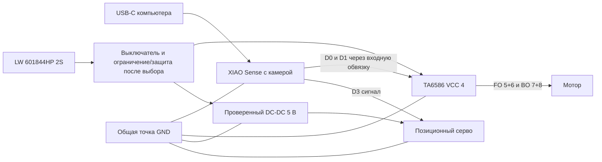

# XIAO Sense: проект подключения привода 0.1

15 сентября: [отдельные провода FI/BI/GND и координаты площадок](../cad/control-harness/README.md) подготовлены в CAD для нового носителя TA6586 H1/H2/H3. Профиль D0/D1 сохранён; реальная пайка, уровень входов, фиксация проводов и силовая общая точка не проверены. Сопоставление PCB1.5 с STEP2023 не подтверждает ревизию купленной платы.

15 сентября: [кандидат серво и совместного управления](../../RC_CAR_ESP32/docs/servo-outputs.md)
подготовлен в прошивке `68a6cca`: D3/GPIO4, LOW_SPEED канал 4/таймер 2, 13 бит.
Калибровка частоты и крайних/центрального импульсов задаётся явно; тестовые значения
не являются профилем заказанного SG90. Код компилируется, но в main не создаётся
и к GPIO не подключён. Согласование общей частоты источника LEDC с камерой,
физические сигналы и рулевая механика ещё не проверены.

15 сентября: [подготовлен адаптер PWM](../../RC_CAR_ESP32/docs/motor-pwm.md)
для предложенных D0/D1, нативных низкоскоростных каналов LEDC 2/3 и таймера 1.
Он только компилируется, в основной программе не создаётся/не включается.
Частота мотора, сигнал/пределы серво, монтаж и совместная работа с камерой ещё
не проверены; эта карта остаётся предложением, а не подтверждённой проводкой.

14 сентября: общий [планировщик привода](drive-output-plan.md) добавлен в независимую задачу watchdog WROOM/XIAO. Рассчитывает ограниченный газ, нарастание, паузу реверса и ноль при отказах. Это ещё не аппаратный PWM/серво-драйвер; карта выводов ниже остаётся предложением без настройки GPIO. Для руля нет предположенных импульсов в микросекундах.

2026-09-13. DRIVE-01/STEER-01/POWER-01: **предложено, проводка не проверена**. Отдельная карта для найденного комплекта XIAO ESP32S3 Sense; прежние GPIO25/26/27 в drive-bench.md относятся только к WROOM. Камерные сборки используют общий [профиль платы](../../RC_CAR_ESP32/board/xiao_sense.h), но не настраивают выходы мотора или серво.

## Выводы и ресурсы

| Сигнал | Надпись XIAO | GPIO | Соединение после проверки монтажа |
| --- | --- | ---: | --- |
| Мотор FI | D0 | 1 | Через 100 Ом к TA6586, ножка 2; от входа 10 кОм к GND |
| Мотор BI | D1 | 2 | Через 100 Ом к TA6586, ножка 1; от входа 10 кОм к GND |
| Руль | D3 | 4 | Сигнальный вход позиционного серво после определения его распиновки и проверки уровня 3,3 В |
| Общая земля | GND | — | Силовая общая точка; ток мотора/серво не пропускать через провод земли XIAO |

Выводы сверены с [Seeed](https://wiki.seeedstudio.com/xiao_esp32s3_pin_multiplexing/) и `variants/XIAO_ESP32S3/pins_arduino.h` установленного Arduino ESP32 2.0.17. Камера использует GPIO10–18, 38–40, 47, 48; SD резервирует 7/8/9/21, микрофон 41/42. USB19/20, UART43/44, выводы загрузки 0/3/45/46 и память исключены из предложения. D2/GPIO3 оставлен свободным из-за функции strapping.

| Потребитель | Каналы LEDC Arduino 2.0.17 | Таймер | Статус |
| --- | --- | --- | --- |
| Камера XCLK | 0 | 0 | Уже используется, 20 МГц |
| Мотор FI/BI | 2 и 3 | 1 | Резерв; одна общая частота, ещё выбрать по испытанию моста |
| Серво | 4 | 2 | Резерв; частота и пределы импульсов по фактическому серво |

В закреплённом [Arduino ESP32 2.0.17](https://github.com/espressif/arduino-esp32/blob/2.0.17/cores/esp32/esp32-hal-ledc.c) номер таймера `(channel / 2) % 4`. Канал 1 делит таймер с камерой: настройка на частоту серво испортит XCLK даже при другом GPIO. Не использовать автоматически распределяющую каналы библиотеку серво без проверки её ресурсов. Профиль содержит статические проверки конфликтов и передаёт текущие номера камере; резерв не является реализацией PWM. При смене версии Arduino карту проверить заново.

## Первый стенд с раздельным питанием

XIAO на этом этапе питается от USB; выход DC-DC питает только серво. Батарею 2S не подключать к BAT XIAO: [Seeed указывает для BAT 3,7 В](https://wiki.seeedstudio.com/xiao_esp32s3_getting_started/). Автономное питание XIAO и развязка сервисного USB остаются в [USB-C power](usb-c-power.md); текущее предложение использует отдельный зарядный порт. Мотор питается от моста, допустимость полного диапазона 2S для конкретной обмотки проверяется отдельно.

У моста резервируются 100 нФ и 470 мкФ/16 В между VCC и GND. Сначала выполнить [статический тест TA6586](ta6586-input-check.md) от ручных входов 3,3 В без мотора. Прежний расчёт VOH WROOM не является измерением выходов XIAO. Затем отдельно проверить питание и сигнал серво со снятой тягой. Его питание нельзя брать с 3V3 XIAO; цвета проводов не считаются доказательством распиновки.

## Остановка и остающиеся проверки

После проверки заводской схемы появился [вариант автономного питания со штатным USB-C](xiao-usb-power.md). Он использует отдельный DC-DC около 4,1 В через блокирующий диод к BAT0, при сохранении 5 В для серво. Этот вариант ещё не собран; приведённый выше первый стенд с отдельным питанием XIAO по USB остаётся исходной проверкой.

15 сентября подготовлена [альтернатива 0.2 от общего Waveshare 5 В](../hardware/xiao-logic-power/README.md): LDO около 4 В и MAX40200 с внутренней обратной блокировкой. Прежний провод сервисного VBUS удалён. Есть схема/ERC и DC-расчёт, но заметны потери/малый запас при просадке; переходы и теплоотвод не проверены. Это не утверждённая замена второго DC-DC и не инструкция включать привод.

Подтяжки FI/BI дают 00 при отключённых GPIO — отсутствие тяги и выбег, а не гарантированный короткий тормозной путь. Программный план уже обнуляется независимой задачей; ещё предстоит подключить к ней аппаратные выходы, выбрать выбег/электротормоз по току и пути остановки и проверить предложенные предел/нарастание/паузу реверса. Нельзя добавлять запись выходов только в сетевой цикл: при его задержке последний PWM продолжит работать. Отказ камеры не должен менять разрешение управления.

До включения GPIO нужны фактические соединения, уровни входов, питание/центр/пределы серво и проверенный способ ограничения тока первого включения. Затем — вывешенные колёса, потеря команд/сброс/отключение USB, совместная камера и нагрузка, после этого остановка на полу. Сейчас подтверждены только схема распределения ресурсов по документации и сборка, физические пункты не выполнены.
