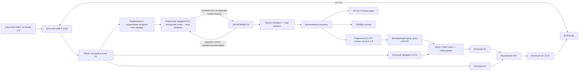

# Штатный USB-C XIAO и аккумулятор 2S: вариант питания 0.1

13 сентября 2026. Статус: **схема для проверки, не выполненный монтаж**. Цель GIFT-01 — зарядка подаренной машинки обычным USB-C блоком и прошивка через тот же разъём. Ни зарядный модуль, ни защита батареи этим документом не объявляются готовыми.

После уточнения пользователя штатный USB-C XIAO принят агентом как основной вариант для следующего стенда. Пользователь просит самостоятельно оценить электрическую реализацию, а не подтверждает конкретную схему. Успех этого варианта означает один доступный владельцу разъём, внутренний зарядник 2S с заводской настройкой тока и корректную работу USB от ПК/блока питания. Прямое подключение батареи 2S к штатному заряднику XIAO не предлагается.

## Что установлено по схеме XIAO

Проверена страница 4 [официальной схемы Seeed](https://files.seeedstudio.com/wiki/SeeedStudio-XIAO-ESP32S3/new-res/202003753_XIAO%20ESP32S3%20Sense_v1.5_SCH_260226.pdf.pdf). Имя файла содержит v1.5, основная надпись — Rev. V1.3, дата 2026-02-10. SHA256 PDF: `15993097cd695d177af352f4664ca91290a99c833f51d122d1165ef222f9923c`. Ревизия платы из заказа AliExpress ещё не установлена.

- Контакт «5V» на боковой колодке U9/14 — сеть **VBUS**, напрямую соединённая с USB0. Это не отдельный развязанный вход питания.
- Диод D2 стоит между VBUS и внутренним VIN. Он не отделяет боковой контакт 5V от USB-разъёма.
- BAT0 — сеть **VBAT** для одной ячейки. Q1 переключает питание внутреннего VIN; U3 SGM6029 формирует 3,3 В. Отдельный U4 SGM40567 заряжает VBAT от VBUS.
- R1/R2 по 5,1 кОм подключены к CC1/CC2. D+/D− идут к ESP32-S3 через R3/R4 по 22 Ом.

Следствие: нельзя считать прямое подключение внешнего DC-DC 5 В к боковому 5V готовой схемой для одновременного USB. Дополнительный диод только на выходе этого DC-DC не перекрывает путь от него к VBUS компьютера. Аккумулятор 2S напрямую к BAT0 также не подходит.

## Предлагаемый способ сохранить штатный разъём

Питать низковольтный BAT-вход XIAO **от отдельного регулируемого DC-DC через блокирующий диод**. Реальная батарея остаётся 2S; до BAT0 доходит только пониженное напряжение. USB-питание зарядного модуля 2S берётся с VBUS/5V XIAO, линии данных остаются штатными.

Общая земля обязательна; силовой возврат мотора/серво не вести через тонкий провод GND XIAO. Расположение зарядника относительно защитных MOSFET зависит от выбранного BMS/PCM: рисунок не назначает контакты неизвестной платы защиты.

Диод у BAT0 нужен, потому что штатный U4 при подключённом USB может поднимать VBAT выше выхода внешнего DC-DC. Диод блокирует этот обратный путь. Сам U4 при этом **не заряжает нашу 2S**; его светодиод CHG не является индикатором готовности аккумулятора машинки. Индикацию нужно брать у настоящего зарядника 2S.

Для стенда предложен регулируемый преобразователь класса Mini360, выставленный около 4,1 В до подключения XIAO, и диод с достаточным током/малым падением. Это дополнительный преобразователь к 5-вольтовому питанию серво, а не перенастройка общей линии серво на 4,1 В. Конкретный диод и допуски выхода ещё выбрать. Пример расчёта: при условных 4,1 В ±2% и падении 0,2–0,4 В на BAT0 получается 3,618–3,982 В. Диапазоны условные; мультиметр, нагрузочный тест и пульсации должны подтвердить реальные значения.

У [SGM6029](https://www.sg-micro.com/rect/assets/3323f5dc-718f-4b81-b820-398ddb702989/SGM6029.pdf) предусмотрен режим 100% duty. Он позволяет рассматривать небольшой запас входного напряжения, но не доказывает устойчивость XIAO/камеры от выбранного DC-DC. Проверить 3,3 В при пиках нагрузки и переключении источников.

## Ожидаемые режимы и доказательства

| Режим | Проектируемое поведение | Что измерить |
| --- | --- | --- |
| Батарея, USB отсутствует | Логика через DC-DC/BAT0, мотор и серво через свои ветви | BAT0, 3V3, пульсации, нагрев; отсутствие значимого обратного питания VBUS |
| USB, батарея снята | XIAO работает и прошивается; зарядник сообщает отсутствие батареи | USB-ток и поведение обоих зарядников при пустых выходах |
| USB и батарея, выключатель машинки выключен | Заряд 2S, привод обесточен, логика доступна по USB | Ток каждой ветви, завершение/балансировка, отсутствие обратного тока в DC-DC |
| Подключение USB во время работы | Для готового изделия зарядка исключает движение | Нужен отдельный VBUS-interlock, он ещё не реализован |
| Отключение USB | Возврат к батарейному питанию; без автоматического ARM | Просадка/сброс XIAO, состояние привода, новая сессия управления |

Проверку начать от ограниченного по току источника с выключенным зарядником 2S и без привода. Затем добавить реальный зарядник и проверить USB-A–C/C–C, обе ориентации, ПК/блок питания. Не подавать USB-ток выше допустимого для источника: Rd сами по себе не определяют токовую возможность, а до определения/разрешения источника зарядная ветвь должна оставаться отключённой. Обработка CC/USB и бюджет тока ещё проектируются.

Преимущества предложения — штатные USB и переключение источников XIAO, доступные BAT-площадки. Цена — дополнительный DC-DC, потери диода и место под них. Текущий CAD содержит один преобразователь; второй туда ещё не примерялся. До выбора этого варианта сравнить с отдельной платой питания и общим внешним USB-C разъёмом. Физическое отсутствие обратных токов, устойчивость и пригодность для подаренной машинки пока не доказаны.
