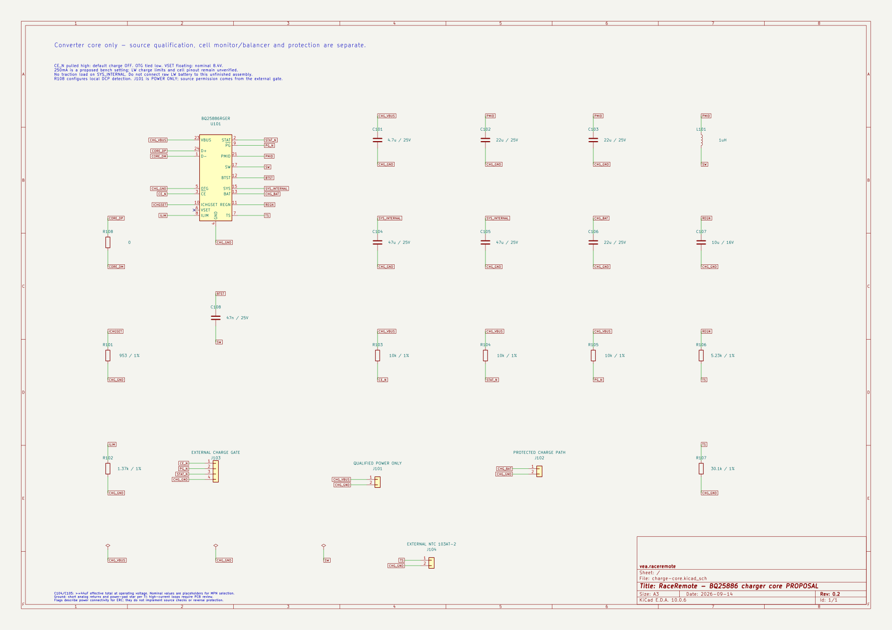

# Зарядный преобразователь BQ25886, предложение 0.1

14 сентября 2026. Подготовлена **электрическая схема основного преобразователя** варианта A. Это часть будущего встроенного зарядника, а не готовый зарядный модуль для LW. PCB, защита/балансировка ячеек, определение USB-источника и монтаж ещё не выполнены. Выбор BQ25886 для серии не утверждён; [сравнение A/B](../../docs/charge-node-comparison.md) остаётся актуальным.

[Проект KiCad](charge-core.kicad_pro) · [Исходная схема](charge-core.kicad_sch) · [PDF](schematic.pdf) · [BOM для подбора деталей](bom.csv) · [ERC](../../docs/evidence/charge-core-erc.json) · [Проверки и расчёты](../../docs/evidence/charge-core-verification.json)



## Что спроектировано

U101 повышает входные 5 В для заряда 2S. В схеме 21 позиция: микросхема, дроссель, восемь конденсаторов, семь резисторов и четыре логических интерфейса. Разъёмы, конкретные пассивные компоненты и их посадочные места ещё выбрать; строки BOM не означают наличие готовых деталей. QFN с нижней тепловой площадкой требует подходящего монтажа; наличие фена/нагревателя у пользователя уточняется.

Основание: [TI SLUSD88A Rev. A, июнь 2019](https://www.ti.com/lit/gpn/bq25886), разделы 6, 7.5, 8.3.7 и 9.2; [схема EVM SLUUC11, февраль 2019](https://www.ti.com/lit/pdf/SLUUC11), стр. 12. Символы/посадочное место — [происхождение и лицензия](NOTICE.md).

| Цепь | Предложение и ограничение |
| --- | --- |
| ICHGSET, R101 | 953 Ом ±1%, номинально около 250 мА. Это настройка для проработки стенда, **не подтверждённый зарядный ток LW**. Прежние 300 мА были расчётным ориентиром, не требованием пользователя |
| ILIM, R102 | 1,37 кОм ±1%, номинально около 810 мА по входу. Не заменяет определение допустимого тока USB и учёт разброса/потребления остальных цепей |
| VSET | Оставлен свободным: номинально 8,4 В на сборке. Это не контроль напряжения каждой ячейки |
| CE_N, R103 | Подтяжка 10 кОм к CHG_VBUS: при свободном внешнем входе заряд запрещён. Разрешение — внешним открытым стоком; его логика ещё не создана |
| OTG | Постоянно соединён с CHG_GND; выдача питания на USB в этой схеме не используется |
| TS | 5,23 кОм от REGN, 30,1 кОм к земле и внешний термистор 103AT-2 у батареи. Постоянного резистора вместо датчика нет |
| SYS_INTERNAL | Только внутренний узел с C104/C105. **CE_N не выключает SYS**; тяга должна иметь отдельное отключение |
| C108 | 47 нФ между BTST и SW; соединение второго вывода с землёй было бы ошибкой |

При 250 мА точность в таблице TI составляет ±25% для указанных там напряжений 6,2/7,6 В и температуры кристалла 0…85 °C. С добавлением ±1% R101 арифметическая оценка — примерно 186…316 мА; это **не гарантированный предел во всём цикле**. Завершение номинально около 25 мА, предварительный заряд ограничен снизу типовыми 30 мА; при очень низком напряжении сборки предусмотрен отдельный режим около 100 мА. Автоматическое восстановление глубоко разряженной LW не разрешено.

Номиналы конденсаторов в BOM предварительные. До разводки нужны кривые ёмкости под постоянным напряжением и допуски: C104+C105 должны обеспечить не менее 44 мкФ эффективной ёмкости, C106 — 10 мкФ, C107 — 4,7 мкФ. Для L101 проверить насыщение, пульсации и потери. Номинальная надпись на корпусе не закрывает эти проверки.

## CHARGE-CORE-01 — границы интерфейса

Уточнён [USB-вход](../../docs/usb-source-qualification.md): ILIM не поддерживает уставку ниже 500 мА, а табличный верх при настройке 500 мА достигает 553 мА в указанных TI условиях. PG не выводит класс источника, CE не обесточивает SYS. Для неопределённого USB-порта нужен отдельный силовой запрет/лимит; номинал R102 и текущая схема ядра этим исследованием не менялись.

Статус: предложение v0.1; единицы — В, А, Ом. Участники: подготовленный USB-вход ↔ преобразователь ↔ отдельно проектируемый защищённый зарядный путь. **Это не распиновка имеющихся разъёмов батареи.**

| Интерфейс | Контакты по порядку | Условие подключения |
| --- | --- | --- |
| J101 | 1 CHG_VBUS; 2 CHG_GND; 3 DP; 4 DM | Уже проверенный/защищённый источник, цель 5 В; предлагаемый диапазон ядра 4,3…5,5 В. CC1/CC2 обрабатывает внешний узел, второй пары Rd здесь нет |
| J102 | 1 CHG_BAT; 2 CHG_GND | Через ещё не разработанный защищённый путь. Не подключать напрямую к непроверенной LW; MID/B−/P− здесь не назначаются |
| J103 | 1 CE_N; 2 PG_N; 3 STAT_N; 4 CHG_GND | Открытый сток разрешения и статус. Подтяжки к CHG_VBUS; **не подключать напрямую к GPIO 3,3 В**. PG не подтверждает исправность ячеек или разрешённый ток источника |
| J104 | 1 TS; 2 CHG_GND | Два провода термистора, размещённого у батареи; электрический и тепловой контакт проверить |

Обрыв управляющего провода оставляет CE_N высоким при исправной подтяжке и входном питании. Замыкание CE_N на землю не защищено этим резистором: внешняя логика/силовой путь должны учитывать отказ. В резистивной модели обрыв NTC даёт TS/REGN ≥0,849 при допусках ±1%, замыкание — 0; оба состояния вне рабочего окна TI. Это расчёт статических состояний, не испытание платы.

До соединения с пассивным USB-портом нужны ограничение/защита входа и его пускового тока. Допустимые 20 В на VBUS самой микросхемы **не распространяются на всю схему**: подтянутые CE/STAT/PG рассчитаны на меньшие напряжения. Отдельно проверить общий провод обоих USB-портов и отсутствие обхода батарейной защиты через B−/MID/сервисный USB.

В Rev. A есть противоречия, которые нельзя скрывать схемой: строка NC=1 на стр. 5 расходится с D−=1 на стр. 4 и схемой EVM; использован D−=1. Для тёплого/холодного режима таблица и раздел 8.3.7.4 называют разные коэффициенты тока/напряжения. Поэтому точный JEITA-профиль и температурный диапазон, допустимый для LW, остаются проверками стенда, а не принятыми характеристиками изделия.

## Проверено и что дальше

KiCad 10.0.6 ERC: 0 замечаний. По экспортированному netlist сверены все 25 выводов U101, пассивные цепи и четыре интерфейса. Проверка обнаруживает три намеренные ошибки в отдельных копиях: C108 на землю вместо SW, потерю подтяжки CE и подключение зарядного выхода к входному VBUS. Это подтверждает соединения схемы, **не моделирует процесс заряда**. PCB/DRC и физической зарядки ещё нет.

```powershell
& build/tooling/kicad-10.0.6/bin/python.exe tools/build_charge_core.py
& build/tooling/kicad-10.0.6/bin/python.exe tools/verify_charge_core.py
& build/tooling/kicad-10.0.6/bin/kicad-cli.exe sch export pdf hardware/charge-core/charge-core.kicad_sch -o hardware/charge-core/schematic.pdf
```

Следующая необходимая часть — контроль обеих ячеек/балансировка и силовая защита со сменой батареи без активации USB; затем внешний запрет заряда и USB-вход. Выбор конкретных пассивных элементов, полная цена и компоновка следуют из полной схемы. Модель LW, её разъёмы, состояние и зарядные пределы требуют физических данных; ответ на ранее заданный вопрос о измерениях пока не получен. До проверки на имитаторе батареи подключение реальных аккумуляторов не является следующим действием.
