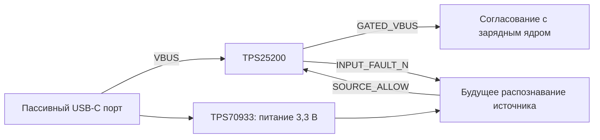

# Входной ключ USB: TPS25200

14 сентября 2026. **USB-INPUT-GATE-01 v0.2 — схема для проверки**.
Созданы [проект KiCad](usb-input-gate.kicad_pro), [схема PDF](usb-input-gate.pdf),
[перечень 13 компонентов](bom.csv) и [выгруженные соединения](usb-input-gate.net).
PCB и физического узла пока нет. Это часть будущей встроенной зарядки,
работающей при выключенной машинке без запуска приложения.

## Назначение и интерфейсы



В v0.2 добавлено питание распознавателя от USB_RAW_VBUS через U202 TPS70933;
для распознавателя подготовлен [интерфейс PI3USB9201](../usb-detector/README.md).
Его MCU, CC-узел и логика разрешения ещё открыты. Питание не зависит от GATED_VBUS,
поскольку ключ по умолчанию выключен. SOURCE_ALLOW не заменяет разрешение
заряда после проверки батареи/температуры. Запрет ключа отключает USB-вход,
но не обесточивает SYS/BAT внутри BQ25886 и не блокирует тягу сам.

| Интерфейс | Выводы и предлагаемый контракт |
| --- | --- |
| J201 | 1 USB_RAW_VBUS; 2 USB_GND. Штатный источник 5 В; логический разъём, не распиновка USB-C |
| J202 | 1 GATED_VBUS; 2 USB_GND. Только вход будущего зарядного узла; сопряжение с CHG_VBUS ещё не принято |
| J203 | 1 AUX_3V3; 2 SOURCE_ALLOW; 3 INPUT_FAULT_N; 4 USB_GND. В v0.2 pin 1 — выход питания для будущей логики; pin 2 — вход разрешения, pin 3 — выход статуса |
| AUX_3V3 | Номинал 3,3 В, предлагаемые допустимые 3,0…3,6 В; питание от U202, независимо от ключа и XIAO. Бюджет нагрузки ≤10 мА, суммарная эффективная выходная ёмкость ≤47 мкФ |
| SOURCE_ALLOW | LOW ≤0,3 В; HIGH ≥2,8 В и ≤AUX_3V3. При старте/сбросе/пропадании питания — LOW или высокоомное состояние; внешний драйвер ещё нужен |
| INPUT_FAULT_N | Открытый сток, R204=10 кОм к AUX_3V3. LOW — ошибка; HIGH/отсутствие AUX не доказывают исправность источника |

Предлагается один режим: включать только при подтверждённом бюджете источника
**не менее 1,5 А**. Type-C 1,5/3 А либо пригодный результат BC1.2 должен
сформировать будущий узел [USB-SOURCE-01](../../docs/usb-source-qualification.md).
SDP, Type-C default без дополнительного разрешения и неизвестный адаптер ключ
не включают. Совместимость с любым бытовым зарядником пока не достигнута.

## Номиналы и расчёт

Источник: [TI TPS25200 SLVSCJ0F, июль 2025](https://www.ti.com/lit/gpn/tps25200),
таблица 4-1, §§5.5, 8.2.2. IN=6, OUT=1, EN=4, FAULT=3, ILIM=2, GND=5;
теплоплощадка — земля. WSON-6 2×2 мм. EN активен высоким уровнем;
R202=47 кОм задаёт запрет, R203=4,7 кОм — последовательный резистор разрешения.
R201=82,5 кОм ±1%. Формула 1 использует **кОм**, результат в мА:

```text
Imin = 97399 / (82.5 × 1.01)^1.015 − 30 = 1063.875 mA
Inom = 98322 / 82.5^1.003              = 1176.109 mA
Imax = 96754 / (82.5 × 0.99)^0.985 + 30 = 1295.497 mA
```

Это аппроксимация TI с допуском резистора, не измеренный предел импульсов.
При утечке EN ±2 мкА статическая модель даёт максимум 0,095 В при обрыве,
минимум 2,532 В при разрешении 2,8 В. C201=100 нФ/50 В, эффективная ёмкость
≥100 нФ у IN; C202=22 мкФ/25 В — начальный вариант для проверки выбросов.

Для остальных входных цепей предложен бюджет 50 мА: расчётный остаток до
1,5 А — около 155 мА. Их ток/пуск не измерены; это не разрешение потреблять
50 мА от любого USB-host. MPN пассивов, DC-bias, посадочные места, монтаж
теплоплощадки и утечки платы остаются открытыми.

## Защита и сопряжение

TPS25200: ограничение выхода 5,25…5,55 В указано при VIN=6,5 В, CL=1 мкФ,
RL=100 Ом, а не для всех выбросов. IN 20 В — absolute maximum, рабочий
диапазон 2,5…6,5 В. При выключении OUT разряжается; обратная блокировка
заявлена для выключенного состояния, постоянное обратное питание не разрешено.

[BQ25886 SLUSD88A](https://www.ti.com/lit/gpn/bq25886) допускает рабочий VBUS
до 6,2 В, но CE/STAT/PG имеют absolute maximum 6 В. Их подтяжки в нашей
схеме идут к CHG_VBUS. Поэтому сравнение только по допустимому VBUS недостаточно.
Прежний контракт ядра 4,3…5,5 В **не расширен**. До объединения схем нужны
подбор/проверка ёмкости, пиков напряжения и пределов всех связанных выводов.
GATED_VBUS намеренно имеет отдельное имя.

При обрыве SOURCE_ALLOW ключ должен отключаться; время всей цепи не измерено.
Застывший HIGH подтяжка не устраняет. Внешний контроллер должен снимать
разрешение при потере квалификации/ошибке и задавать условия повторного запуска.
Защита ключа не заменяет удержание ошибки. Обрыв/замыкание ILIM, перегрев,
исчезновение AUX, просадки и повторные подключения требуют физических проверок.

На J202 не допускаются батарея 8,4 В, питание тяги или сервисный USB XIAO.
Развязка этих путей и блокировка движения при кабеле остаются отдельными узлами.

## Проверки и воспроизведение

```powershell
& build/tooling/kicad-10.0.6/bin/python.exe tools/build_usb_input_gate.py
& build/tooling/kicad-10.0.6/bin/python.exe tools/verify_usb_input_gate.py
```

[Отчёт](../../docs/evidence/usb-input-gate-verification.json): ERC — 0 замечаний,
12 выводов двух IC с теплоплощадкой и внешние/пассивные соединения сверены по netlist.
Обнаружены шесть намеренных ошибок после экспорта изменённых схем: подтяжка EN
ключа к питанию, обход ключа выходным разъёмом, возврат ILIM на выход,
питание LDO после ключа, неверная цепь выходного конденсатора LDO и EN LDO на VBUS. Расчёт единиц
воспроизводит пример TI с 42,2 кОм. PDF осмотрен как изображение: подписи и
соединения видимы, наложений не обнаружено. Это не аналоговая/тепловая проверка.

Следующая работа — распознавание перед ключом, проверка просадки питания, SOURCE_ALLOW и
согласование выхода с ядром. Первый физический тест ключа — ограниченный
лабораторный источник и эквивалент нагрузки, без LiPo. Наличие лабораторного
БП/электронной нагрузки не подтверждено.

## Кандидат покупки

[ChipDip 8035454964, TPS25200DRVR](https://www.chipdip.ru/product/tps25200drvr-kontrollery-goryachey-zameny-texas-instruments-8035454964):
14 сентября карточка показывает **53 ₽/шт.**, от 10 — 46 ₽, от 100 — 43 ₽;
минимальная отображённая покупка 1 шт., остаток 176 в Москве. Привоз в магазин
Чебоксар ориентировочно 20 сентября бесплатно, местного остатка нет.
Для 1/4/6 машин: 53/212/318 ₽ только за микросхему. Данные в
[общей таблице](../../docs/charge-parts.csv). Технология монтажа корпуса с нижней
теплоплощадкой не подтверждена. Заказов нет, полной сметы узла ещё нет.

## USB-AUX-01 v0.1: питание до основного ключа

U202 — **TPS70933DBVR Texas Instruments**, обычная распиновка TPS709 DBV:
IN=1, GND=2, EN=3, NC=4, OUT=5. Это не TPS709A/B и не автоматически
взаимозаменяемая микросхема другого производителя с похожим названием.
Вход подключён к USB_RAW_VBUS. EN и NC оставлены свободными намеренно:
[TI SBVS186H, таблица 5-1 и §7.4](https://www.ti.com/lit/gpn/tps709)
разрешает автоматический запуск при свободном EN и запрещает связывать EN
с VIN. Вход допускает 2,7…30 В, но EN — только до 6,5 В рабочего диапазона.
Эти пределы не расширяют допустимое питание всего зарядного узла.

C203=1 мкФ/50 В — входной, C204=4,7 мкФ/16 В X7R — выходной кандидат.
По §8.1.1 при 3,3 В требуется эффективная выходная ёмкость 1,5…47 мкФ,
ESR 0…0,2 Ом. В проекте нижняя цель взята с запасом: ≥2,2 мкФ.
Верхний предел учитывает также развязку будущей платы распознавания.
MPN и остаточная ёмкость под напряжением пока не подтверждены.

Предлагаемый бюджет **10 мА** относится только к детектору/логике/подтяжкам.
XIAO, камера, серво и мотор сюда не подключаются. Это не аппаратный лимит:
внутреннее ограничение TPS709 по таблице составляет 200…500 мА в указанных
условиях. Ранее выделенные 50 мА для остальных входных цепей не увеличены;
нагрузка AUX входит в них, а не добавляется сверху.

Расчёт потерь проходного элемента при 10 мА: 19,5 мВт при 5,25 В,
167 мВт при условных 20 В. JEDEC RθJA 212,1 °C/Вт даёт для второго случая
около 35,4 °C прироста, но реальная PCB и закрытый кузов не проверены.
Это оценка для выбора нагрузки, не разрешение заряжать от 20 В.

**Изменение относительно v0.1:** AUX_3V3 больше не является внешним входом
питания. Нельзя подключать к J203.1 второй регулятор, 3,3 В XIAO или батарею.
Наличие AUX само по себе не распознаёт USB-источник и не формирует SOURCE_ALLOW.
При плавном падении/прерывании AUX будущий детектор должен гарантированно
снять разрешение; схема этой функции и измерение времени ещё открыты.
Не объявляем весь вход обесточенным без кабеля до проверки всех сигнальных путей.

Для проверки ветви сначала нужны питание с ограничением тока и эквивалент
нагрузки 0…10 мА: запуск при SOURCE_ALLOW=0, отсутствие GATED_VBUS,
ступень нагрузки, плавная просадка/отключение, отсутствие второго источника
на J203.1. Пусковой ток всего USB-входа, утечки и нагрев требуется измерить.

[ChipDip 9000996321](https://www.chipdip.ru/product/tps70933dbvr-stabilizator-napryazheniya-texas-instruments-9000996321):
проверено 14 сентября, **40 ₽/шт.**, от 100 — 33 ₽, от 1000 — 30 ₽;
минимальная отображённая покупка 1 шт., 13 816 шт. в Москве, срок 4 дня.
Привоз в магазин Чебоксар показан на 18 сентября бесплатно; местного остатка нет.
Для 1/4/6 машин — 40/160/240 ₽. Вместе U201+U202 — 93/372/558 ₽,
без пассивов, платы, распознавания и монтажа. Заказов нет.

Сопряжение с ядром упрощено в [CHARGE-CORE-01 v0.2](../charge-core/README.md): J101 имеет только питание, локальные CORE_DP/CORE_DM соединены R108=0 Ом и не выходят к USB. Это устраняет переключение двух детекторов на одних линиях, но не закрывает напряжения/разрешение. BQ24392 объединяет DCP и некоторые legacy-адаптеры своим HIGH; такой результат не разрешает данный режим ≥1,5 А без дополнительной классификации.
