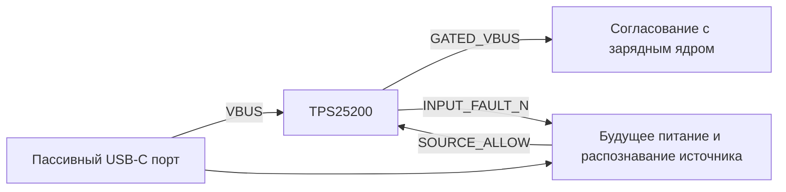

# Входной ключ USB: TPS25200

14 сентября 2026. **USB-INPUT-GATE-01 v0.1 — схема для проверки**.
Созданы [проект KiCad](usb-input-gate.kicad_pro), [схема PDF](usb-input-gate.pdf),
[перечень 10 компонентов](bom.csv) и [выгруженные соединения](usb-input-gate.net).
PCB и физического узла пока нет. Это часть будущей встроенной зарядки,
работающей при выключенной машинке без запуска приложения.

## Назначение и интерфейсы



Питание/распознавание слева от ключа ещё не спроектировано. Его нельзя брать
с GATED_VBUS: ключ по умолчанию выключен. SOURCE_ALLOW не заменяет разрешение
заряда после проверки батареи/температуры. Запрет ключа отключает USB-вход,
но не обесточивает SYS/BAT внутри BQ25886 и не блокирует тягу сам.

| Интерфейс | Выводы и предлагаемый контракт |
| --- | --- |
| J201 | 1 USB_RAW_VBUS; 2 USB_GND. Штатный источник 5 В; логический разъём, не распиновка USB-C |
| J202 | 1 GATED_VBUS; 2 USB_GND. Только вход будущего зарядного узла; сопряжение с CHG_VBUS ещё не принято |
| J203 | 1 AUX_3V3; 2 SOURCE_ALLOW; 3 INPUT_FAULT_N; 4 USB_GND. От будущего входного узла |
| AUX_3V3 | Предлагаемые 3,0…3,6 В для подтяжки статуса, независимо от выключенного XIAO |
| SOURCE_ALLOW | LOW ≤0,3 В; HIGH ≥2,8 В и ≤AUX_3V3. При старте/сбросе/пропадании питания — LOW или высокоомное состояние; внешний драйвер ещё нужен |
| INPUT_FAULT_N | Открытый сток, R204=10 кОм к AUX_3V3. LOW — ошибка; HIGH/отсутствие AUX не доказывают исправность источника |

Предлагается один режим: включать только при подтверждённом бюджете источника
**не менее 1,5 А**. Type-C 1,5/3 А либо пригодный результат BC1.2 должен
сформировать будущий узел [USB-SOURCE-01](../../docs/usb-source-qualification.md).
SDP, Type-C default без дополнительного разрешения и неизвестный адаптер ключ
не включают. Совместимость с любым бытовым зарядником пока не достигнута.

## Номиналы и расчёт

Источник: [TI TPS25200 SLVSCJ0F, июль 2025](https://www.ti.com/lit/gpn/tps25200),
таблица 4-1, §§5.5, 8.2.2. IN=6, OUT=1, EN=4, FAULT=3, ILIM=2, GND=5;
теплоплощадка — земля. WSON-6 2×2 мм. EN активен высоким уровнем;
R202=47 кОм задаёт запрет, R203=4,7 кОм — последовательный резистор разрешения.
R201=82,5 кОм ±1%. Формула 1 использует **кОм**, результат в мА:

```text
Imin = 97399 / (82.5 × 1.01)^1.015 − 30 = 1063.875 mA
Inom = 98322 / 82.5^1.003              = 1176.109 mA
Imax = 96754 / (82.5 × 0.99)^0.985 + 30 = 1295.497 mA
```

Это аппроксимация TI с допуском резистора, не измеренный предел импульсов.
При утечке EN ±2 мкА статическая модель даёт максимум 0,095 В при обрыве,
минимум 2,532 В при разрешении 2,8 В. C201=100 нФ/50 В, эффективная ёмкость
≥100 нФ у IN; C202=22 мкФ/25 В — начальный вариант для проверки выбросов.

Для остальных входных цепей предложен бюджет 50 мА: расчётный остаток до
1,5 А — около 155 мА. Их ток/пуск не измерены; это не разрешение потреблять
50 мА от любого USB-host. MPN пассивов, DC-bias, посадочные места, монтаж
теплоплощадки и утечки платы остаются открытыми.

## Защита и сопряжение

TPS25200: ограничение выхода 5,25…5,55 В указано при VIN=6,5 В, CL=1 мкФ,
RL=100 Ом, а не для всех выбросов. IN 20 В — absolute maximum, рабочий
диапазон 2,5…6,5 В. При выключении OUT разряжается; обратная блокировка
заявлена для выключенного состояния, постоянное обратное питание не разрешено.

[BQ25886 SLUSD88A](https://www.ti.com/lit/gpn/bq25886) допускает рабочий VBUS
до 6,2 В, но CE/STAT/PG имеют absolute maximum 6 В. Их подтяжки в нашей
схеме идут к CHG_VBUS. Поэтому сравнение только по допустимому VBUS недостаточно.
Прежний контракт ядра 4,3…5,5 В **не расширен**. До объединения схем нужны
подбор/проверка ёмкости, пиков напряжения и пределов всех связанных выводов.
GATED_VBUS намеренно имеет отдельное имя.

При обрыве SOURCE_ALLOW ключ должен отключаться; время всей цепи не измерено.
Застывший HIGH подтяжка не устраняет. Внешний контроллер должен снимать
разрешение при потере квалификации/ошибке и задавать условия повторного запуска.
Защита ключа не заменяет удержание ошибки. Обрыв/замыкание ILIM, перегрев,
исчезновение AUX, просадки и повторные подключения требуют физических проверок.

На J202 не допускаются батарея 8,4 В, питание тяги или сервисный USB XIAO.
Развязка этих путей и блокировка движения при кабеле остаются отдельными узлами.

## Проверки и воспроизведение

```powershell
& build/tooling/kicad-10.0.6/bin/python.exe tools/build_usb_input_gate.py
& build/tooling/kicad-10.0.6/bin/python.exe tools/verify_usb_input_gate.py
```

[Отчёт](../../docs/evidence/usb-input-gate-verification.json): ERC — 0 замечаний,
7 выводов с теплоплощадкой и внешние/пассивные соединения сверены по netlist.
Обнаружены три намеренные ошибки после экспорта изменённых схем: подтяжка EN
к питанию, обход ключа выходным разъёмом, возврат ILIM на выход. Расчёт единиц
воспроизводит пример TI с 42,2 кОм. PDF осмотрен как изображение: подписи и
соединения видимы, наложений не обнаружено. Это не аналоговая/тепловая проверка.

Следующая работа — питание/распознавание перед ключом, SOURCE_ALLOW и
согласование выхода с ядром. Первый физический тест ключа — ограниченный
лабораторный источник и эквивалент нагрузки, без LiPo. Наличие лабораторного
БП/электронной нагрузки не подтверждено.

## Кандидат покупки

[ChipDip 8035454964, TPS25200DRVR](https://www.chipdip.ru/product/tps25200drvr-kontrollery-goryachey-zameny-texas-instruments-8035454964):
14 сентября карточка показывает **53 ₽/шт.**, от 10 — 46 ₽, от 100 — 43 ₽;
минимальная отображённая покупка 1 шт., остаток 176 в Москве. Привоз в магазин
Чебоксар ориентировочно 20 сентября бесплатно, местного остатка нет.
Для 1/4/6 машин: 53/212/318 ₽ только за микросхему. Данные в
[общей таблице](../../docs/charge-parts.csv). Технология монтажа корпуса с нижней
теплоплощадкой не подтверждена. Заказов нет, полной сметы узла ещё нет.
