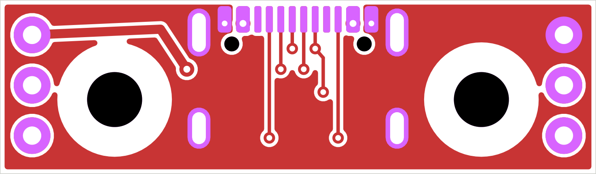
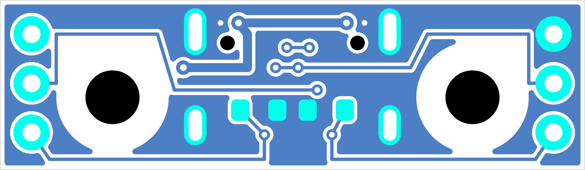

# Пассивная плата зарядного USB-C, ревизия 0.1

14 сентября 2026. **Разведена, проверена KiCad DRC, не изготовлена.** Это плата разъёма с двумя резисторами, подключаемая к отдельному зарядному узлу. Зарядного контроллера, защиты аккумулятора, ограничения входного тока и согласования PD/QC здесь нет. Батарею 2S к VBUS не подключать.

[Открыть PCB](usb-port.kicad_pcb) · [Проект KiCad](usb-port.kicad_pro) · [CAD-размещение](../../cad/usb-port-study.md) · [Проверка DRC](../../docs/evidence/usb-port-pcb-drc.json)





Плата двухслойная, **26×7,6×1 мм**. Медь 35 мкм предложена для изготовления и использована в CAD; полный стек слоёв с изготовителем ещё не согласован. Разъём GCT USB4105-GF-A сверху, R1/R2 5,1 кОм ±1% типоразмера 0603 снизу. Два отверстия Ø2,4 мм с зонами без меди радиусом 2,5 мм под металлический крепёж. Шесть площадок Ø1,6 с отверстиями Ø0,8 — для пайки жгута; разъём жгута/калибр провода пока не выбраны. Крепление должно разгружать жгут от натяжения, его конструкция ещё открыта.

При сверке с библиотекой обнаружено: в прежнем CAD при X входа 58,5 мм задние площадки USB выходили за плату на 0,33 мм. Сдвиг входа до X=59,1 мм даёт зазор меди до заднего края **0,27 мм**. Ширина платы в CAD увеличена с 22 до 26 мм для пайки жгута за пределами крепёжных зон. Передняя кромка PCB осталась X=58,5 мм: корпус разъёма выступает за неё на 0,6 мм; отдельный вырез под вход не потребовался. [Геометрия площадок и отверстий](geometry.json) экспортируется из KiCad в OpenSCAD.

## USB-PORT-01, предложение v0.1

Участники: зарядный USB-C ↔ плата порта ↔ жгут ↔ отдельный зарядник. Штатный сервисный USB XIAO к этой плате не подключается.

| Контакт | Цепь | Назначение |
| --- | --- | --- |
| H1 | VBUS | Вход от USB-источника; цель системы — 5 В. К защите/ограничителю входа зарядника |
| H2 | DP | A6/B6 разъёма, линия определения источника |
| H3 | CC1 | A5, отдельный R1 5,1 кОм на GND |
| H4 | GND | Общий провод USB и экран разъёма |
| H5 | DM | A7/B7 разъёма, линия определения источника |
| H6 | CC2 | B5, отдельный R2 5,1 кОм на GND |

На рисунках сверху вниз слева H1/H2/H3, справа H4/H5/H6. Низ показан **без зеркалирования** для сопоставления слоёв, а не как вид при перевороте платы. Сверять маркировку цепей в KiCad перед пайкой; маркировка выводов на самой плате пока не добавлена.

CC1 и CC2 не соединяются друг с другом. На основной плате допускаются только подходящие высокоомные входы измерения CC, в том числе при её обесточивании; вторая пара Rd недопустима. Их допустимые напряжения и защита ещё определить. Резисторы позволяют источнику обнаружить потребитель, но **не разрешают произвольный ток**. Определение доступного тока, защита от ESD/замыканий, запрет заряда при ошибках и защита от обратного питания остаются в проектировании зарядного узла. D+/D− разведены для определения источника; USB 2.0 передача данных, импеданс пары и высокоскоростной интерфейс не заявлены.

Обрыв жгута, одного Rd или неправильное распознавание источника должны приводить к запрету заряда либо к подтверждённому допустимому режиму основной платы. Здесь MCU/логики разрешения нет. При отключении VBUS заряд прекращает основной узел; сам порт не разрешает движение.

Основание для двух Rd: [Renesas, модель USB Type-C Source/Sink, рисунки 5–6](https://www.renesas.com/en/support/engineer-school/usb-power-delivery-03). Распиновка J1 — [GCT USB4105 B4](https://gct.co/files/drawings/usb4105.pdf). A8/B8 (SBU) оставлены без подключений.

## Проверка и её пределы

KiCad **10.0.6**: DRC с повторной заливкой зон — 0 нарушений и 0 неподключённых соединений. Заданные минимумы: дорожка/межцепной зазор 0,15 мм, зазор меди до края 0,20 мм, зазор до отверстия 0,15 мм, переход Ø0,50 с отверстием Ø0,25 мм. Зазор до отверстия выбран с учётом заводского посадочного места: там есть около 0,194 мм до направляющего отверстия. Возможности конкретного изготовителя ещё не подтверждены.

В отчёте сохранены стандартные отключённые проверки KiCad; у интегрированных площадок жгута и крепёжных отверстий нет отдельных courtyard. Их механические зоны проверяются явно в PCB/CAD. Сравнение с независимой схемой/ ERC не выполнено: отдельного файла `.kicad_sch` пока нет. DRC не доказывает допустимый ток/нагрев, отсутствие дефектов пайки, стойкость к статике и работоспособность зарядки.

Приёмка изготовленного образца: прозвонить пары силовых контактов и экран, отсутствие коротких между VBUS/GND/DP/DM/CC; проверить каждый Rd около 5,1 кОм (при отключённом заряднике). Затем проверить 5-В источник с ограничением тока и обе ориентации A–C/C–C, падение напряжения/нагрев при выбранном токе, крепление и жгут. Эти измерения не выполнены.

## Воспроизведение

Используется Python из KiCad, обычный Python не содержит `pcbnew`:

```powershell
& build/tooling/kicad-10.0.6/bin/python.exe tools/build_usb_port_pcb.py
& build/tooling/kicad-10.0.6/bin/kicad-cli.exe pcb drc hardware/usb-port/usb-port.kicad_pcb --format json --all-track-errors --refill-zones --save-board --exit-code-violations -o docs/evidence/usb-port-pcb-drc.json
uv run --with-requirements tools/cad-requirements.txt python tools/build_usb_port_study.py
```

На этом ПК KiCad извлечён в игнорируемую папку `build/tooling/kicad-10.0.6` из [официального подписанного дистрибутива](https://kicad-downloads.s3.cern.ch/windows/stable/kicad-10.0.6-x86_64.exe). Проверена действительная подпись KICAD SERVICES CORPORATION. Системная установка не выполнялась. Извлечены `bin/*`, `lib/*`, `share/kicad/schemas/*`, `share/kicad/template/*`, `share/kicad/scripting/*` и используемый footprint резистора. На другом ПК можно использовать обычную установку KiCad 10.0.6, изменив пути.

Источники посадочных мест и лицензия — [NOTICE](RaceRemote_USB.pretty/NOTICE.md). Полная стоимость PCB/монтажа, производитель и жгут не выбраны. Разъём есть в [таблице предложений](../../docs/charge-parts.md); резисторы пока указаны как тип/номинал без проверенной цены. Заказов нет.
