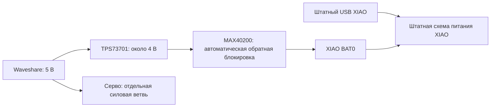

# Питание XIAO от общей линии 5 В, предложение 0.2

15 сентября 2026. **XIAO-LOGIC-01 v0.2** заменяет LM66100 на MAX40200AUK+T: обратное напряжение на ключе отслеживает сам IC, внешний провод обнаружения USB больше не нужен. Обновлены [KiCad](xiao-logic-power.kicad_sch), [PDF](schematic.pdf), [соединения](connections.csv) и [BOM](bom.csv). PCB, тепловая/переходная квалификация и монтаж ещё отсутствуют.

## Соединение с машинкой

| Вывод | Соединение | Ограничение |
| --- | --- | --- |
| J1 WAVE_5V | Выход Waveshare в режиме 5 В | Расчёт требует измеренных 4,75…5,25 В; это не гарантия модуля |
| J2 DRIVE_GND | Возврат питания Waveshare | Силовой ток серво/мотора не вести через XIAO |
| J3 XIAO_BAT | Положительная площадка BAT0 XIAO | Только выход узла; сырые 2S сюда не подключаются |
| J5 DRIVE_GND | GND XIAO | Общая опора с J2; связь с сырой батареей/землёй зарядки здесь не назначена |

**J4 удалён, его номер не переиспользован.** Боковой 5V XIAO и отдельный зарядный USB к этой схеме не подключаются. EN U2 соединён с его VDD локальной дорожкой. Четыре J — логические интерфейсы, не покупные разъёмы.

На [схеме Seeed, лист 4](https://files.seeedstudio.com/wiki/SeeedStudio-XIAO-ESP32S3/new-res/202003753_XIAO%20ESP32S3%20Sense_v1.5_SCH_260226.pdf.pdf) боковой 5V соединён с USB VBUS, а BAT0 — со штатным зарядником U4. Прямые внешние 5 В на боковом контакте не развязывают компьютер. Реальная ревизия заказанной платы неизвестна. Этот узел не заряжает LW; отдельная [2S USB-C зарядка](../../docs/usb-c-power.md) остаётся незавершённой.

## Выбор ключа

[MAX40200 Rev 4, февраль 2023, стр. 2–3, 8–9](https://www.analog.com/media/en/technical-documentation/data-sheets/max40200.pdf): SOT23-5 имеет VDD=1, GND=2, EN=3, NC=4, OUT=5. Обратная блокировка предусмотрена внутри; внешний USB-сигнал не нужен. Диапазон питания — 1,5…5,5 В.

Для **SOT23**, при паспортной точке VDD=3,3 В, падение при 0,5 А — 97 мВ типично / 175 мВ максимально. Рекламные 43 мВ относятся к WLP. Точка 1 А измерялась импульсно; она не устанавливает непрерывный ток нашей PCB. Типовые времена EN не задают гарантированный обратный импульс при переключении источников.

C3/C4 увеличены до **1 мкФ X7R/10 В**: каждый должен сохранять ≥0,33 мкФ, а полная выходная ёмкость с XIAO — оставаться ≤100 мкФ. Конкретные MPN и вся нагрузка ещё не проверены.

[TPS737 Rev W, §6.3.3–6.3.4](https://www.ti.com/lit/ds/symlink/tps737.pdf) не гарантирует обратную блокировку при EN=IN; регулируемая версия имеет путь через FB. Поэтому U2 необходим. Медленный запуск U1 может дать выброс; новая схема этого не устраняет. Номер 9 у U1 в нашем символе обозначает тепловую площадку GND, а не дополнительную ножку корпуса.

## Расчёт и оставшиеся ограничения

[Скрипт](../../tools/calculate_xiao_logic_power.py) и [отчёт 0.2](../../docs/evidence/xiao-logic-power-v02/dc-calculation.json) проверяют 320 сочетаний допусков R1/R2=23,2/10 кОм 0,1%, ±3% U1 и дополнительного знакопеременного запаса IFB. Это условная DC-оценка.

| Результат модели | Значение |
| --- | --- |
| Выход U1 | Номинально 3,997 В; оценка 3,858…4,137 В |
| Запас сверх 0,5 В между IN и OUT U1 | Минимум 0,113 В при принятом входном диапазоне |
| Преднагрузка R3=360 Ом 1% перед U2 | 10,61…11,61 мА; до 0,048 Вт |
| Потери U1 при номинальных 5 В и нагрузке 0,5 А | 0,513 Вт |
| Максимум потерь U1 среди режимов до 0,6 А | 0,850 Вт, без собственного потребления U1/U2 |
| Нижняя оценка BAT при 0,5 А, если падение U2 ≤175 мВ | 3,683 В до потерь проводов/Q1 |
| Потери U2 при 0,5 А при том же допущении | До 0,0875 Вт |

Перенос предела падения со входа 3,3 В на наши около 4 В — **проектное допущение**. Для 0,6 А точный предел не назначен; интерполяция не выдаётся за гарантию. 0,5/0,6 А — исследуемые нагрузки, не измеренное потребление камеры. При общей линии 4,5 В условие запаса U1 уже нарушено. R3 оставлен перед U2 для нагрузки U1 ≥10 мА; C2 предложен 4,7 мкФ с фактической ёмкостью ≥1 мкФ.

| Состояние | Ожидаемое поведение / неизвестность |
| --- | --- |
| Waveshare включён, USB нет | U2 проводит к BAT0; запуск камеры и просадка не проверены |
| Штатный USB подключён | При BAT0 выше выхода U1 ключ должен блокировать обратный путь автоматически |
| Waveshare выключен, USB подключён | Внешний провод для блокировки не нужен; переход к малому VIN и утечки не измерены |
| Оба источника выключены | Разряд конденсаторов; нулевой обратный ток через U1 не заявлен |
| Обрыв прежнего USB-сигнала | Такого соединения в 0.2 нет; это не защита от любых обрывов/отказов IC |
| Переключение USB, дребезг, пуск серво | Обратный импульс, выброс U1 и непрерывность питания XIAO неизвестны |

Теплоотвод, собственные токи IC, пульсации, Q1/провода и размещение PCB ещё требуют работы. Путь LW→защита→выключатель→Waveshare не квалифицирован. Мультиметр не проверит короткие выбросы; подходящего прибора пока нет. Отдельный buck с блокирующим диодом остаётся резервом. Печать отложена.

## Закупка и доказательства

[MAX40200AUK+T в ЧИП и ДИП](https://www.chipdip.ru/product/max40200auk-t-mikroshema-idealnyy-diod-s-sverhnizkim-maxim-9000587524): 15 сентября **50 ₽ от 1 шт.**, 97 шт. на складе Москвы, ориентировочный бесплатный самовывоз в Чебоксарах 18 сентября. Только этот IC для 1/4/6 машин — 50/200/300 ₽, не стоимость всей платы. Заголовок магазина переносит падение WLP на SOT23; аналоги TPMAX не признаны эквивалентными. Покупок нет.

На [странице ADI](https://www.analog.com/en/products/max40200.html) указан PCN 2571C от 20 апреля 2026 для AUK. Содержание пока не прочитано; влияние на корпус/параметры не установлено. Проверить перед фиксацией закупки/посадочного места.

[Отчёт 0.2](../../docs/evidence/xiao-logic-power-v02/summary.json): 13 позиций, 32 вывода включая четыре NC, пять рабочих цепей; экспорт KiCad и CSV сверены с независимой таблицей. **ERC=0 без нового подавления**: прежнее замечание ST→GND исчезло вместе с LM66100. PDF просмотрен. Нет PCB/DRC, SPICE, пайки или физических испытаний. Сохранены [источники](../../docs/evidence/xiao-logic-power-v02/sources.json) и [предложение магазина](../../docs/evidence/xiao-logic-power-v02/shop.json).

Повторение: `python tools/build_xiao_logic_power.py`, затем `python tools/verify_xiao_logic_power.py` из корня, с имеющимся KiCad CLI в `build/tooling/kicad-10.0.6/bin`. Схема 0.1 со старым проводом/LM66100 находится в коммите `11380ef`; отчёты `xiao-logic-power-v01` исторические и не описывают текущие файлы.
