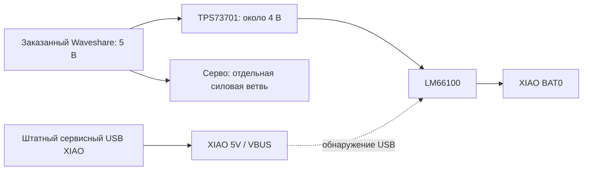

# Питание XIAO от общей линии 5 В, предложение 0.1

15 сентября 2026. **XIAO-LOGIC-01 v0.1 — исследуемая альтернатива второму DC-DC**, не выбранный для серии узел. Подготовлены [редактируемая схема KiCad](xiao-logic-power.kicad_sch), [PDF](schematic.pdf), [соединения по номерам выводов](connections.csv) и [состав](bom.csv). PCB и посадочные места ещё не разработаны; размер, стоимость и допустимый ток платы не установлены. Пять J — логические выводы, не пять покупных разъёмов. Покупок нет.

## Соединение с машинкой

| Вывод | Соединение | Ограничение |
| --- | --- | --- |
| J1 WAVE_5V | Выход Waveshare в режиме 5 В | Для расчёта требуется измеренный диапазон 4,75…5,25 В; это не паспортная гарантия модуля |
| J2 DRIVE_GND | Возврат питания Waveshare | Силовой ток серво/мотора не проводить через XIAO |
| J3 XIAO_BAT | Положительная площадка BAT0 XIAO | Только выход узла; сырые 2S сюда не подключаются |
| J4 SERVICE_VBUS | Боковой 5V, U9/14 XIAO | Только обнаружение штатного USB; не соединять с J1 или зарядным USB |
| J5 DRIVE_GND | GND XIAO | Одна опорная земля с J2; соединение с сырой батареей/землёй зарядки этим не назначается |

На [официальной схеме Seeed, лист 4](https://files.seeedstudio.com/wiki/SeeedStudio-XIAO-ESP32S3/new-res/202003753_XIAO%20ESP32S3%20Sense_v1.5_SCH_260226.pdf.pdf) боковой 5V соединён с USB VBUS; BAT0 связан со штатным зарядником U4. Поэтому внешние 5 В непосредственно на боковой 5V не дают развязки компьютера. Реальная ревизия заказанной платы ещё неизвестна. Схема отдельного зарядника LW остаётся в [USB-C power](../../docs/usb-c-power.md); данный узел батарею **не заряжает**.

## Почему два IC и дополнительный провод

U1 снижает общую линию до номинальных 3,997 В. [TPS737 Rev W, §6.3.3–6.3.4](https://www.ti.com/lit/ds/symlink/tps737.pdf) требует выключать EN раньше снятия входа для гарантии обратной блокировки; у регулируемой версии есть дополнительный путь через FB. В этой схеме EN связан с IN: на внутреннюю обратную защиту U1 не полагаемся. Медленный запуск может дать выброс; он ещё не проверен.

У U2 вывод CE сравнивается с его VIN. При установившемся сервисном USB CE выше выхода U1, поэтому ключ выключен. [LM66100 Rev A, стр. 5 и §8.3–8.4](https://www.ti.com/lit/ds/symlink/lm66100.pdf): порог выключения достигает +80 мВ; в OFF остаётся прямой диод IN→OUT. Это не полное отключение питания. Соединение CE только с VOUT вместо J4 не принимается: паспортный обратный ток срабатывания 0,5…1 А не обосновывает блокировку слабого зарядного источника XIAO. ST подключён к земле согласно таблице выводов производителя.

## Расчёт и что он меняет

[Воспроизводимый расчёт](../../tools/calculate_xiao_logic_power.py) проверяет 320 сочетаний условных параметров. R1/R2 = 23,2/10 кОм 0,1%; заложены ±3% U1 и дополнительный знакопеременный запас по IFB. Это консервативная оценка установившегося режима, не статистическая точность и не гарантия готовой платы.

| Результат модели | Значение |
| --- | --- |
| Выход U1 | 3,858…4,137 В |
| Минимальный запас сверх требуемых 0,5 В между IN и OUT | 0,113 В |
| Запас выключения U2 при сервисном USB ≥4,75 В | 0,533 В сверх порога |
| Преднагрузка R3 = 360 Ом 1% | 10,61…11,61 мА; до 0,048 Вт |
| Потери проходного элемента U1 при номинальных 5 В и нагрузке XIAO 0,5 А | 0,513 Вт |
| Наибольшие потери U1 среди рассмотренных режимов до 0,6 А | 0,850 Вт, без собственного тока IC |

Преднагрузка стоит **до** U2, чтобы U1 сохранял нагрузку ≥10 мА при отключённой ветви XIAO. C2 предложен 4,7 мкФ X7R/10 В, но требуется ≥1 мкФ фактической ёмкости под напряжением. Номиналы не заменяют выбор конкретных пассивных деталей.

0,5/0,6 А — исследуемые нагрузки, не измеренное потребление камеры. Расчёт BAT ≥3,774 В дополнительно предполагает RON=0,14 Ом; паспортная точка этого сопротивления дана при 3,6 В/200 мА, поэтому перенос на наши режимы — только оценка. Потери в проводах, Q1 и пульсации не учтены. При просадке общей линии до 4,5 В запас U1 уже отрицателен: совместная работа с серво пока не доказана. Полватта и более требуют теплоотвода; размер корпуса IC не определяет размер всей платы. Второй buck с диодом остаётся резервным вариантом.

## Режимы и открытые проверки

| Состояние | Ожидаемое поведение / граница доказательства |
| --- | --- |
| Waveshare включён, сервисного USB нет | J4 притянут к земле, U2 включён; оценка требует отсутствия постороннего источника на VBUS |
| Оба источника установились | U2 выключен; XIAO работает от USB, штатный U4 может поднять BAT0; прямые 5-вольтовые сети не объединены |
| Waveshare выключен, USB подключён | CE должен удерживать U2 выключенным; обратные утечки и переходы нужно измерить |
| Оба источника выключены | Разряд локальных конденсаторов; нулевой обратный ток через U1 не заявлен |
| Вставка/вынимание USB, дребезг, просадка от серво | Установившаяся DC-модель этого не проверяет; непрерывность работы XIAO неизвестна |
| Обрыв J4 при подключённом USB | CE может стать LOW, исчезнет принудительная блокировка обратного пути; схема не выдерживает такой отказ гарантированно |

Перед монтажом с XIAO остаются: переходные режимы/выбросы, фактическая ревизия платы, ток и теплоотвод, безопасный силовой путь от LW и защита батареи. Мультиметр не подтвердит короткие выбросы. Имеющихся USB-зарядок недостаточно для полной квалификации переходов; отдельного требования купить прибор пользователю сейчас не предъявляем. Печать остаётся отложенной.

## Проверено в репозитории

[Отчёт](../../docs/evidence/xiao-logic-power-v01/summary.json): 15 позиций, 36 выводов (четыре NC), шесть рабочих цепей; экспорт KiCad и CSV независимо сверены с таблицей соединений. PDF просмотрен. **ERC содержит одно сохранённое замечание**: open-collector ST подключён к отмеченной PWR_FLAG земле. Такое соединение предписано TI для неиспользуемого ST; оно разобрано, не скрыто настройкой и не выдаётся за ERC=0. Других замечаний нет. Нет PCB/DRC, SPICE, пайки или испытания питания.

Повторение из корня: `python tools/build_xiao_logic_power.py`, затем `python tools/verify_xiao_logic_power.py`. Нужен имеющийся `build/tooling/kicad-10.0.6/bin/kicad-cli.exe`. [Снимок источников](../../docs/evidence/xiao-logic-power-v01/sources.json) фиксирует прочитанные редакции; расчётный отчёт отделён от физических доказательств.
